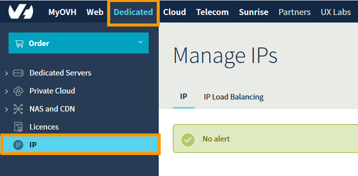
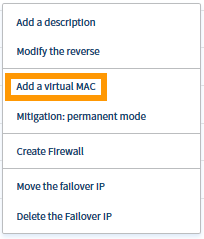
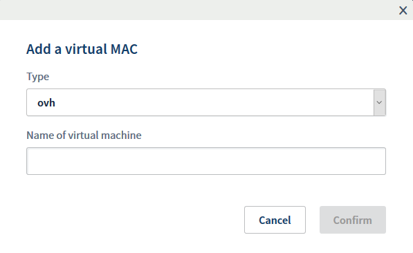

**Ultimo aggiornamento: 29/11/2018**

## Obiettivo

OVH ti permette di associare un indirizzo MAC virtuale a un indirizzo IP al fine di poter creare VM con una configurazione <i>bridge</i> sul tuo server.

**Questa guida ti mostra come creare un indirizzo MAC virtuale e come associarlo a un IP Failover.**

## Prerequisiti

* Possedere un [server dedicato](https://www.ovh.it/server_dedicati/){.external}
* Disporre di un [indirizzo IP Failover](https://www.ovh.it/server_dedicati/ip_failover.xml){.external} o di un blocco IP Failover (RIPE)
* Essere connesso allo [Spazio Cliente OVH](https://www.ovh.com/auth/?action=gotomanager){.external}

## Procedura

### Assegna un indirizzo MAC

Una volta connesso allo [Spazio Cliente OVH](https://www.ovh.com/auth/?action=gotomanager){.external}, accedi al menu `Dedicato`{.action} e clicca sulla sezione `IP`{.action} nella colonna a sinistra.

{.thumbnail}

Successivamente, individua il tuo indirizzo IP Failover (o il tuo blocco) nella lista, clicca sul pulsante `...`{.action} per visualizzare la lista delle opzioni e seleziona Aggiungi un MAC virtuale.

{.thumbnail}

Nella finestra di dialogo, seleziona il tipo di indirizzo dal menu a tendina, inserisci il nome della macchina virtuale e infine clicca su `Conferma`{.action}.

> [!primary]
>
> **Tipo**\: si tratta del tipo di indirizzo MAC virtuale (“VMware” per il sistema VMware ESXi e “OVH” per tutti gli altri sistemi di virtualizzazione).
>
> **Nome della macchina virtuale**\: si tratta del nome che intendi assegnare all’indirizzo MAC virtuale per poi ritrovare più facilmente la coppia IP/MAC.
>

{.thumbnail}

> [!primary]
>
> Ricordati di assegnare l’indirizzo MAC virtuale creato durante la configurazione della tua macchina virtuale.
> 

### Elimina un indirizzo MAC

> [!warning]
>
> La rimozione di un indirizzo MAC è definitiva e non sarà quindi più possibile recuperarlo in seguito.
> 

Per eliminare un indirizzo MAC virtuale associato a un IP Failover, collegati al tuo [Spazio Cliente](https://www.ovh.com/auth/?action=gotomanager){.external}, accedi al menu `Dedicato`{.action} e clicca sulla sezione `IP`{.action} nella colonna a sinistra. Seleziona il server per visualizzare gli IP Failover o i blocchi IP associati.

Infine clicca sul pulsante `...`{.action} sulla destra e seleziona la voce `Elimina un MAC virtuale`{.action}.

## Per saperne di più

Contatta la nostra Community di utenti all’indirizzo <https://www.ovh.it/community/>.