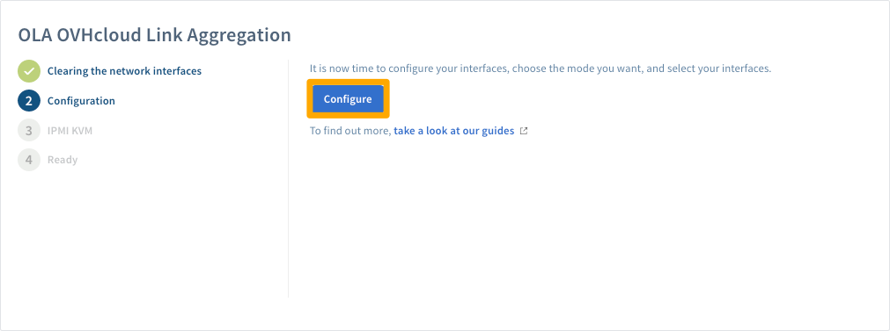
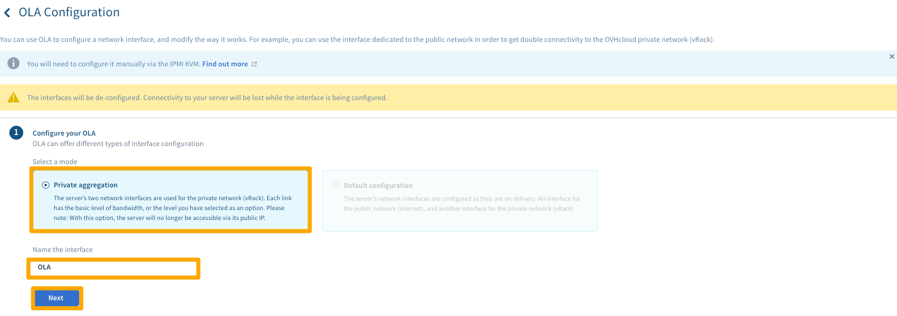

**Last updated October 24th, 2019**

## Objective

OVHcloud Link Aggregation (OLA) technology is designed by our teams to increase your server’s availability, and boost the efficiency of your network connections. In just a few clicks, you can aggregate your network cards and make your network links redundant. This means that if one link goes down, traffic is automatically redirected to another available link. In this article, we will discuss how to set up OLA in the OVHcloud Manager.

## Requirements

Make sure you have ordered OLA through the OVHcloud Manager prior to following the steps in this guide.

> [!warning]
>
> In order to make any changes to OLA, you will first need to remove any server you are working on from any vRacks to which they are currently attached and remove any attached failover IP.
>

## Instructions

To begin configuring OLA, log into the [OVHcloud Manager](https://ca.ovh.com/manager/){.external}.  Click the **Server** button at the top of the screen then select the server in question from the drop-down menu on the left-hand sidebar. Then click the **Network interfaces** tab. Once you have confirmed that the server is not attached to any vRacks, click the **I have done this, go to the next step** button. 

{.thumbnail}

On the "Configuration" step, click the **Configure** button.

{.thumbnail}

Now select the "Private aggregation" option and give your interface a name. Click the **Next** button when you have confirmed that everything is correct.

{.thumbnail}

On the following tab, check all of the interfaces you wish to aggregate on OLA and then click **Next**.

{.thumbnail}

Now review the "Configuration overview" step. When you have confirmed that all of the information is correct, click the **Create** button.

{.thumbnail}

It may take a few minutes for the operation to finish. Once it is done, the next step will be to configure the interfaces in your operating system into a NIC bond or NIC team. To learn how to do this, please check out the following articles for some of the most popular operating systems:

[How to Configure Your NIC for OVHcloud Link Aggregation in Debian 9](../ola-debian9/){.ref}

[How to Configure Your NIC for OVHcloud Link Aggregation in CentOS 7](../ola-centos7/){.ref}

[How to Configure Your NIC for OVHcloud Link Aggregation in Windows Server 2019](../ola-w2k19/){.ref}

## Conclusion

At OVHcloud, we believe in Innovation for Freedom. OLA gives our customers the freedom to use their NICs how they choose. Having read this article, you should be able to configure your server with OLA in the OVHcloud Manager. 
