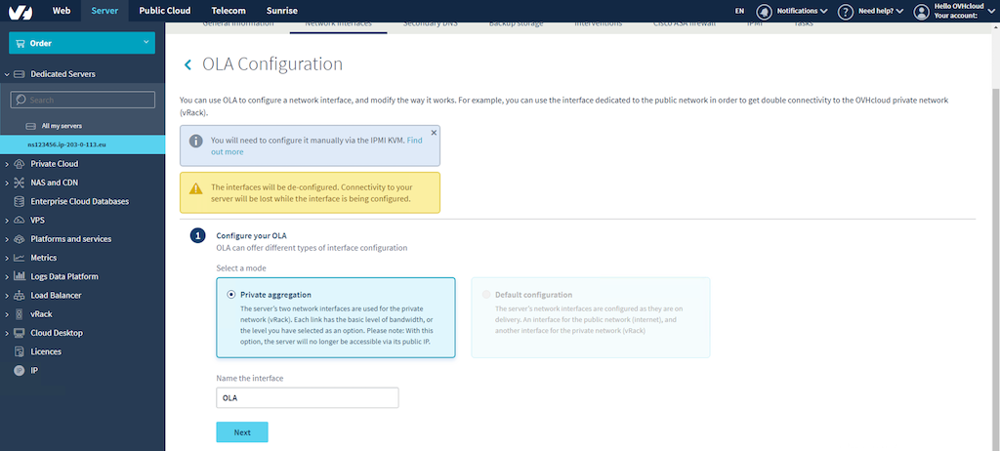
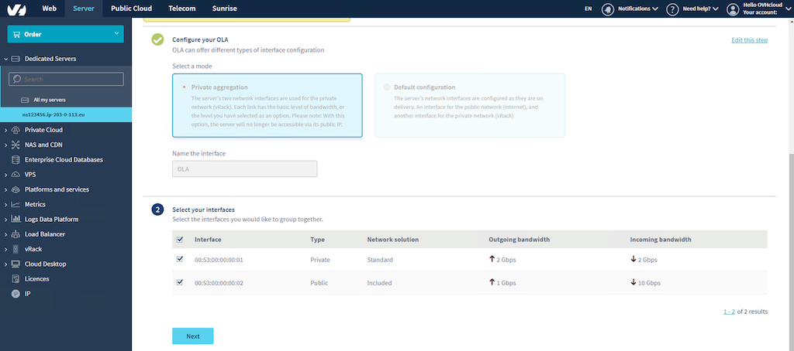
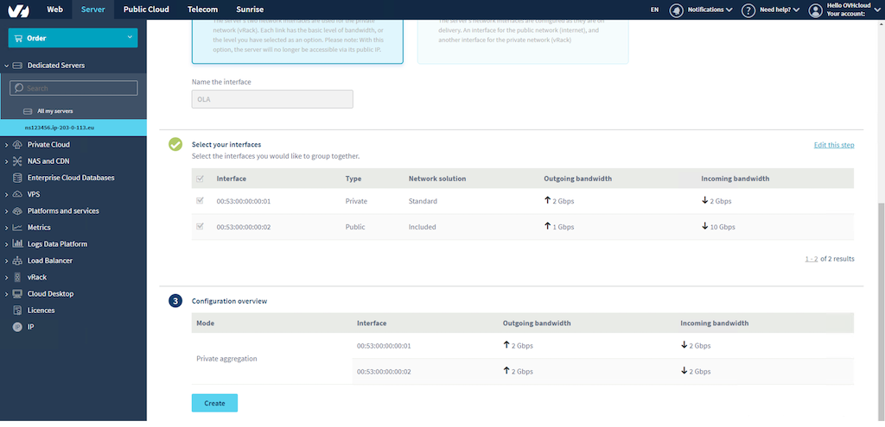

**Ultimo aggiornamento: 11/11/2019**

## Obiettivo

La tecnologia OVHcloud Link Aggregation (OLA) è stata progettata dai team OVHcloud per aumentare la disponibilità dei server e potenziare le connessioni di rete. L’attivazione dell’opzione permette di aggregare in pochi click le schede di rete e rendere i collegamenti ridondati in modo che, in caso di malfunzionamenti, il traffico venga reindirizzato automaticamente verso il collegamento disponibile.

**Questa guida ti mostra come configurare il servizio OLA nello Spazio Cliente di OVHcloud.**

## Prerequisiti

Assicurarsi di aver ordinato l’opzione OVHcloud Link Aggregation dallo Spazio Cliente

> [!warning]
>
> Per poter apportare modifiche al servizio OLA, per prima cosa è necessario rimuovere tutti i server dalle vRack a cui risultano associati ed eliminare i relativi IP Failover.
>

## Procedura

Per iniziare a configurare OLA accedi alla sezione `Server`{.action} dello [Spazio Cliente](https://www.ovh.com/manager/){.external}, seleziona il tuo server nel menu a sinistra e clicca sulla scheda `Interfacce di rete`{.action}. Una volta verificato che il server non risulti associato a nessuna vRack, clicca su `Già fatto, passo allo step successivo.`{.action} 

{.thumbnail}

Nello step `Configurazione`, clicca sul pulsante `Configurazione`{.action}.

{.thumbnail}

Seleziona l'opzione `Aggregazione privata`{.action}, assegna un nome all’interfaccia, verifica la correttezza dei dati inseriti e clicca su `Seguente`{.action}.

{.thumbnail}

Nella tab successiva, scegli le interfacce da aggregare su OLA e clicca su `Seguente`{.action}.

{.thumbnail}

Verifica le informazioni riepilogate nella sezione `Anteprima della configurazione`{.action} e. se sono corrette, clicca sul pulsante `Crea`{.action}.

{.thumbnail}

Questa operazione potrebbe richiedere qualche minuto. Lo step successivo consisterà nella configurazione delle interfacce del sistema operativo come NIC bond o NIC team. Per conoscere la procedura da seguire, consulta la nostra documentazione disponibile relativa ai sistemi operativi più diffusi:

[Configurare un NIC per il servizio OVHcloud Link Aggregation in Debian 9](https://docs.ovh.com/it/dedicated/ola-debian9/){.ref}

[Configurare un NIC per il servizio OVHcloud Link Aggregation in CentOS 7](https://docs.ovh.com/it/dedicated/ola-centos7/){.ref}

[Configurare un NIC per il servizio OVHcloud Link Aggregation in Windows Server 2019](https://docs.ovh.com/it/dedicated/ola-w2k19/){.ref}

## Conclusioni

In OVHcloud crediamo fermamente in un'innovazione per la libertà. OLA offre ai clienti la libertà di utilizzare i NIC in base alle proprie esigenze. A questo punto dovresti essere in grado di configurare il tuo server con OLA nello Spazio Cliente OVHcloud.