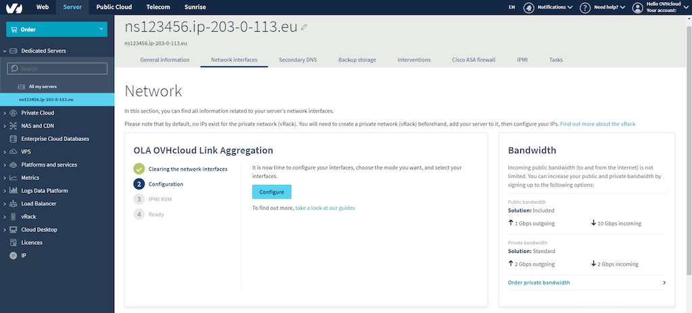

**Ostatnia aktualizacja z dnia 02-12-2019**

## Wprowadzenie

Technologia OVHcloud Link Aggregation (OLA) została przez nas zaprojektowana w celu zwiększenia dostępności serwera oraz podniesienia wydajności połączeń sieciowych. Możesz w prosty sposób przeprowadzić agregację kart sieciowych, dzięki czemu Twoje połączenia sieciowe staną się redundantne. Jeśli jedno połączenie zostanie zerwane, ruch zostanie automatycznie przekierowany do innego dostępnego łącza. Ten przewodnik wyjaśnia, jak skonfigurować OLA w Panelu klienta.

## Wymagania początkowe

Przed przystąpieniem do realizacji kroków opisanych w tym przewodniku upewnij się, że zamówiłeś OLA w Panelu klienta.

> [!warning]
>
> Aby skonfigurować OLA na serwerze, najpierw usuń serwer z sieci vRack. Usuń także podpięte do niego adresy IP Failover.
>

## W praktyce

Aby rozpocząć konfigurację OLA, zaloguj się do [Panelu klienta](https://www.ovh.com/manager/){.external}. Kliknij przycisk **Serwer** u góry ekranu, po czym wybierz serwer z rozwijanego menu na pasku bocznym po lewej stronie. Następnie kliknij zakładkę **Interfejsy sieciowe**. Po potwierdzeniu, że serwer nie jest podłączony do żadnej sieci vRack, kliknij przycisk **Wykonałem tę czynność, przechodzę dalej**. 

{.thumbnail}

W kroku "Konfiguracja" kliknij przycisk **Skonfiguruj**.

{.thumbnail}

Teraz wybierz opcję "Agregacja prywatna" i nadaj interfejsowi nazwę. Po sprawdzeniu poprawności ustawień kliknij przycisk **Dalej**.

{.thumbnail}

W następnej zakładce zaznacz wszystkie interfejsy, które chcesz zagregować w OLA, po czym kliknij przycisk **Dalej**.

{.thumbnail}

Następnie przejdź do kroku „Przegląd konfiguracji”. Po potwierdzeniu, że wszystkie informacje są poprawne, kliknij przycisk **Utwórz**.

{.thumbnail}

Zakończenie operacji może potrwać kilka minut. Kolejny krok to powiązanie interfejsów w systemie operacyjnym. Szczegółowe informacje na temat konfiguracji znajdziesz w przewodnikach:

[Konfiguracja karty sieciowej (NIC) dla OVHcloud Link Aggregation w Debianie 9](https://docs.ovh.com/pl/dedicated/ola-debian9/){.ref}

[Konfiguracja karty sieciowej (NIC) dla OVHcloud Link Aggregation CentOS 7](https://docs.ovh.com/pl/dedicated/ola-centos7/){.ref}

[Konfiguracja karty sieciowej (NIC) dla OVHcloud Link Aggregation w Windows Server 2019](https://docs.ovh.com/pl/dedicated/ola-w2k19/){.ref}

## Podsumowanie

W OVHcloud wierzymy w ideę wolności dzięki innowacji, czyli „Innovation for Freedom”. Nasi klienci zyskują dzięki OLA swobodę wykorzystania kart sieciowych w sposób najlepiej odpowiadający ich potrzebom. Po przeczytaniu tego przewodnika będziesz potrafił skonfigurować usługę OLA w Panelu klienta. 

## Sprawdź również

Przyłącz się do społeczności naszych użytkowników na stronie <https://community.ovh.com/en/>.