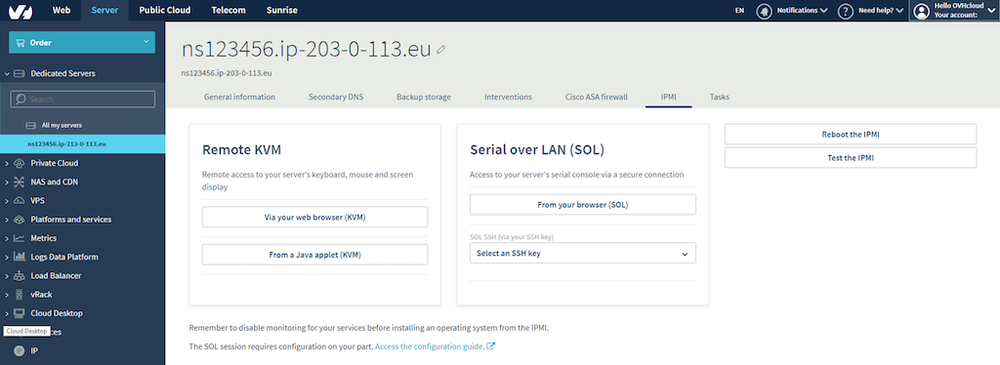
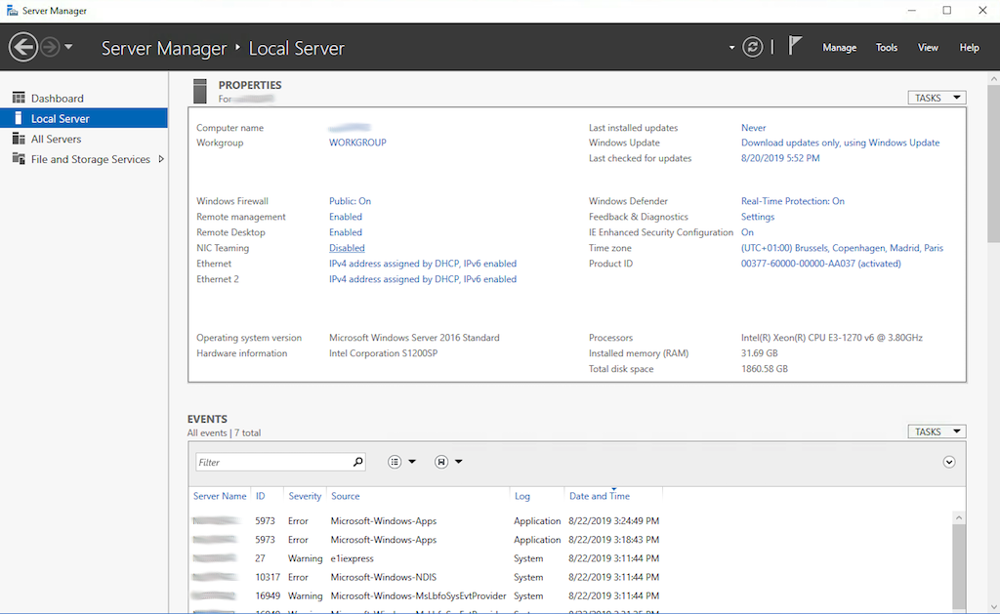
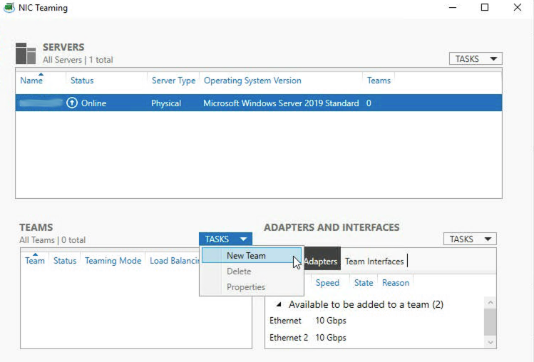
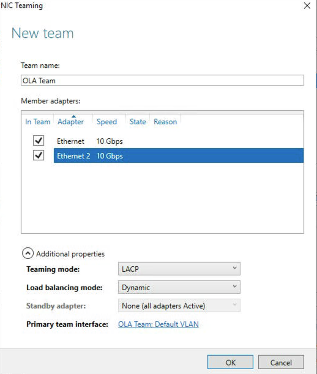
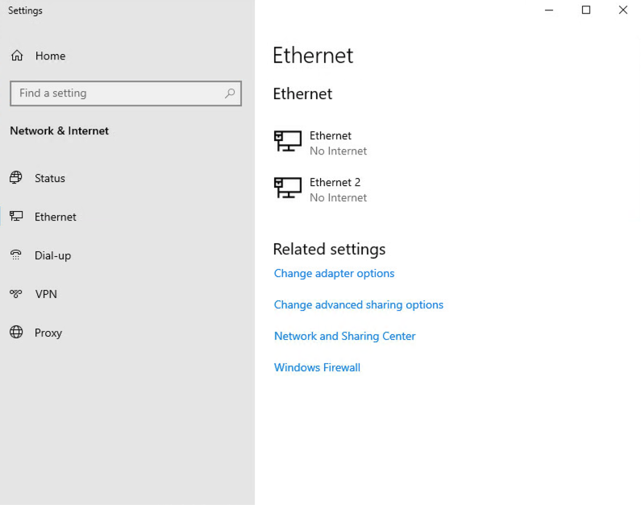
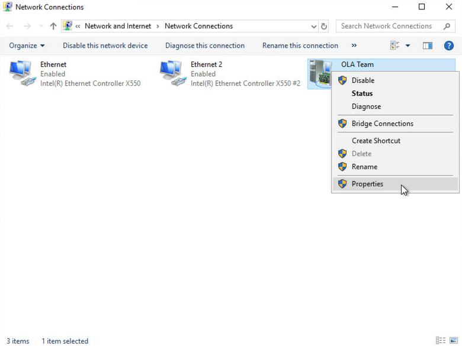
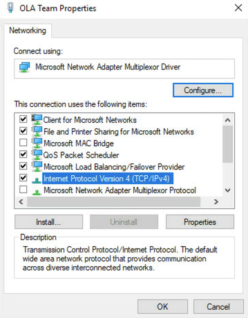

**Última atualização: 19/12/2019**

## Sumário

A tecnologia OVHcloud Link Aggregation (OLA) foi criada pelas nossas equipas para aumentar a disponibilidade do seu servidor e aumentar a eficiência das suas ligações de rede. Em apenas alguns cliques, pode agregar as suas placas de rede e tornar as suas ligações de rede redundantes. Isto significa que se uma ligação for interrompida, o tráfego é automaticamente redirecionado para outra ligação disponível. Neste manual, explicaremos como ligar as suas NIC para as utilizar para o OLA em Windows Server 2019.

## Requisitos

[Como configurar o seu ID de cliente para o OVHcloud Link Aggregation na Área de Cliente OVHcloud](https://docs.ovh.com/pt/dedicated/ola-manager){.external}

## Instruções

A configuração private-private disponível no OLA para as nossas NIC não permite aceder ao servidor em RDP. Para aceder ao mesmo, é necessário utilizar a ferramenta IPMI. Para o fazer, inicie sessão na [Área de Cliente](https://www.ovh.com/manager/){.external}.  , selecione o servidor que pretende configurar na menu à esquerda e clique no separador **IPMI.**

{.thumbnail}

Em seguida, clique no botão **A partir de applet java (KVM)**. Um programa JNLP será descarregado: Abra-o  e introduza as credenciais associadas ao servidor.

Uma vez efetuado o login, abra o Server Manager (se não abriu por predefinição, está disponível no menu Start).

{.thumbnail}

A seguir, clique no separador **Local Server** à esquerda e, a seguir, em **Disabled** junto de “NIC Teaming”.

{.thumbnail}

Na nova janela, clique em “**TASKS** na secção “TEAMS” e selecione “New Team” no menu pendente.

{.thumbnail}

Dê um nome à equipa e verifique as NIC a utilizar com o OLA. Clique na seta descendente junto de “Additional properties” e modifique o “Teaming mode” em LACP. Clique em **OK** depois de confirmar que a informação está correta.

{.thumbnail}

Poderá demorar alguns minutos até que a equipa NIC fique online. Depois de concluído, clique no ícone de ligação de rede no canto direito inferior.  A seguir, clique em **Network & Internet settings**.  Selecione **Ethernet** na barra lateral à esquerda.

{.thumbnail}

Clique no botão **Change adapter options**. 

{.thumbnail}

De seguida, clique com o botão direito do rato na equipa NIC e selecione **Properties** no menu pendente.

{.thumbnail}

Na nova janela, clique duas vezes em **Internet Protocol Version 4 (TCP/IPv4)**.

{.thumbnail}

Clique em “Use the following IP address” e adicione o IP privado e a subrede. Clique em **OK** depois de confirmar que as configurações estão corretas. 

{.thumbnail}

Para testar se a equipa NIC está a funcionar, faça um teste de ping noutro servidor da mesma rede vRack.  Se funcionar, está tudo pronto. Caso contrário, volte a verificar as suas configurações ou tente reiniciar o servidor.

## Conclusão

A OVHcloud oferece aos seus clientes a liberdade e a flexibilidade para impulsionar o seu hardware da maneira que melhor se adapta às suas necessidades. Depois de ler este manual, deverá poder configurar o OVHcloud Link Aggregation (OLA) no seu sistema Windows Server 2019 e utilizar as NIC (Network Interface Controller) como interfaces privadas ligadas. 
