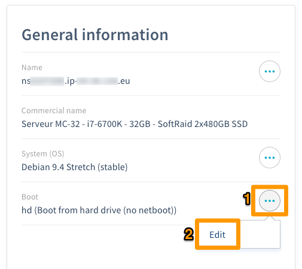

**Stand 22.08.2018**

## Einleitung

Der Rescue-Modus ist ein Tool Ihres dedizierten Servers, mit dem Sie diesen auf einem temporären Betriebssystem starten können, um Probleme zu diagnostizieren und zu beheben.

**Hier erfahren Sie, wie Sie den Rescue-Modus für einen dedizierten Server aktivieren und verwenden.**

<iframe width="560" height="315" src="https://www.youtube.com/embed/UdMZSgXATFU?rel=0" frameborder="0" allow="autoplay; encrypted-media" allowfullscreen></iframe>

## Voraussetzungen

- Sie haben SSH-Zugriff (Root-Zugriff) auf Ihren [Dedicated Server](https://www.ovh.de/dedicated_server/){.external}.


## Beschreibung

Um den Rescue-Modus zu aktivieren, loggen Sie sich zunächst in Ihrem [OVH Kundencenter](https://www.ovh.com/auth/?action=gotomanager/){.external} ein. Wählen Sie Ihren Server im Bereich `Dedicated`{.action} unter `Dedicated Server`{.action}. Gehen Sie anschließend auf `Serverstatus`{.action} (auch: „Zustand des Servers") > `Allgemeine Informationen`{.action} > `...`{.action} und klicken Sie auf den Button `Ändern`{.action}, um den Startmodus zu ändern.

{.thumbnail}

Wählen Sie im angezeigten Fenster `Im Rescue-Modus booten`{.action}. Wenn Ihr Server über ein Linux-Betriebssystem verfügt, wählen Sie `rescue64-pro`{.action} im Drop-down-Menü aus. Wenn Sie einen Server mit Windows verwenden, wählen Sie `WinRescue`{.action}. Um den Vorgang abzuschließen, geben Sie Ihre E-Mail-Adresse im Textfeld ein und klicken Sie dann auf `Weiter`{.action}.

{.thumbnail}

Bestätigen Sie im nächsten Fenster die von Ihnen gewählten Optionen und starten Sie Ihren Server neu, um die Änderungen anzuwenden. 

{.thumbnail}

Ihr Server wird jetzt im Rescue-Modus neu gestartet. Sie erhalten anschließend die Login-Daten an die von Ihnen angegebene E-Mail-Adresse. Um den Rescue-Modus zu beenden, ändern Sie einfach den Startmodus zu `Von Festplatte booten`{.action} und starten Sie Ihren Server erneut.

### Linux

#### Das Webinterface verwenden

Nachdem Sie den Server neu gestartet haben, erhalten Sie eine E-Mail mit den Login-Daten für den Rescue-Modus. Die E-Mail enthält außerdem einen Link zum Webinterface des Rescue-Modus, über das Sie folgende Tests ausführen können:

- Festplatten: überprüft die Integrität der Laufwerke mit SMART-Tests.
- Prozessoren: überprüft, ob die Prozessoren korrekt funktionieren.
- Partitionen (Status): überprüft den Laufwerkstatus.
- Partitionen (Dateisystem): überprüft das Dateisystem.
- Partitionen (Explore): startet einen Browser zum Durchsuchen der Dateien. Sie können die Dateien mit diesem Tool nicht bearbeiten, aber Sie können ein Backup erstellen.
- Memory: überprüft den installierten RAM.

{.thumbnail}


#### SSH verwenden (Kommandozeile)

> [!primary]
> 
> Falls Sie einen SSH-Schlüssel (in Ihrem OVH Kundencenter hinzugefügt) verwenden, wird Ihnen kein Passwort zugesandt. Sobald Ihr Server im Rescue-Modus neu gestartet ist, können Sie sich direkt mit Ihrem SSH-Schlüssel verbinden.
>

Nachdem Sie den Server neu gestartet haben, erhalten Sie eine E-Mail mit den Login-Daten für den Rescue-Modus. Verbinden Sie sich mit den üblichen Befehlen mit Ihrem Server, verwenden Sie dabei jedoch das Root-Passwort für den Rescue-Modus anstelle Ihres Passworts.

Zum Beispiel:

```sh
ssh root@IP_ihres_servers
Password: passworts_ihres_servers
```

Für die meisten Änderungen Ihres Servers im Rescue-Modus via SSH muss eine Partition gemountet werden. Denn dieser Modus nutzt sein eigenes temporäres Dateisystem. Folglich gehen alle im Rescue-Modus vorgenommenen Änderungen am Dateisystem beim Neustart des Servers im normalen Modus verloren.

Partitionen werden mit dem SSH-Befehl `mount` gemountet. Zunächst müssen jedoch Ihre Partitionen aufgelistet werden, um den Namen derjenigen Partition zu ermitteln, die Sie mounten möchten. Im Folgenden finden Sie einige Codebeispiele, an denen Sie sich orientieren können.

```sh
rescue:~# fdisk -l

Disk /dev/hda 40.0 GB, 40020664320 bytes
255 heads, 63 sectors/track, 4865 cylinders, total 41943040 sectors
Units = cylinders of 16065 * 512 = 8225280 bytes

Device Boot Start End Blocks Id System
/dev/hda1 * 1 1305 10482381 83 Linux
/dev/hda2 1306 4800 28073587+ 83 Linux
/dev/hda3 4801 4865 522112+ 82 Linux swap / Solaris

Disk /dev/sda 8254 MB, 8254390272 bytes
16 heads, 32 sectors/track, 31488 cylinders, total 41943040 sectors
Units = cylinders of 512 * 512 = 262144 bytes

Device Boot Start End Blocks Id System
/dev/sda1 1 31488 8060912 c W95 FAT32 (LBA)
```

Wenn Sie den Namen der gewünschten Partition ermittelt haben, verwenden Sie den folgenden Befehl:

```sh
rescue:~# mount /dev/hda1 /mnt/
```

> [!primary]
>
> Ihre Partition wird nun gemountet. Sie können jetzt Operationen auf Ihrem Dateisystem vornehmen.
> 
> Wenn Ihr Server über eine Software-RAID-Konfiguration verfügt, muss Ihr RAID-Laufwerk gemountet werden (in der Regel `/dev/mdX/`).
>


### Windows

#### Auf WinRescue zugreifen

Nachdem Sie den Server neu gestartet haben, erhalten Sie eine E-Mail mit den Login-Daten für den Rescue-Modus. Um diese zu verwenden, laden Sie entweder eine VNC-Konsole herunter und installieren diese, oder verwenden Sie das `IPMI`-Modul in Ihrem [OVH Kundencenter](https://www.ovh.com/auth/?action=gotomanager/){.external}.

{.thumbnail}

#### WinRescue-Tools

|Tools|Beschreibung|
|---|---|
|Freecommander|Ein Dateimanager mit allen notwendigen Standardfunktionen.|
|NTPWdi|Ein benutzerfreundlicher Passwort-Manager. Mit diesem Tool können Sie die Passwörter der Benutzerkonten Ihres Servers reaktivieren oder bearbeiten. Es ist besonders nützlich beim Verlust von Login-Daten sowie für die Reaktivierung eines Sicherheitskontos.|
|FileZilla|Ein Open-Source-FTP-Client. Er unterstützt SSH- und SSL-Protokolle und verfügt über ein intuitives Drag-and-Drop-Interface. FileZilla kann für den Transfer von Daten auf einen FTP-Server verwendet werden, wie beispielsweise beim für die meisten OVH Server verfügbaren FTP-Backup.|
|7-ZIP|Ein Datenkomprimierungs- und Datenarchivierungstool, das die folgenden Formate liest: ARJ, CAB, CHM, CPIO, CramFS, DEB, DMG, FAT, HFS, ISO, LZH, LZMA, MBR, MSI, NSIS, NTFS, RAR, RPM, SquashFS, UDF, VHD, WIM, XAR und Z. Außerdem können Sie mit diesem Tool Ihre eigenen Archive in den folgenden Formaten anlegen : BZIP2, GZIP, TAR, WIM, XZ, Z und ZIP.|
|Avast Virus Cleaner|Eine Antivirus-Anwendung mit Datenscan- und Datenbereinigungsfunktionen.|
|ActivNIC|Ein Tool, mit dem Sie eine deaktivierte Netzwerk-Interface-Karte wieder aktivieren können.|
|SRVFirewall|Ein Skript, das die Firewall Ihres Servers aktiviert oder deaktiviert.|
|SysInternal|Eine Software-Suite von Microsoft mit zahlreichen Tools für Netzwerkwartung und Prozessverwaltung.|
|Virtual Clone Drive|Ein Tool zum Mounten von BIN-, CCD- und ISO-Dateien in einem virtuellen CD-Laufwerk.|
|Firefox|Ein Webbrowser.|
|Testdisk|Eine leistungsstarke Anwendung zur Datenwiederherstellung. Mit diesem Tool können Sie beschädigte Partitionen wiederherstellen und bearbeiten, verlorene Partitionen wiederfinden, einen Bootsektor reparieren oder sogar einen fehlerhaften MBR rekonstruieren.|

## Weiterführende Informationen

Für den Austausch mit unserer User Community gehen Sie auf <https://community.ovh.com/en/>.
