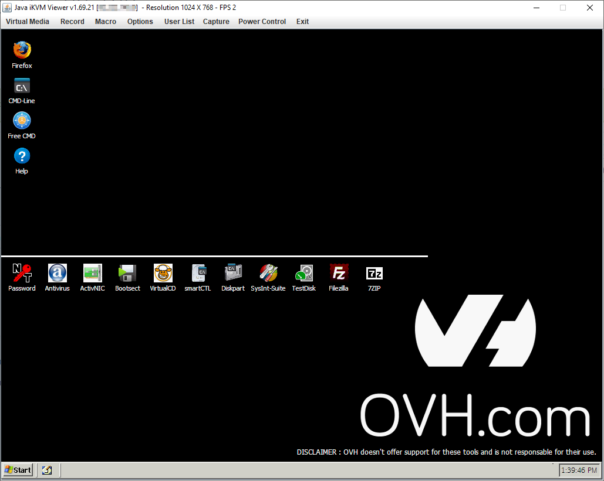

**Päivitetty 24.8.2018**

## Tavoite

Rescue-tila on yksi dedikoidun palvelimesi työkaluista. Sen avulla palvelin voidaan käynnistää tilapäisessä käyttöjärjestelmässä vianhakua ja ongelmien ratkaisua varten.

**Tässä ohjeessa kerrotaan, kuinka voit aktivoida ja käyttää palvelimesi rescue-tilaa.**

<iframe width="560" height="315" src="https://www.youtube.com/embed/UdMZSgXATFU" frameborder="0" allow="autoplay; encrypted-media" allowfullscreen></iframe>

## Edellytykset

- SSH-yhteys (pääkäyttäjä) [dedikoituun palvelimeesi](https://www.ovh-hosting.fi/dedikoidut_palvelimet/){.external}.


## Käytännössä

Voit aktivoida rescue-tilan kirjautumalla [hallintapaneeliisi](https://www.ovh.com/auth/?action=gotomanager/){.external}. Valitse dedikoitu palvelimesi osiosta `Dedikoidut`{.action} ja sitten kohdasta `Dedikoidut palvelimet`{.action}. Mene tämän jälkeen kohtaan `Palvelimen tila`{.action} > `Yleiset tiedot`{.action} > `...`{.action} ja klikkaa painiketta `Muokkaa`{.action} käynnistystilan vaihtamiseksi.

{.thumbnail}

Valitse seuraavalla näytöllä `Uudelleenkäynnistä rescue-tilassa`{.action}. Jos palvelimellasi on Linux-käyttöjärjestelmä, valitse alasvetovalikosta `rescue64-pro`{.action}. Jos sinulla on Windows-palvelin, valitse `WinRescue`{.action}. Syötä lopuksi sähköpostiosoitteesi tekstikenttään ja klikkaa `Seuraava`{.action}.

{.thumbnail}

Vahvista lisävalinnat seuraavassa näkymässä ja käynnistä sitten palvelimesi uudelleen muokkausten soveltamiseksi. 

{.thumbnail}

Palvelimesi uudelleenkäynnistyy nyt rescue-tilassa, minkä jälkeen saat antamaasi sähköpostiosoitteeseen tunnistautumistiedot kirjautumista varten. Rescue-tilasta poistuaksesi vaihda vain käynnistystilaksi `Uudelleenkäynnistä kovalevyllä`{.action} ja käynnistä palvelimesi sitten uudelleen.

### Linux

#### Verkkokäyttöliittymän käyttö

Palvelimen uudelleenkäynnistyksen jälkeen saat sähköpostiviestin, jossa on rescue-tilan kirjautumistietosi. Se sisältää lisäksi linkin rescue-tilan verkkokäyttöliittymään, jossa voit tehdä seuraavia testejä:

- kovalevyt: niiden eheyden tarkistus SMART-testeillä
- suorittimet: normaalin toiminnan tarkistaminen
- levyosiot (tila): lukijoiden tilan tarkistus
- levyosiot (tiedostojärjestelmä): palvelimen tiedostojärjestelmän tarkistus
- levyosiot (explore): selaimen käynnistys tiedostojen selaamiseksi. Niitä ei voida muokata tällä työkalulla, mutta voit tehdä niistä varmuuskopion.
- muisti: asennetun RAM-muistin tarkistus

{.thumbnail}

#### SSH:n käyttö (komentorivit)


>
> 
> Mikäli käytät SSH-avainta (lisättynä myös hallintapaneelissasi), ei mitään salasanaa lähetetä. Kun palvelin on rescue-tilassa, voit kirjautua suoraan SSH-avaimellasi.
>

Palvelimen uudelleenkäynnistyksen jälkeen saat sähköpostiviestin, jossa on rescue-tilan kirjautumistietosi. Sinun on nyt kirjauduttava palvelimellesi tavanomaisten komentojen avulla, mutta käyttäen rescue-tilan pääkäyttäjän salasanaa omasi sijasta.

Esimerkiksi:

```sh
ssh root@palvelimesi_IP
root@palvelimesi_salasana:
```

Suurin osa rescue-tilassa SSH-yhteyden kautta tehdyistä muutoksista edellyttää levyosion alustusta. Tällä tilalla onkin oma tilapäinen tiedostojärjestelmänsä. Tästä johtuen rescue-tilan tiedostojärjestelmään tehdyt muutokset menetetään, kun palvelin käynnistetään uudelleen normaalitilaan.

Levyosioiden alustus toteutetaan komennon `mount` avulla SSH-yhteydellä. Levyosiot on listattava etukäteen, jotta voit hakea alustettavan levyosion nimen. Voit käyttää apuna seuraavia koodiesimerkkejä:

```sh
rescue:~# fdisk -l

Disk /dev/hda 40.0 GB, 40020664320 bytes
255 heads, 63 sectors/track, 4865 cylinders
Units = cylinders of 16065 * 512 = 8225280 bytes

Device Boot Start End Blocks Id System
/dev/hda1 * 1 1305 10482381 83 Linux
/dev/hda2 1306 4800 28073587+ 83 Linux
/dev/hda3 4801 4865 522112+ 82 Linux swap / Solaris

Disk /dev/sda 8254 MB, 8254390272 bytes
16 heads, 32 sectors/track, 31488 cylinders
Units = cylinders of 512 * 512 = 262144 bytes

Device Boot Start End Blocks Id System
/dev/sda1 1 31488 8060912 c W95 FAT32 (LBA)
```

Kun olet tunnistanut alustettavan levyosion nimen, käytä alla olevaa komentoa:

```sh
rescue:~# mount /dev/hda1 /mnt/
```

> 
>
> Levyosiosi alustetaan nyt. Voit sitten toteuttaa toimenpiteitä tiedostojärjestelmässä.
> 
> Jos palvelimellasi on ohjelmistopohjainen RAID-konfigurointi, sinun on alustettava RAID-volyymisi (yleensä `/dev/mdX`).
>


### Windows

#### Kirjautuminen WinRescueen

Palvelimen uudelleenkäynnistyksen jälkeen saat sähköpostiviestin, jossa on rescue-tilan kirjautumistietosi. Tunnusten käyttämiseksi sinun on ladattava ja asennettava VNC-konsoli tai käytettävä `IPMI`-moduulia [hallintapaneelissa](https://www.ovh.com/auth/?action=gotomanager/){.external}.

{.thumbnail}

#### WinRescue-työkalu

|Työkalu|Kuvaus|
|---|---|
|Freecommander|Tiedostojenhallintaohjelma kaikilla tarvitsemillasi perusominaisuuksilla.|
|NTPWdi|Helppokäyttöinen salasananhallintaohjelmisto. Sen avulla voit uudelleenaktivoida tai muokata palvelimesi käyttäjätilien salasanoja. Tämä työkalu on käytännöllinen tietojen menetysten sattuessa tai turvallisuustilin uudelleen aktivoinnissa.|
|FileZilla|Avoimen lähdekoodin FTP-asiakasohjelma. Se huolehtii SSH- ja SSL-protokollista ja sillä on selkeä ja intuitiivinen raahaa-pudota-käyttöliittymä. Sitä voidaan käyttää tiedostonsiirtoon FTP-palvelimille, kuten FTP-varmuuskopiossa, joka toimitetaan useimpien OVH:n palvelinmallien mukana.|
|7-ZIP|Tiedostojen pakkaus- ja arkistointityökalu, joka lukee seuraavia formaatteja: ARJ, CAB, CHM, CPIO, CramFS, DEB, DMG, FAT, HFS, ISO, LZH, LZMA, MBR, MSI, NSIS, NTFS, RAR, RPM, SquashFS, UDF, VHD, WIM, XAR ja Z. Lisäksi sillä voidaan luoda omia arkistoja seuraavissa formaateissa: BZIP2, GZIP, TAR, WIM, XZ, Z ja ZIP.|
|Avast Virus Cleaner|Virustorjuntasovellus tiedostojen skannaus- ja puhdistusominaisuuksilla.|
|ActivNIC|Työkalu käytöstä poistetun verkkokortin uudelleen aktivointiin.|
|SRVFirewall|Skripti, jolla voidaan aktivoida tai poistaa käytöstä palvelimesi palomuuri.|
|SysInternal|Microsoftin ohjelmistopaketti, joka sisältää useita työkaluja verkon ylläpitoon tai prosessien hallintaan.|
|Virtual Clone Drive|Työkalu, jolla voidaan alustaa BIN-, CCD- ja ISO-tiedostoja virtuaalisella CD-asemalla.|
|Firefox|Verkkoselain.|
|Testdisk|Tehokas tiedostojen hakusovellus. Sen avulla voidaan hakea ja muokata vioittuneita levyosioita, löytää kadonneita levyosioita, korjata uudelleenkäynnistysalue ja jopa rakentaa uudelleen vaurioitunut MBR.|

## Lue lisää aiheesta

Viesti käyttäjäyhteisömme kanssa osoitteessa <https://community.ovh.com/en/>.