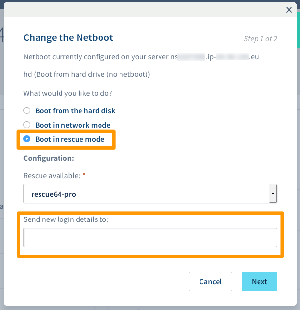
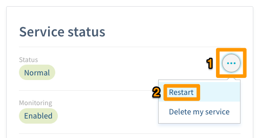

**Ultimo aggiornamento: 28/11/2018**

## Obiettivo

La modalità Rescue è una funzione che consente di avviare il tuo server dedicato su un sistema operativo temporaneo, permettendoti di diagnosticare e risolvere eventuali problemi. 

**Questa guida ti mostra la procedura per attivare e utilizzare il Rescue mode sul tuo server.**

<iframe width="560" height="315" src="https://www.youtube.com/embed/UdMZSgXATFU?rel=0" frameborder="0" allow="autoplay; encrypted-media" allowfullscreen></iframe>

## Prerequisiti

- Avere accesso in SSH (root) al [server dedicato](https://www.ovh.it/server_dedicati/){.external}


## Procedura

Per attivare la modalità Rescue accedi allo [Spazio Cliente OVH](https://www.ovh.com/auth/?action=gotomanager/){.external}, clicca su `Dedicato`{.action} > `Server Dedicati`{.action} e seleziona il tuo server.  Nel riquadro `Informazioni generali`{.action} della scheda `Stato del server`{.action}, clicca su ` ...`{.action} in corrispondenza della categoria <i>Boot </i>e poi sul pulsante `Modifica`{.action} per cambiare la modalità di avvio.

{.thumbnail}

Nella finestra successiva, seleziona `Avviare in Rescue mode`{.action}. Se il tuo server utilizza un sistema operativo Linux, seleziona `rescue64-pro`{.action} nel menu a tendina. Per un server Windows, seleziona invece `WinRescue`{.action}. Per completare l’operazione inserisci il tuo indirizzo email nell’area di testo e clicca su `Seguente`{.action}.

{.thumbnail}

Conferma le opzioni nella schermata successiva e riavvia il server per applicare le modifiche. 

{.thumbnail}

A operazione completata riceverai all’indirizzo fornito un’email con le credenziali di accesso. Per uscire dalla modalità Rescue è sufficiente modificare la modalità di avvio in `Avviare da hard disk`{.action} e riavviare nuovamente il server. 

### Linux

#### Da interfaccia Web

Dopo il riavvio del server riceverai un’email con le credenziali di accesso e un link all’interfaccia Web della modalità Rescue, da cui sarà possibile eseguire questi test: 

- **Hard drives**: permette di verificare l’integrità dei dischi con test SMART
- **Processors**: verifica il corretto funzionamento dei processori
- **Partitions (State)**: effettua un controllo dello stato dei dischi
- **Partitions (File System)**: effettua un controllo del file system del server 
- **Partitions (Explore)**: avvio di un browser per esplorare i file. Questo tool non consente di modificare i file ma permette, ad esempio, di eseguirne un backup
- **Memory**: effettua un controllo della RAM installata

{.thumbnail}

#### Con SSH (righe di comando)


> [!primary]
> 
> L’utilizzo di una chiave SSH (attiva anche nella relativa sezione dello Spazio Cliente OVH) non prevede l’invio di alcuna password. Una volta abilitata la modalità Rescue, è possibile accedere al server direttamente con la chiave.
>

Dopo il riavvio del server riceverai un’email con le credenziali per accedere in Rescue mode. La connessione al server dovrà quindi avvenire tramite le righe di comando utilizzate abitualmente, inserendo la password di root del Rescue mode al posto di quella personale.

Per esempio:

```sh
ssh root@IP_del_tuo_server
root@IP_della_password_del_tuo_server
```

Con il Rescue mode attivo, la maggior parte delle azioni eseguite sul server via SSH richiedono il mount di una partizione: questa modalità possiede infatti il proprio file system temporaneo e, di conseguenza, le modifiche apportate vengono perse con il reboot della macchina sul disco principale.

Per montare la partizione in SSH è sufficiente utilizzare il comando `mount`, dopo aver recuperato la lista delle partizioni per individuare quella che vuoi montare.  Ecco alcuni esempi di codice: 

```sh
rescue:# fdisk -l

Disk /dev/hda 40.0 GB, 40020664320 bytes
255 heads, 63 sectors/track, 4865 cylinders
Units = cylinders of 16065 *512 = 8225280 bytes

Device Boot Start End Blocks Id System
/dev/hda1 * 1 1305 10482381 83 Linux
/dev/hda2 1306 4800 28073587+ 83 Linux
/dev/hda3 4801 4865 522112+ 82 Linux swap / Solaris

Disk/dev/sda 8254 MB, 8254390272 bytes
16 heads, 32 sectors/track, 31488 cylinders
Units = cylinders of 512 *512 = 262144 bytes

Device Boot Start End Blocks Id System
/dev/sda1 1 31488 8060912 c W95 FAT32 (LBA)
```

Una volta identificato il nome della partizione da montare, esegui il comando:

```sh
rescue:~# mount /dev/hda1 /mnt/
```

> [!primary]
>
> La tua partizione verrà montata e, da questo momento, sarà possibile effettuare operazioni sul file system.  
> 
> Se il tuo server dispone di una configurazione RAID software, è necessario montare il volume RAID (in genere `/dev/mdX`).
>


### Windows

#### Accedi a WinRescue

Dopo il riavvio del server riceverai un’email con le credenziali per accedere in Rescue mode. Per utilizzarle è necessario scaricare e installare una console VNC o usare il modulo `IPMI` disponibile nel tuo [Spazio Cliente OVH](https://www.ovh.com/auth/?action=gotomanager/){.external}.

{.thumbnail}

#### Tool WinRescue

|Tool|Descrizione|
|---|---|
|Freecommander|File manager con tutte le funzionalità standard di cui hai bisogno.|
|NTPWdi|Gestore di password semplice da utilizzare, che permette di riattivare un account o modificarne le password.  Questo strumento è utile in caso di perdita degli identificativi o per riattivare un account di sicurezza.|
|FileZilla|Client FTP open source che supporta i protocolli SSH e SSL e le operazioni <i>drag and drop</i> (copia/trascina).   Grazie a un’interfaccia chiara e intuitiva permette di trasferire i tuoi dati verso un server FTP, come lo spazio backup FTP incluso con la maggior parte delle gamme di server OVH.|
|7-ZIP|Software per la compressione e archiviazione di file e cartelle, che legge questi formati: ARJ, CAB, CHM, CPIO, CramFS, DEB, DMG, FAT, HFS, ISO, LZH, LZMA, MBR, MSI, NSIS, NTFS, RAR, RPM, SquashFS, UDF, VHD, WIM, XAR e Z. Con 7-ZIP è inoltre possibile creare archivi nei formati BZIP2, GZIP, TAR, WIM, XZ, Z e ZIP.|
|Avast Virus Cleaner|Applicazione antivirus che permette di eseguire la scansione e pulizia dei file.|
|ActivNIC|Tool che consente di riattivare una scheda di rete disabilitata sul server.|
|SRVFirewall|Script che attiva o disattiva il firewall sul tuo server.|
|SysInternal|Suite Microsoft composta da diversi strumenti per la manutenzione della rete e la gestione dei processi.|
|Virtual Clone Drive|Lettore virtuale che consente di montare file BIN, CCD e ISO su un lettore CD virtuale.|
|Firefox|Browser Web.|
|Testdisk|Software di recupero dati. Permette di recuperare e modificare partizioni corrotte, ritrovare partizioni scomparse, riparare un settore di boot e ricostruire un MBR difettoso.|

## Per saperne di più

Contatta la nostra Community di utenti all’indirizzo <https://www.ovh.it/community/>.
