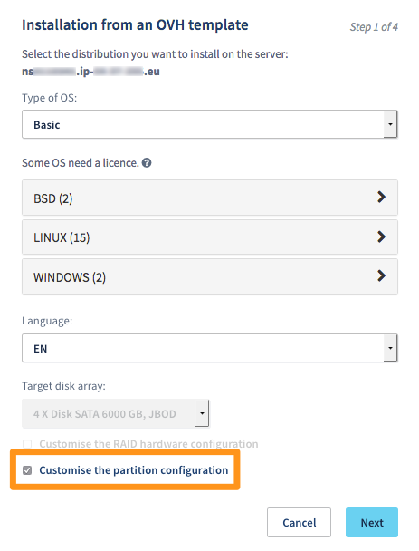

## Esittely 

Sähköiset tietosi ovat arkaluontoisia ja niinpä niiden menettäminen tai muuttaminen voi johtaa nopeasti liiketoimintasi kannalta ongelmallisiin tilanteisiin. Koska nollariskiä ei ole olemassa, on suositeltua toteuttaa varmuuskopiointi päivittäin ja mieluiten tuotantoinfrastruktuureistasi erillisellä palvelimella tai storage-ratkaisulla.

OVH tarjoaa tallennusoperaatioihin sopivan sarjan [dedikoituja palvelimia](https://www.ovh-hosting.fi/dedikoidut_palvelimet/storage/){.external}, jotka on varustettu vähintään neljällä kovalevyllä. Näitä resursseja voidaan käyttää OVH:lla tai julkisen verkon kautta toisella palveluntarjoajalla ylläpidetyn infrastruktuurin varmuuskopioimiseen.

Tässä ohjeessa kerrotaan, kuinka konfiguroit OVH:n storage-palvelimen vastaamaan tarpeisiisi, luot varmuuskopioiden jaottelurakenteita ja automatisoit kahden etäpalvelimen tietojen varmuuskopioinnin SCP-protokollan kautta.


## Edellytykset

### Mitä tietoja tarvitset

- Linuxin administraattorin tunnukset.
- Tiedät, miten kirjaudutaan SSH-yhteydellä. 
- Tiedät, miten kirjaudutaan tietokantaan. 
- Tiedät, kuinka tietokantasi varmuuskopioidaan.
- Osaat asentaa distribuution (käytämme tässä Debian 9.4 -distribuutiota).

### Mitä muuta tarvitset

- OVH:n [Storage-palvelimen](https://www.ovh-hosting.fi/dedikoidut_palvelimet/storage/){.external}.
- Tuotantoinfrastruktuurin ([VPS](https://www.ovh-hosting.fi/vps/){.external}, [dedikoidut palvelimet](https://www.ovh-hosting.fi/dedikoidut_palvelimet/){.external}, [Public Cloud](https://www.ovh-hosting.fi/public-cloud/instances/){.external}...).
- Storage-palvelimen ja tuotantoinfrastruktuurin väliin konfiguroidun SSH-yhteyden.
- Suositeltu: yksityinen virtuaaliverkko palvelintesi välillä ([OVH:n virtuaaliräkki](https://www.ovh-hosting.fi/ratkaisut/vrack/){.external}).


## Käytännössä

### 1\. vaihe: Valitse sopiva RAID-malli

OVH:lla on [storage-palvelinten](https://www.ovh-hosting.fi/dedikoidut_palvelimet/storage/){.external} sarja, jonka materiaaliset konfiguraatiot sisältävät useita kovalevyjä. Tässä esimerkissä käytetään ohjelmistopohjaista RAIDia (tai _soft RAID_) neljällä levyllä, joiden kunkin kapasiteetti on 6 TB.

OVH:lla voit valita tallennustilan konfiguraation, vaihtoehtoina on RAID-ohjaimet 0, 1, 5, 6 ja 10. Jokaisella tyypillä on omat suorituskykyyn ja häiriönsietokykyyn liittyvät etunsa ja haittansa. Näin ollen neljällä levyllä voidaan varastoida tietoja tehokkaasti RAID-ohjaimilla 5, 6 tai 10 (RAID 0 ja 1 eivät ole tässä tarkoituksenmukaisia).

Tässä joitakin selityksiä RAID-ohjainten tyypeistä.

#### RAID 5

Tämä tila jakaa tietosi vähintään kolmelle kovalevylle. Neljättä se käyttää tietojesi rekonstruoinnissa levyn vioittumistapauksissa tallentaen sinne pariteettitietoja. Sinulla on siis vikasietoisuus yhdellä levyllä. Suorituskyky paranee lukutilassa, mutta ei kirjoituksessa (pariteettibitistä johtuen).

Tässä esimerkissä volyymin kapasiteetti on 18 TB.

#### RAID 6

Kyseessä on RAID 5 -ohjaimen paranneltu versio, joka edellyttää vähintään neljää kovalevyä. Pariteettitiedot kirjoitetaan kahdelle levylle yhden ainoan sijasta, mikä varmistaa paremman redundanssin (kahden levyn vikasietoisuus). Lisäksi luku- ja kirjoitusnopeus kasvaa.

Tässä esimerkissä volyymin kapasiteetti on 12 TB.

#### RAID 10

Tämä tyyppi on kahden prosessin yhdistelmä. Ensimmäinen “hajottaa” tietosi ja varastoi ne kahdelle levylle, mikä parantaa suorituskykyä, sillä näitä molempia voidaan käyttää samanaikaisesti. Toinen kahdentaa eli “peilaa” tiedot kahdelle levylle. Sinulla on siis vikasietoisuus kahdella saman klusterin levyllä.

Tässä esimerkissä volyymin kapasiteetti on 12 TB.

Ei ole olemassa kaikista parasta RAIDia, vaan kaikki vastaavat erilaisiin tarpeisiin. Esimerkissämme haluamme mahdollisimman hyvän levyjen vikasietoisuuden sekä säilyttää vahvan luku- ja kirjoitussuorituskyvyn. Valitsemme siis asennettavaksi RAID 6 -ohjaimen.


### 2\. vaihe: Asenna ja konfiguroi palvelin

Mene [hallintapaneeliisi](https://www.ovh.com/auth/?action=gotomanager){.external} ja asenna palvelin. Kuten alussa kerrottiin käytämme tässä Debian 9.4 -versiota. Lisätietoa voit katsoa ohjeesta [Dedikoidun palvelimen käytön aloitus](https://docs.ovh.com/fi/dedicated/dedikoidun-palvelimen-kayton-aloitus/#dedikoidun-palvelimen-asennus-tai-uudelleenasennus_1){.external}.

Kun olet valinnut asennettavan järjestelmän, rastita ruutu `Osioiden konfiguraation kustomointi`{.action}.

{.thumbnail}

Tässä vaiheessa muokkaat `/home`-hakemiston (1) RAID tyyppiä ja halutessasi suljet levyosion (2).

{.thumbnail}

> [!primary]
> 
> `/boot`-hakemiston RAID-tasoa ei voida muokata.
> 

### 3\. vaihe: Luo kohdehakemistoja

Varmuuskopioiden selkeää säilytystä varten luomme kohdehakemistoja. Kirjaudu SSH-yhteydellä dedikoituun palvelimeesi ja katso levyosio:

```sh
df -h

Filesystem      Size    Used Avail Use% Mounted on
udev            7,8G       0  7,8G   0% /dev
tmpfs           1,6G     51M  1,6G   4% /run
/dev/md3         20G    740M   18G   4% /
tmpfs           7,9G       0  7,9G   0% /dev/shm
tmpfs           5,0M       0  5,0M   0% /run/lock
tmpfs           7,9G       0  7,9G   0% /sys/fs/cgroup
/dev/md2        487M     32M  426M   7% /boot
/dev/sda1       510M    152K  510M   1% /boot/efi
/dev/md4         11T     31M   11T   1% /home
```

Luo jaottelurakenteesi komennolla `mkdir`. Tässä esimerkissä palvelin saa kahden tuotannossa olevan verkkopalvelimen varmuuskopiot. Luomme siis kaksi hakemistoa: *palvelin1* ja *palvelin2*. Kummassakin on alakansio *dump* SQL-varmuuskopioille ja alakansio *data* verkkotiedostoille.

Komennolla `tree` voit nähdä hakemiston jaottelurakenteen. Voit esimerkiksi saada tuloksen tässä muodossa:

```sh
tree
.
└── backups
    ├── palvelin1
    │   ├── datas
    │   └── dump
    └── palvelin2
        ├── datas
        └── dump

7 directories, 0 files
```

### 4\. vaihe: Siirrä etäpalvelimesi tiedot storage-palvelimelle

Storage-palvelin on nyt valmis vastaanottamaan varmuuskopiosi.

> [!primary]
> 
> Jos tuotantoinfrastruktuurejasi ylläpidetään OVH:lla ja ne käyttävät virtuaaliräkkiä, älä epäröi konfiguroida niitä tällä tavoin. Näin varmuuskopiosi eivät kulje julkisen verkon (Internet) kautta.
>

Tämän vaiheen perusperiaate on kirjautua SSH-yhteydellä tuotantopalvelimillesi, jotka itse ottavat yhteyden storage-palvelimeen SCP-protokollan kautta. Tätä varten kaikkien resurssien täytyy voida kommunikoida SSH:n kautta.

Toteutetaan ensin MySQL-tietokannan, joka tunnetaan yleisesti nimellä *dumppi*, varmuuskopiointi. Katso tietokantasi virallista dokumentaatiota edistynyttä käyttöä varten.

```sh
mysql --host=localhost --user=myname --password=password mydb
mysqldump --all-databases > dump.sql
```

Kun SSH-palvelusi on konfiguroitu, voit mennä tuotantopalvelimillesi ja käyttää `scp-`komentoa.

```sh
scp dump_tiedostosi user@IP_Storage:/home/backups/palvelin1/dump

The authenticity of host 'IP_Storage (IP_Storage)' can't be established.
ECDSA key fingerprint is SHA256:fmmeu5feHlnaUC56+2DB73sgNd4aMPVkS7oEtcyO2o8.
Are you sure you want to continue connecting (yes/no)? yes
Warning: Permanently added 'IP_Storage' (ECDSA) to the list of known hosts.

user@IP_Stockage's password: 
```

> [!primary]
> 
> Jos olet muokannut storage-palvelimesi SSH-porttia, täytyy lisätä argumentti `-P`.
>

Toteuta sama operaatio tiedostoillesi. Komennolla `scp` voit lisäksi varmuuskopioida kokonaisia kansioita.

```sh
scp -r varmuuskopioitava_hakemisto user@IP_Storage:/home/backups/palvelin1/datas/2018_01_01
```

Muita tehokkaampia keinoja kuten *rsync* on saatavilla maksutta. Niillä on edistyneitä ominaisuuksia kuten lähetyksen uusinta, mikäli ensimmäinen epäonnistui.


### 5\. vaihe: Päivittäisen perussuunnitelman toteuttaminen cronin kautta

Päivittäinen kirjautuminen jokaiselle varmuuskopioitavalle palvelimelle käy nopeasti vaivalloiseksi. Tehtävien automatisointiin on olemassa peruskeinoja, joista tunnetuin on Unix-ohjelma *cron*. Sen avulla voidaan ajastaa komennot tunnin, päivän, kuukauden tai vuoden mukaan. Jokaisella Unix-käyttäjällä on oma ajastettujen tehtävien listansa, jotka kutsutaan nimellä *crontab*.

Lisätietoturvaa varten suositellaan luomaan ylimääräinen Unix-käyttäjä ja jakamaan sille ajastettuja tehtäviä.

Listan muokkaamiseksi suorita komento:

```sh
crontab -e
```

Lisää seuraava linja automatisoimaan SQL-dumpin lähetys vuoden jokaisena päivänä klo 2 aamulla.

```sh
0 2 * * * scp dump_tiedostosi user@IP_Storage:/home/backups/palvelin1/dump >/dev/null 2>&1
```

*Crontabin* syntaksi on erityinen ja siksi emme käsitelle sitä tässä tarkemmin, mutta useat sivut mahdollistavat sen muodostamisen helposti.


## Yhteenveto

Olet konfiguroinut nyt tarpeisiisi vastaavan OVH:n storage-palvelimen ja automatisoinut tavanomaisella tavalla tiedostojen varmuuskopioimisen sinne. Tämä on tärkeä vaihe tietojen menetysten ehkäisemisen ja liiketoimintasi suojaamisen kannalta.

Kuten tässä ohjeessa kerrottiin, on olemassa lisäksi muita maksuttomia tai maksullisia keinoja varmuuskopioidesi optimoimiseksi entuudestaan. Jos tietosi ovat arkaluontoisia, suosittelemme lisäksi niiden salaamista ja siirtojen suorittamista ainoastaan yksityisten verkkojen, kuten OVH:n virtuaaliräkin kautta.