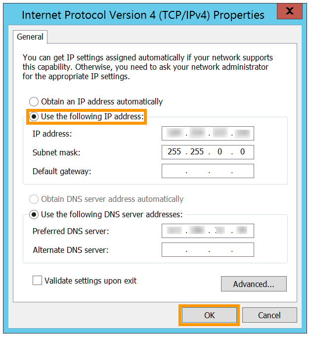

**Päivitetty 28.2.2018**

## Tavoite

vRack-virtuaaliräkkiteknologialla voidaan koota yhteen useita palvelimia riippumatta niiden lukumäärästä tai siitä, missä konesalissa ne fyysisesti sijaitsevat. Lisäksi ne voidaan yhdistää toisiinsa virtuaalikytkimellä saman yksityisen verkon sisällä. Palvelimesi viestivät keskenään yksityisesti ja suojatusti jakamattomassa VLAN-verkossa.

**Opi konfiguroimaan kaksi tai useampi dedikoitu palvelin virtuaaliräkissä.**


## Edellytykset

- Sinulla on [virtuaaliräkki](https://www.ovh-hosting.fi/ratkaisut/vrack/){.external}.
- Sinulla on vähintään kaksi [vRack-yhteensopivaa palvelinta](https://www.ovh-hosting.fi/dedikoidut_palvelimet/){.external} tai enemmän.
- Olet kirjautunut SSH-yhteydellä (tai graafisen käyttöliittymän kautta) Linux-palvelimeesi (pääkäyttäjänä).
- Sinulla on käyttöoikeudet [OVH:n hallintapaneeliin](https://www.ovh.com/auth/?action=gotomanager){.external}.
- Valmistelet valitsemasi yksityisen IP-osoitealueen.


## Käytännössä

### Palvelinten lisäys virtuaaliräkkiin

1. Kun virtuaaliräkki on lisätty tilillesi, mene [hallintapaneelisi](https://www.ovh.com/auth/?action=gotomanager){.external} `Cloud`{.action}-osioon.
2. Valitse valikko `vRack`{.action} vasemman puoleisesta sarakkeesta.
3. Valitse virtuaaliräkkisi ehdotetusta listasta.
4. Valitse palvelulistasta virtuaaliräkkiin lisättävät palvelimet ja klikkaa `Lisää`{.action}.

{.thumbnail}

### Verkkokäyttöliittymien konfigurointi

Esimerkkinä käytämme sisäisten IP-osoitteiden aluetta *192.168.0.0/16*.

Käytämme lisäksi toissijaisesta verkkokäyttöliittymästä nimiä **eth1** ja **eno4**. Palvelimet saattavat käyttää erilaista nimeämiskäytäntöä. Kehotamme tarkistamaan käytännöt alla selitettyjä komentoja käyttämällä.

Verkkokäyttöliittymien listaamiseksi käytetään seuraavaa komentoa:

```sh
ifconfig -a | grep eth | awk '{print $ 1}'
```

Luettelon ensimmäinen käyttöliittymä koskee pääasiallista verkkokäyttöliittymääsi. Voit tarkistaa aktiivisena olevan seuraavalla komennolla:

```sh
ifconfig eth1 up
```

```sh
ethtool eth1 | grep "Link detected"
```

Jos komento palauttaa vastauksen `Link detected: no`, on kyseessä virtuaaliräkkisi konfiguroinnissa käytettävä verkkokäyttöliittymä tämän komennon suorittamisen jälkeen:

```sh
ifconfig eth1 down
```

#### CentOS 6 ja 7

Avaa verkkokäyttöliittymän konfigurointikansio seuraavalla komennolla:

```sh
vi /etc/sysconfig/network-scripts/ifcfg-eth1
```

Paina näppäintä `l` lisäystilaan siirtymiseksi.

Konfiguroi toissijainen verkkokäyttöliittymä seuraavasti:

```sh
DEVICE=eth1
BOOTPROTO=static
IPADDR=192.168.0.1
NETMASK=255.255.0.0
ONBOOT=yes
TYPE=Ethernet
```

Ylläolevassa esimerkissä voit valita minkä tahansa yksityisen IP-osoitealueen ja minkä tahansa tällä alueella sijaitsevan osoitteen.

1. Paina näppäintä `Esc`.
2. Paina näppäintä `Shift` ja näppäintä *piste* editorin avaamiseksi.
3. Syötä `wq`.
4. Paina `Enter`.
5. Uudelleenkäynnistä palvelimesi.
6. Toista kaikki vaiheet muille palvelimille ja jaa niille ainutlaatuinen IP-osoite sisäisestä alueestasi. Tämän jälkeen palvelimesi voivat kommunikoida keskenään yksityisessä verkossa.


#### Debian 7 ja 8

Avaa verkkokäyttöliittymän konfigurointikansio seuraavalla komennolla:

```sh
nano /etc/network/interfaces
```

Konfiguroi toissijainen verkkokäyttöliittymä seuraavasti:

```sh
auto eth1
iface eth1 inet static
address 192.168.0.1
netmask 255.255.0.0
```

Ylläolevassa esimerkissä voit valita minkä tahansa yksityisen IP-osoitealueen ja minkä tahansa tällä alueella sijaitsevan osoitteen.


1. `Ctrl + X` verkon konfigurointitiedostosta poistumista varten.
2. Paina näppäintä `Y` muutosten tallentamiseksi ja paina sitten `Enter`.
3. Uudelleenkäynnistä palvelimesi.
4. Toista kaikki vaiheet muille palvelimille ja jaa niille ainutlaatuinen IP-osoite sisäisestä alueestasi. Tämän jälkeen palvelimesi voivat kommunikoida keskenään yksityisessä verkossa.


#### Debian 9

Avaa verkkokäyttöliittymän konfigurointikansio seuraavalla komennolla:

```sh
nano /etc/network/interfaces
```

Konfiguroi toissijainen verkkokäyttöliittymä seuraavasti:

```sh
auto eno4
iface eno4 inet static
address 192.168.0.1
netmask 255.255.0.0
```

Ylläolevassa esimerkissä voit valita minkä tahansa yksityisen IP-osoitealueen ja minkä tahansa tällä alueella sijaitsevan osoitteen.

1. `Ctrl + X` verkon konfigurointitiedostosta poistumista varten.
2. Paina näppäintä `Y` muutosten tallentamiseksi ja paina sitten `Enter`.
3. Uudelleenkäynnistä palvelimesi.
4. Toista kaikki vaiheet muille palvelimille ja jaa niille ainutlaatuinen IP-osoite sisäisestä alueestasi. Tämän jälkeen palvelimesi voivat kommunikoida keskenään yksityisessä verkossa.


#### Ubuntu Server 16

Avaa verkkokäyttöliittymän konfigurointikansio seuraavalla komennolla:

```sh
vi /etc/network/interfaces
```

Paina näppäintä `l` lisäystilaan siirtymiseksi.

Konfiguroi toissijainen verkkokäyttöliittymä seuraavasti:

```sh
auto eth1
iface eth1 inet static
address 192.168.0.1
netmask 255.255.0.0
```

Ylläolevassa esimerkissä voit valita minkä tahansa yksityisen IP-osoitealueen ja minkä tahansa tällä alueella sijaitsevan osoitteen.

1. Paina näppäintä `Esc`.
2. Paina näppäintä `Shift` ja näppäintä *piste* editorin avaamiseksi.
3. Syötä `wq`.
4. Paina `Enter`.
5. Uudelleenkäynnistä palvelimesi.
6. Toista kaikki vaiheet muille palvelimille ja jaa niille ainutlaatuinen IP-osoite sisäisestä alueestasi. Tämän jälkeen palvelimesi voivat kommunikoida keskenään yksityisessä verkossa.


#### Ubuntu Server 17

Avaa verkkokäyttöliittymän konfigurointikansio seuraavalla komennolla:

```sh
nano /etc/network/interfaces
```

Konfiguroi toissijainen verkkokäyttöliittymä seuraavasti:

```sh
auto eno4
iface eno4 inet static
address 192.168.0.1
netmask 255.255.0.0
```

Ylläolevassa esimerkissä voit valita minkä tahansa yksityisen IP-osoitealueen ja minkä tahansa tällä alueella sijaitsevan osoitteen.

1. `Ctrl + X` verkon konfigurointitiedostosta poistumista varten.
2. Paina näppäintä `Y` muutosten tallentamiseksi ja paina sitten `Enter`.
3. Uudelleenkäynnistä palvelimesi.
4. Toista vaiheet 1 - 5 muille palvelimille ja jaa niille ainutlaatuinen IP-osoite sisäisestä alueestasi. Tämän jälkeen palvelimesi voivat kommunikoida keskenään yksityisessä verkossa.


#### Windows

Esimerkkinä käytämme sisäisten IP-osoitteiden aluetta *192.168.0.0/16*.

Suoritettavat vaiheet:

- Kirjaudu Windows-palvelimelle etätyöpöydän kautta.
- Klikkaa painiketta `Start`{.action}.
- Klikkaa kohtaa `Control Panel`{.action}.

{.thumbnail}

- Klikkaa kohtaa `Network and Internet`{.action}.

{.thumbnail}

- Klikkaa kohtaa `Network and Sharing Centre`{.action}.

{.thumbnail}.

- Klikkaa kohtaa `Change Adapter Settings`{.action}.

{.thumbnail}

- Tee klikkaus hiiren oikealla painikkeella toissijaisen verkkokäyttöliittymän kohdalla.

- Klikkaa `Properties`{.action}.

{.thumbnail}

- Tee kaksoisklikkaus kohdassa `Internet Protocol Version 4 (TCP/IP/IPv4)`{.action}.

{.thumbnail}

- Klikkaa kohtaa `Use the following IP address`:

    - Syötä kohtaan `IP address`: yksi sisäisen IP-alueesi osoitteista
    - Syötä kohtaan `Subnet mask`: 255.255.0.0

{.thumbnail}

-  Klikkaa painiketta `OK`{.action} muutosten tallentamiseksi.
- Uudelleenkäynnistä palvelimesi.
- Toista kaikki vaiheet muille palvelimille ja jaa niille ainutlaatuinen IP-osoite sisäisestä alueestasi. Tämän jälkeen palvelimesi voivat kommunikoida keskenään yksityisessä verkossa.

## Lue lisää aiheesta

Viesti käyttäjäyhteisömme kanssa osoitteessa <https://ovh-hosting.fi/community/foorumi>.