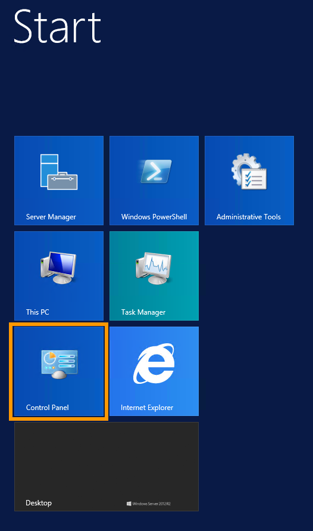
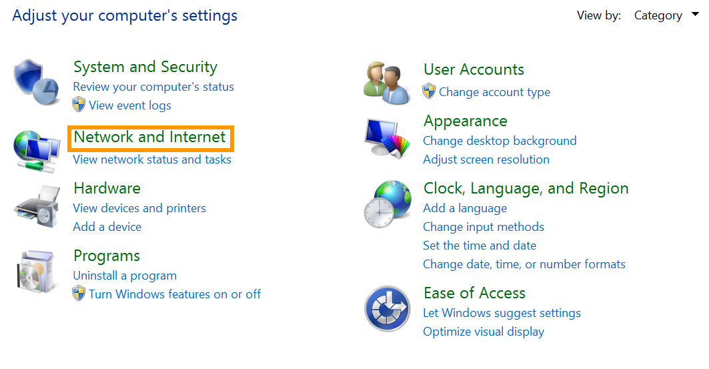

**Laatste update 28-02-2018**

## Introductie

Virtual Rack (vRack)-technologie maakt het mogelijk om meerdere servers, ongeacht het aantal fysieke locaties in onze datacenters, aan te sluiten op een virtuele switch binnen een enkel privénetwerk. Uw servers kunnen privé en veilig met elkaar communiceren binnen een dedicated VLAN.

**Leer hoe u meerdere dedicated servers op vRack kunt configureren.**


## Vereisten

- U moet beschikken over een [vRack](https://www.ovh.nl/oplossing/vrack/){.external}. 
- Er moeten ten minste twee of meer vRack-compatibele servers beschikbaar zijn.
- U moet via SSH (of op uw graphic interface) ingelogd zijn op uw Linux-server (root-toegang).
- U moet toegang hebben tot uw [OVH Control Panel](https://www.ovh.com/auth/?action=gotomanager){.external}.
- De door u gekozen reeks IP-adressen moet zijn voorbereid. 


## Instructies

### Voeg de servers toe aan de vRack

1. Zodra vRack aan uw account is toegevoegd, gaat u naar het gedeelte `Cloud`{.action} van uw [OVH Control Panel](https://www.ovh.com/auth/?action=gotomanager){.external}.
2. Selecteer vervolgens het `vRack`{.action}-menu in de linkerkolom.
3. Selecteer uw vRack in de weergegeven lijst.
4. Selecteer, in de lijst met beschikbare diensten, de servers die u aan de vRack wilt toevoegen, en klik op de knop `Toevoegen`{.action}.

{.thumbnail}

### Configureer de netwerkinterfaces

Als een voorbeeld gebruiken we de interne IP-adresreeks *192.168.0.0/16*.

We gebruiken ook de namen **eth1** en **eno4** voor de secundaire netwerkinterface. Servers kunnen een andere naamgeving gebruiken. We raden aan dit te controleren met behulp van de onderstaande commando's.

Het volgende commando wordt gebruikt om de netwerkgebruikersinterfaces weer te geven:

```sh
ifconfig -a | grep eth | awk '{print $ 1}'
```

De eerste interface in de lijst is voor uw hoofdnetwerkinterface. U kunt controleren welke actief is door het volgende commando te gebruiken:

```sh
ifconfig eth1 up
```

```sh
ethtool eth1 | grep "Link detected"
```

Als het commando de respons `Link detected : no` terugkrijgt, dan is dit de netwerkinterface die moet worden gebruikt voor uw vRack-configuratie na het uitvoeren van dit commando:

```sh
ifconfig eth1 down
```

#### CentOS 6 en 7

Open het configuratiebestand van de netwerkinterface met de volgende opdracht:

```sh
vi /etc/sysconfig/network-scripts/ifcfg-eth1
```

Druk op de `I`-toets op uw toetsenbord om de invoegmodus te openen.

Configureer de secundaire netwerkinterface als volgt:

```sh
DEVICE=eth1
BOOTPROTO=static
IPADDR=192.168.0.1
NETMASK=255.255.0.0
ONBOOT=yes
TYPE=Ethernet
```

In het bovenstaande voorbeeld kunt u ervoor kiezen elke privé IP-reeks en elk adres binnen die reeks te gebruiken.

1. Klik op de `ESC`-knop.
2. Druk op de `SHIFT`-toets en de *dubbele punt*-toets om de editor te openen.
3. Voer `wq`in.
4. Druk op de `Enter`-knop.
5. Start uw server opnieuw op. 
6. Herhaal alle bovenstaande stappen voor uw andere servers en geef ze een uniek IP-adres dat bij uw interne IP-reeks hoort. Zodra u dit hebt gedaan, kunnen uw servers met elkaar communiceren via het privénetwerk.


#### Debian 7 en 8

Open het configuratiebestand van de netwerkinterface met de volgende opdracht:

```sh
nano /etc/network/interfaces
```

Configureer de secundaire netwerkinterface als volgt:

```sh
auto eth1
iface eth1 inet static
address 192.168.0.1
netmask 255.255.0.0
```

In het bovenstaande voorbeeld kunt u ervoor kiezen elke privé IP-reeks en elk adres binnen die reeks te gebruiken.


1. `Ctrl + X` om het netwerkconfiguratiebestand te sluiten.
2. Druk op de `Y`-toets om uw wijzigingen op te slaan en klik vervolgens op Enter.
3. Start uw server opnieuw op. 
4. Herhaal alle bovenstaande stappen voor uw andere servers en geef ze een uniek IP-adres dat bij uw interne IP-reeks hoort. Zodra u dit hebt gedaan, kunnen uw servers met elkaar communiceren via het privénetwerk.


#### Debian 9

Open het configuratiebestand van de netwerkinterface met de volgende opdracht:

```sh
nano /etc/network/interfaces
```

Configureer de secundaire netwerkinterface als volgt:

```sh
auto eno4
iface eno4 inet static
address 192.168.0.1
netmask 255.255.0.0
```

In het bovenstaande voorbeeld kunt u ervoor kiezen elke privé IP-reeks en elk adres binnen die reeks te gebruiken.

1. `Ctrl + X` om het netwerkconfiguratiebestand te sluiten.
2. Druk op de `Y`-toets om uw wijzigingen op te slaan en klik vervolgens op Enter.
3. Start uw server opnieuw op. 
4. Herhaal alle bovenstaande stappen voor uw andere servers en geef ze een uniek IP-adres dat bij uw interne IP-reeks hoort. Zodra u dit hebt gedaan, kunnen uw servers met elkaar communiceren via het privénetwerk.


#### Ubuntu Server 16

Open het configuratiebestand van de netwerkinterface met de volgende opdracht:

```sh
vi /etc/network/interfaces
```

Druk op de `I`-toets op uw toetsenbord om de invoegmodus te openen.

Configureer de secundaire netwerkinterface als volgt:

```sh
auto eth1
iface eth1 inet static
address 192.168.0.1
netmask 255.255.0.0
```

In het bovenstaande voorbeeld kunt u ervoor kiezen elke privé IP-reeks en elk adres binnen die reeks te gebruiken.

1. Klik op de `ESC`-knop.
2. Druk op de `SHIFT`-toets en de *dubbele punt*-toets om de editor te openen.
3. Voer `wq`in.
4. Druk op de `Enter`-knop.
5. Start uw server opnieuw op. 
6. Herhaal alle bovenstaande stappen voor uw andere servers en geef ze een uniek IP-adres dat bij uw interne IP-reeks hoort. Zodra u dit hebt gedaan, kunnen uw servers met elkaar communiceren via het privénetwerk.


#### Ubuntu Server 17

Open het configuratiebestand van de netwerkinterface met de volgende opdracht:

```sh
nano /etc/network/interfaces
```

Configureer de secundaire netwerkinterface als volgt:

```sh
auto eno4
iface eno4 inet static
address 192.168.0.1
netmask 255.255.0.0
```

In het bovenstaande voorbeeld kunt u ervoor kiezen elke privé IP-reeks en elk adres binnen die reeks te gebruiken.

1. `Ctrl + X` om het netwerkconfiguratiebestand te sluiten.
2. Druk op de `Y`-toets om uw wijzigingen op te slaan en klik vervolgens op Enter.
3. Start uw server opnieuw op. 
4. Herhaal alle bovenstaande stappen voor uw andere servers en geef ze een uniek IP-adres dat bij uw interne IP-reeks hoort. Zodra u dit hebt gedaan, kunnen uw servers met elkaar communiceren via het privénetwerk.


#### Windows

Als een voorbeeld gebruiken we de interne IP-adresreeks *192.168.0.0/16*.

Volg de onderstaande stappen: 

- Log in op uw Windows-server via uw remote desktop. 
- Klik op de `Start`{.action}-knop.
- Klik op `Control Panel`{.action}.

{.thumbnail}

- Klik op `Network and Internet`{.action}.

{.thumbnail}

- Klik op `Network and Internet`{.action}.

{.thumbnail}

- Klik op `Change Adapter Settings`{.action}.

{.thumbnail}.

- Klik vervolgens met de rechtermuisknop op de secundaire netwerkinterface.

- Klik op `Properties`{.action}.

{.thumbnail}

- Klik met de rechtermuisknop op `Internet Protocol versie 4 (TCP/IP/IPv4)`{.action}.

{.thumbnail}

- Klik op `Use the following IP address`:

    - `IP-adres`: voer het IP-adres voor uw interne reeks in.
    - Voor `Subnet mask`: voer 255.255.0.0 in.

{.thumbnail}

- Klik op de `OK`{.action}-knop om de wijzigingen door te voeren. 
- Start uw server opnieuw op. 
- Herhaal alle bovenstaande stappen voor uw andere servers en geef ze een uniek IP-adres dat bij uw interne IP-reeks hoort. Zodra u dit hebt gedaan, kunnen uw servers met elkaar communiceren via het privénetwerk.

## Verder

Ga in gesprek met andere communityleden via <https://community.ovh.com/en/>.