## Objective

With this guide, we will explore a specific use for the OVH Load Balancer service — configuring a service to manage production/development infrastructures easily. This is also called a blue-green infrastructure.

With a `blue-green`{.action} infrastructure, you can stop your infrastructure from experiencing any downtime. The main benefit of this deployment type is that you can prepare updates and/or maintenance in an environment that is isolated from your production environment. This way, you can test your changes before they are put into production, undo them quickly if you detect any faults, and do all of this with virtually zero downtime.

**This guide will show you how to deploy a blue-green infrastructure with the OVH Load Balancer.**

## Requirements

To deploy a `blue-green`{.action} infrastructure, you need the following components:

- an OVH Load Balancer service
- a first server that hosts your production infrastructure
- a second server with a similar infrastructure, dedicated to development

## Instructions

### Scenario

The scenario we’ll describe here is as follows... 

You have an infrastructure that you can use to put your website online.

This infrastructure hosts your website’s code, and it also hosts the applications (web servers, database servers, etc.) required to put your website online. You need to update your applications and/or your code on a regular basis. You want to be able to test your updates without the risk of affecting your website’s availability to customers, or stopping the website from working properly.

One way to achieve this is by deploying a `blue-green`{.action} infrastructure.

The principle of a `blue-green`{.action}  deployment involves being able to switch easily from a development infrastructure to a production infrastructure, and vice versa. This switch must be done in a way that is transparent for your users. To do this, we will assign the standard HTTP port 80 for access to the production infrastructure, and the arbitrary port 8888 to access the development infrastructure.

## Deploy the infrastructures.

In the scenario we are using, your IP Load Balancer service plays a central role. It is the element you use to expose your two infrastructures (production and development) to different users at the same time.

The production infrastructure can be accessed by your customers on the standard HTTP service (port 80), and your development infrastructure can be accessed by developers and admins on the non-standard port 8888.

During the initial setup phase, we will arbitrarily assign a role to each of the parts of our infrastructure. `Infrastructure A`{.action} will be assigned to production, while `infrastructure B`{.action} will be assigned to development. At this stage, we will consider them to be similar to one another.

A `blue-green`{.action} infrastructure involves switching from infrastructure A to infrastructure B, when infrastructure B is ready to expose your website after your changes have been applied and tested. The IP Load Balancer will manage this switch.

The diagram below gives a general idea of the architecture:

{.thumbnail}

### Infrastructure A.

This infrastructure is made up of a server farm that will later be associated with a front-end of your IP Load Balancer. This farm will expose an HTTP, TCP or UDP service to the front-end. It also balances loads by sending the front-end’s incoming traffic to the servers. For more detail on the role of various component of the OVH Load Balancer service, you can read the following guide: [Introduction to the OVH Load Balancer](../loadbalancer-introduction/).

In our scenario, we will declare a farm of servers for the HTTP service. Please note that you can create as many farms (as well as TCP and/or UDP services) as are required for your final service to be exposed to your customers.

#### Via the OVH Control Panel:

{.thumbnail}

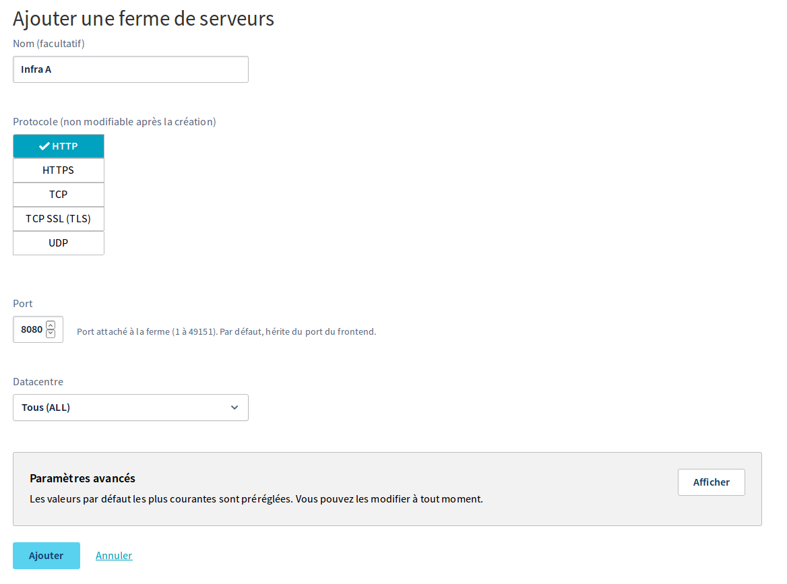{.thumbnail}

#### Via the API:

> [!api]
>
> @api {POST} /ipLoadbalancing/{serviceName}/http/farm
> 

|Setting|Meaning|
|---|---|
|serviceName|Your Load Balancer service ID|

With the additional calls listed below, you can list, modify and delete your server farms respectively.

> [!api]
>
> @api {GET} /ipLoadbalancing/{serviceName}/http/farm
> 

> [!api]
>
> @api {PUT} /ipLoadbalancing/{serviceName}/http/farm
> 

> [!api]
>
> @api {DELETE} /ipLoadbalancing/{serviceName}/http/farm
> 

Associate a server with your farm, if it is a physical server hosting your production infrastructure. The service exposed to the front-end is supplied by the server’s port 8080. Please note that you can associate one or more servers with each farm (to balance the load and/or offer higher fault tolerance, for ex.).

#### Via the OVH Control Panel:

{.thumbnail}

{.thumbnail}

#### Via the API:

> [!api]
>
> @api {POST} /ipLoadbalancing/{serviceName}/http/farm/{farmId}/server
> 

|Setting|Required|Meaning|Example|
|---|---|---|---|
|serviceName|Required|Your Load Balancer service ID|loadbalancer-abcdef0123456789|
|farmId|Required|Your server farm ID|77212|
|address|Required|Your server's IPv4 address|10.10.1.100|
|displayName||The name of the server associated with your farm|HTTP A server|
|port||The server port associated with your farm|8080|

With the additional calls listed below, you can list, modify and delete your servers respectively.

> [!api]
>
> @api {GET} /ipLoadbalancing/{serviceName}/http/farm/{farmId}/server
> 

> [!api]
>
> @api {PUT} /ipLoadbalancing/{serviceName}/http/farm/{farmId}/server
> 

> [!api]
>
> @api {DELETE} /ipLoadbalancing/{serviceName}/http/farm/{farmId}/server
> 

### Infrastructure B.

Functionally, this second infrastructure is identical to the first. It is also composed of a server farm that will later be associated with a second front-end of your IP Load Balancer. This server farm exposes the same service to the front-end as the first server farm. This service is supplied on the servers by port 8080.

Deploy the server farm for the HTTP service (and/or any other TCP or UDP services required for your final service to be exposed to your customers).

#### Via the Sunrise Control Panel:

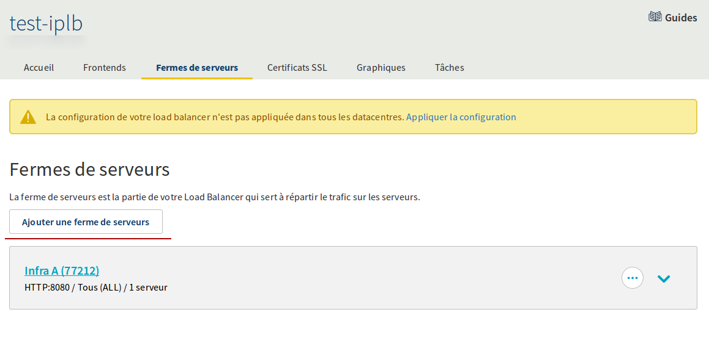{.thumbnail}

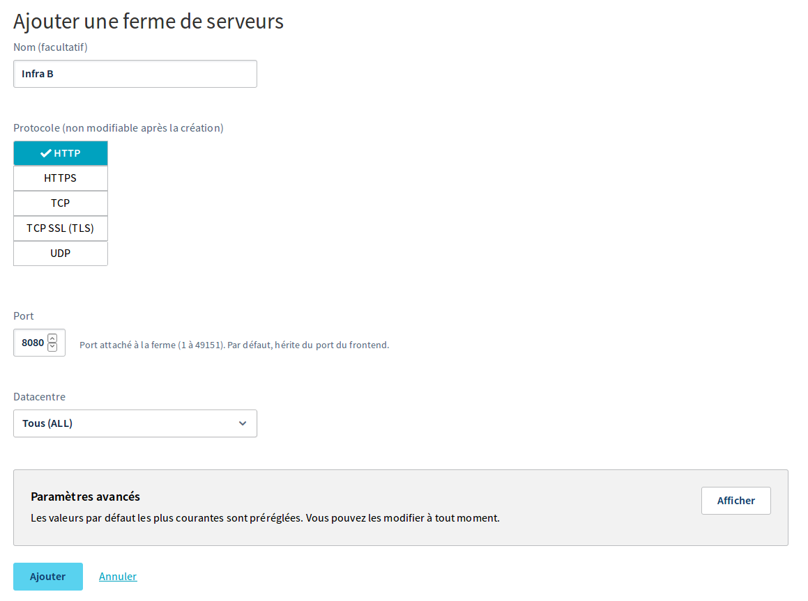{.thumbnail}

#### Via the API:

> [!api]
>
> @api {POST} /ipLoadbalancing/{serviceName}/http/farm
> 

|Setting|Meaning|
|---|---|
|serviceName|Your Load Balancer service ID|

Associate a server with your farm. Here, it involves one or more physical servers hosting your development infrastructure.

#### Via the OVH Control Panel:

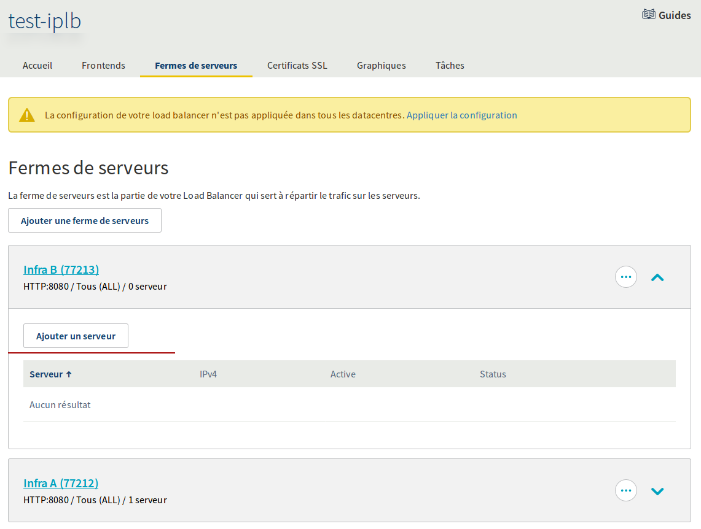{.thumbnail}

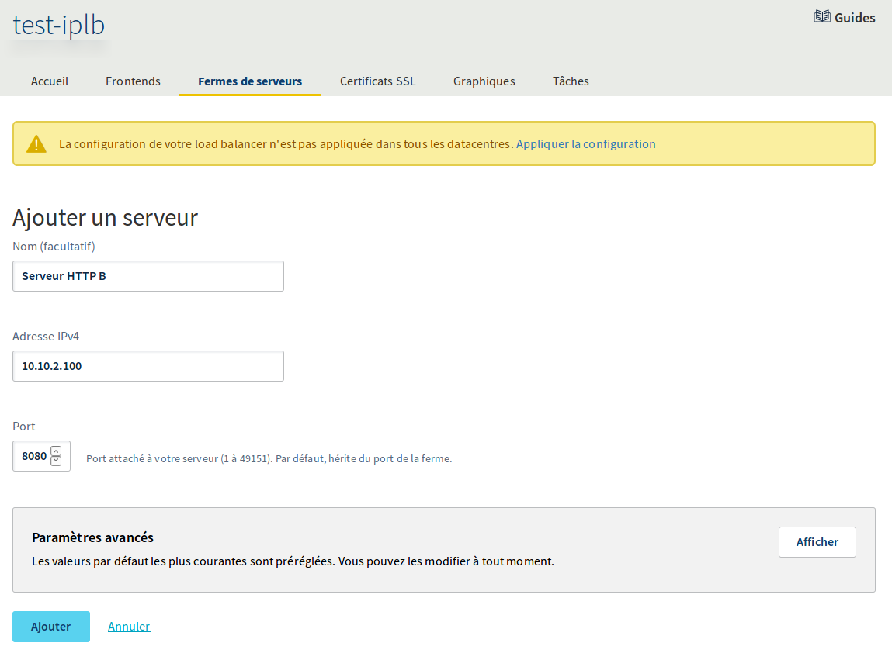{.thumbnail}

#### Via the API:

> [!api]
>
> @api {POST} /ipLoadbalancing/{serviceName}/http/farm/{farmId}/server
> 

|Setting|Required|Meaning|Example|
|---|---|---|---|
|serviceName|Required|Your Load Balancer service ID|loadbalancer-abcdef0123456789|
|farmId|Required|Your server farm ID|77213|
|address|Required|Your server's IPv4 address|10.10.2.100|
|displayName||The name of the server associated with your farm|HTTP B server|
|port||The server port associated with your farm|8080|

At this stage, here is the configuration status for your two farms:

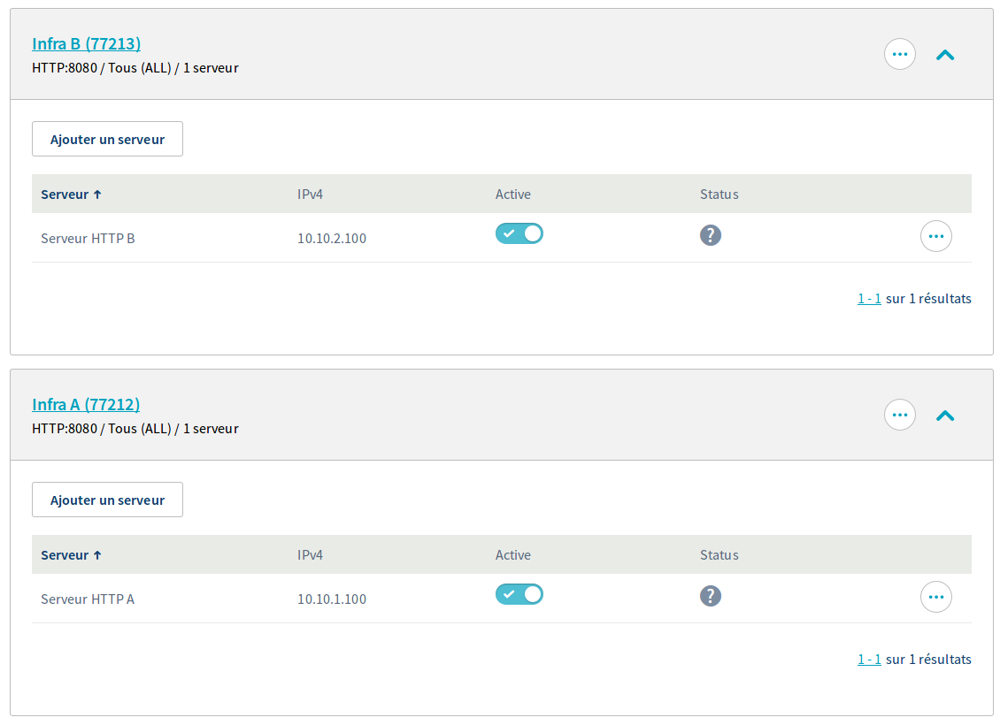{.thumbnail}

## Front-ends.

The magic of `blue-green`{.action} deployment lies in the configuration of your front-ends. At this stage, we have configure two functionally identical infrastructures. For both infrastructures, you have declared one or more server farms, each with their own set of associated servers.

To switch simply from one infrastructure to another, we will use front-ends.

To do this, we need to declare two front-ends. The first one will give you access to your production infrastructure, whereas the second will give you access to your development infrastructure. You can control access to one infrastructure or the other using the ports you expose to your customers.

> [!warning]
>
> If the final service you expose to your customers requires several server farms (e.g. ports 80 and 443), you will need to declare a `front-end`{.action} for each of your farms.
> 

### Blue front-end.
This `front-end`{.action} is dedicated to accessing the production infrastructure. The ports exposed to your customers are the standard ports for accessing the service. In this case, we are exposing a HTTP service, so we will use port 80 (443 if you would like an SSL termination).

#### Via the OVH Control Panel:

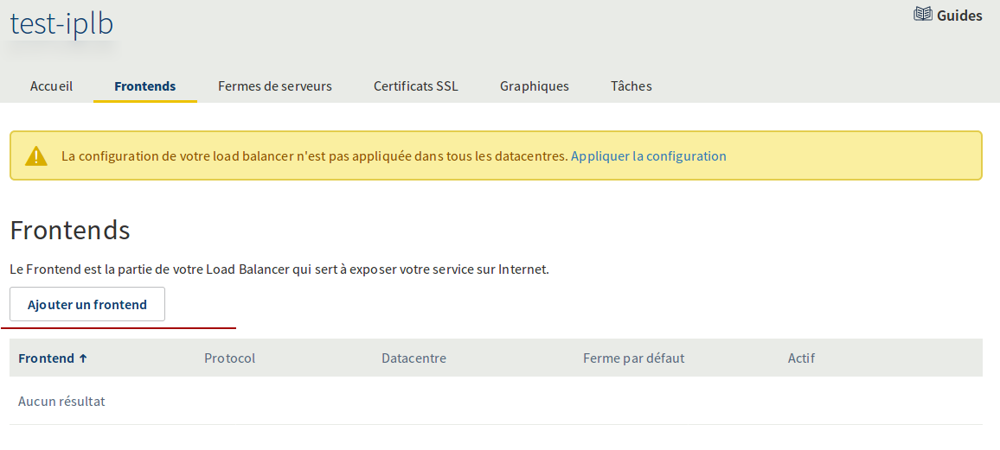{.thumbnail}

{.thumbnail}

#### Via the API:

> [!api]
>
> @api {POST} /ipLoadbalancing/{serviceName}/http/frontend
> 

|Setting|Required|Meaning|Example|
|---|---|---|---|
|serviceName|Required|Your Load Balancer service ID|loadbalancer-abcdef0123456789|
|defaultFarmId||Your production farm’s ID|77212|
|displayName||The name given to the front-end|Blue front-end|
|port|Required|The port exposed to your customers by your front-end|80|
|zone|Required|The zone in which you want to deploy your front-end|all|

### Green front-end.

This `front-end`{.action} is dedicated to accessing the development infrastructure. The ports exposed to your customers will be non-standard ports that you can choose arbitrarily. In this case, we will expose the HTTP development service on port 8888.

#### Via the OVH Control Panel:

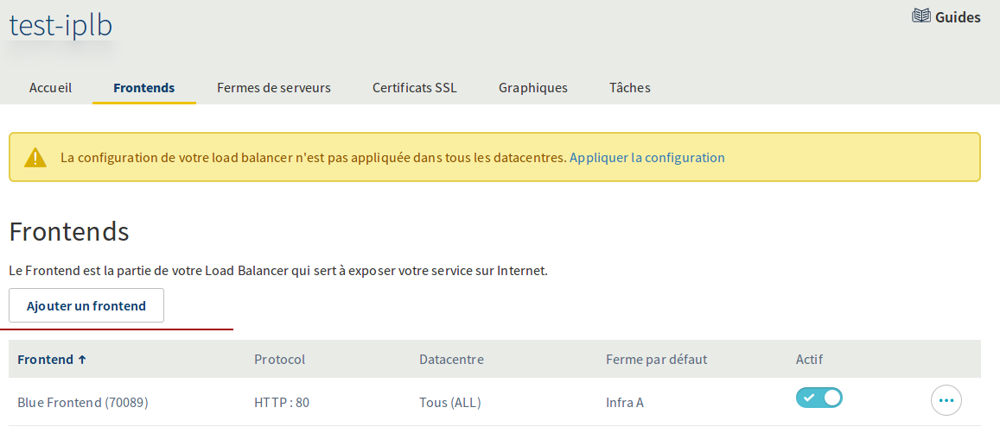{.thumbnail}

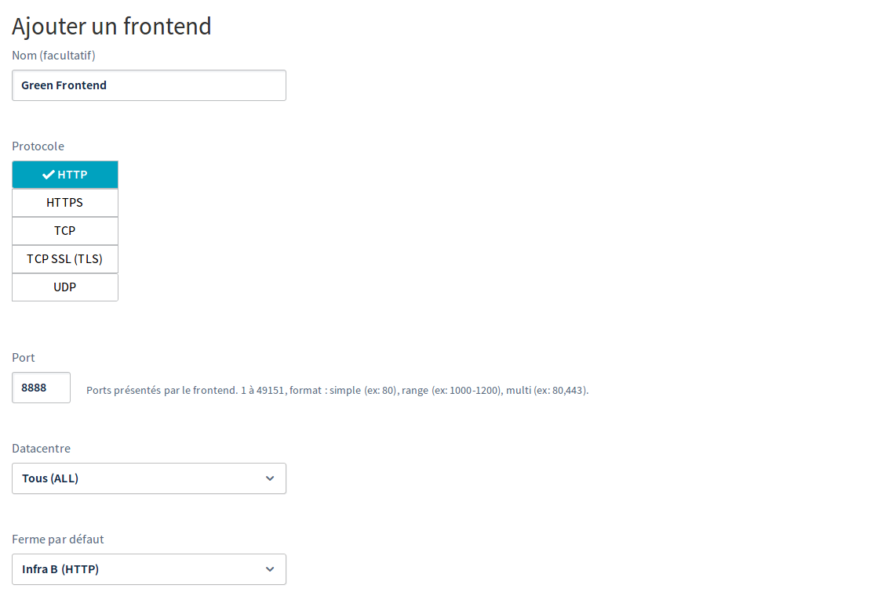{.thumbnail}

#### Via the API:

> [!api]
>
> @api {POST} /ipLoadbalancing/{serviceName}/http/frontend
> 

|Setting|Required|Meaning|Example|
|---|---|---|---|
|serviceName|Required|Your Load Balancer service ID|loadbalancer-abcdef0123456789|
|defaultFarmId||Your production farm’s ID|77213|
|displayName||The name given to the front-end|Green front-end|
|port|Required|The port exposed to your customers by your front-end|8888|
|zone|Required|The zone in which you want to deploy your front-end|all|

## Manage the deployments.

### Initial deployment.

Once you have finished configuring the components of the OVH Load Balancer service, you now just need to apply your changes.

#### Via the OVH Control Panel:

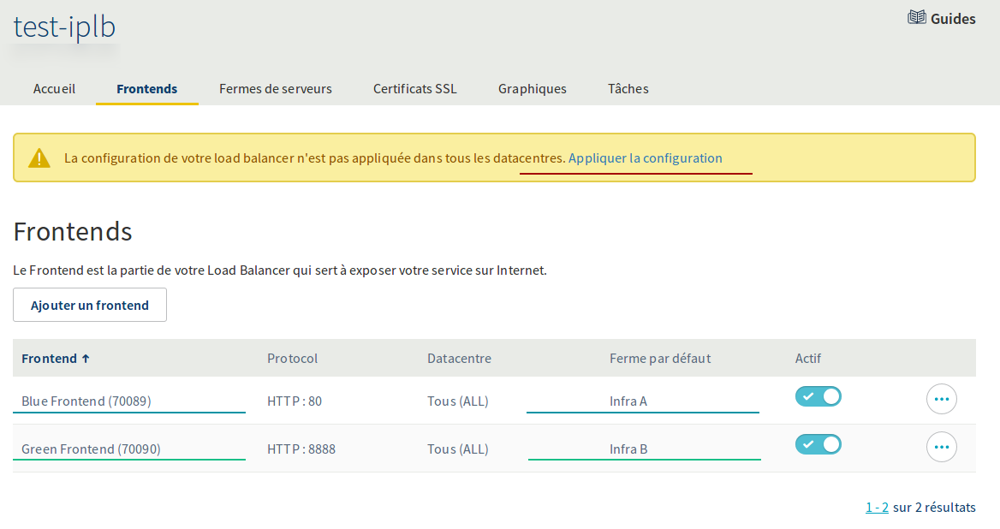{.thumbnail}

#### Via the API:

> [!api]
>
> @api {POST} /ipLoadbalancing/{serviceName}/refresh
> 

|Setting|Meaning|
|---|---|
|serviceName|Your Load Balancer service ID|

### The production/pre-production switch.

At this stage, our initial environment is deployed and ready to use. How do we use it?

To put it simply, you just need to switch over your front-ends from one server farm to another.

Let’s take a look at our scenario:

- The production infrastructure (A) is deployed on `HTTP farm A`{.action} (id 77212), which in turn is attached to `HTTP server A`{.action}. This infrastructure can be accessed through the `blue front-end`{.action}.
- The development infrastructure (B) is deployed on `HTTP farm B`{.action} (id 77213), which in turn is attached to `HTTP server B`{.action}. This infrastructure can be accessed through the `green front-end`{.action}.

Once you have modified/applied updates to `infrastructure B`{.action} and checked that the service is working properly, you decide to put it into production.

To switch between the two farms, you can simply update your different front-ends by modifying the ID of the farm it is attached to, and applying the modification.

The `blue front-end`{.action} (id 70089) will then be associated with `Farm B`{.action} (infrastructure B, new production, id 77213).

The `green front-end`{.action} (id 70090) will then be associated with `Farm A`{.action} (infrastructure A, new development, id 77212).

This should be the result on the Sunrise Control Panel after updating the front-ends and applying the new configuration:

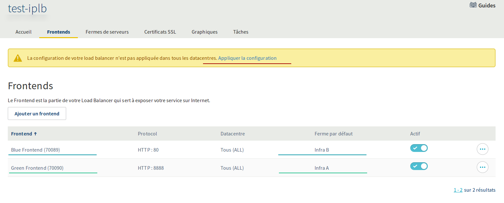{.thumbnail}

#### Via the API: updating front-ends and applying modifications#### 

> [!api]
>
> @api {PUT} /ipLoadbalancing/{serviceName}/http/frontend/{frontendId}
> 

|Setting|Meaning|Example|
|---|---|---|
|serviceName|Your Load Balancer service ID|loadbalancer-abcdef0123456789|
|frontendId|Your production front-end ID|70089|
|defaultFarmId|Your development server farm ID|77213|

> [!api]
>
> @api {PUT} /ipLoadbalancing/{serviceName}/http/frontend/{frontendId}
> 

|Setting|Meaning|Example|
|---|---|---|
|serviceName|Your Load Balancer service ID|loadbalancer-abcdef0123456789|
|frontendId|Your production front-end ID|70090|
|defaultFarmId|Your development server farm ID|77212|

#### To apply your changes and effectively switch over the production and development environments:

> [!api]
>
> @api {POST} /ipLoadbalancing/{serviceName}/refresh
> 

|Setting|Meaning|
|---|---|
|serviceName|Your Load Balancer service ID|

## Go further

You now have an infrastructure you can use to simply and efficiently manage `blue-green deployments`{.action}.

Developers have access to a development environment on port 8888 (or whichever other port you would prefer to define), while your customers continue to access the service in production via the standard HTTP port (80 in our case, for example).

The infrastructure presented here is limited to just one port, but it can be expanded by adding other ports. For example, you can also expose your website on the standard HTTPS port (443). You can do this by defining new farms dedicated to each port you want to expose, and associating them with their corresponding front-ends (one for the standard port exposed in production, the second for the arbitrary port dedicated to development).

Another way to consolidate your infrastructure even further is by multiplying the servers attached to your farms. This way, you can make your services more redundant (guaranteeing availability as a result), and also add a load balancing capacity.
