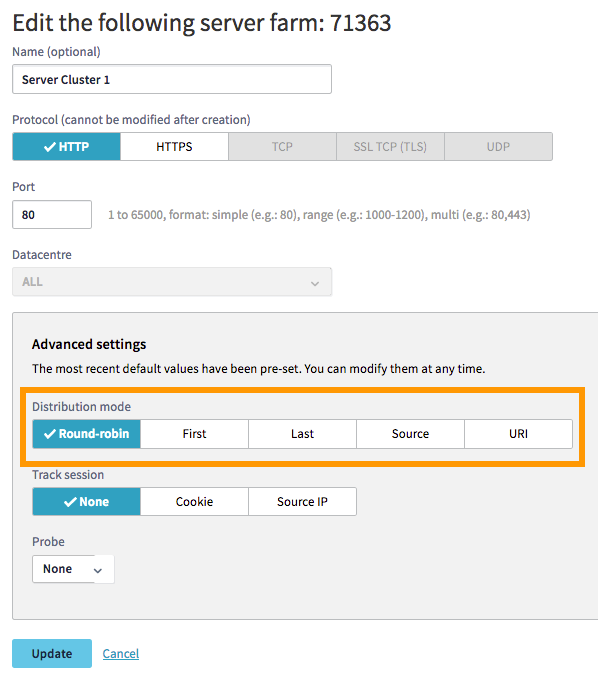

**Päivitetty 22.01.2018**

## Tavoite

OVH:n uusi Kuormantasaaja tarjoaa palveluillesi erilaisia kuormanjakotyyppejä. Tämä prosessi määrittää tavan, jolla OVH:n Kuormantasaaja jakaa palvelimillesi saapuneet kyselyt.

**Tässä ohjeessa esitellään erilaiset kuormanjakotyypit ja kerrotaan, kuinka niitä voidaan muokata.**

## Edellytykset

- Olet kirjautunut [hallintapaneeliin](https://www.ovh.com/auth/?action=gotomanager){.external}.
- Sinulla on luotuna palvelinfarmi.

## Käytännössä

### Erilaiset kuormanjakotyypit

Kuormanjakoa käytetään palvelinfarmeilla. Tämä on asetus, joka määrittää, millä tavalla kyselyt jaetaan farmin palvelinten välillä.

OVH:n Kuormantasaajan tärkeimpiin erilaisiin osiin voit tutustua täällä: [Kuormantasaajan esittely](https://docs.ovh.com/fi/loadbalancer/kuormantasaaja-esittely/){.external}.

|Algoritmi|Ominaisuudet|
|---|---|
|First|Ensimmäinen vapaana oleva palvelin vastaanottaa yhteyden. Palvelin valitaan ID-tunnisteen perusteella, pienimmästä suurimpaan.|
|LeastConn|Valitsee palvelimen, jolla on vähiten aktiivisia yhteyksiä. Tämä on suositeltu asetus pitkiin istuntoihin vähäisellä liikennemäärällä. *RoundRobin*-algoritmia sovelletaan palvelinryhmille, joilla on sama määrä aktiivisia yhteyksiä.|
|RoundRobin|Valitsee palvelimen yksitellen järjestyksessä jokaiselle yhteydelle. **Tämä on oletusalgoritmi.**|
|Source|Tämä algoritmi suorittaa *hajautus* (hash) -toiminnon lähde IP -osoitteella ja jakaa sitten tuloksen sillä hetkellä aktiivisten palvelinten lukumäärällä. Sama lähde IP -osoite uudelleenohjataan aina samalle palvelimelle, niin kauan kuin se pysyy aktiivisena.|
|URI|Tämä algoritmi suorittaa *hajautus* (hash) -toiminnon osaan tai kokonaiseen URIin ja jakaa sitten tuloksen sillä hetkellä aktiivisten palvelinten lukumäärällä. Sama URI uudelleenohjataan aina samalle palvelimelle niin kauan kuin se pysyy aktiivisena.|

### Palvelinfarmin kuormanjaon muodon muokkaus hallintapaneelin kautta

- Osiossa `Palvelinfarmit`{.action} (1) näet tällä hetkellä luodut palvelimet. Muokkaaminen onnistuu klikkaamalla jonkin farmin kohdalla olevaa kolmea pistettä (2) ja sitten `Muokkaa`{.action}:

{.thumbnail}

Kohdassa `Edistyneet asetukset`{.action} voit muokata `Jaon tyyppiä`{.action}:

{.thumbnail}

Kun olet valinnut haluamasi jakomuodon, klikkaa `Päivitä`{.action} ja sitten `Aseta konfiguraatio`{.action} näkyviin tulevassa keltaisessa palkissa:

{.thumbnail}

### Palvelinfarmin kuormanjaon muodon muokkaus APIn kautta

Kuormanjaon asetusten muokkaus tapahtuu muokkaamalla palvelinfarmin asetuksia.

- Katso palvelinfarmin tiedot

Tällä komennolla voidaan tarkastella palvelinfarmin tietoja, kun palvelimen tunniste on tiedossa. Esimerkissä työskentelemme HTTP-palvelimella:

> [!api]
>
> @api {GET} /ipLoadbalancing/{serviceName}/http/farm/{farmId}
> 

|Asetus|Merkitys|
|---|---|
|serviceName*|Kuormantasauspalvelusi tunniste|
|farmId*|Farmin numerotunniste|

|Vastaus (BackendHttp)|Merkitys|
|---|---|
|farmId|Farmin numerotunniste|
|balance|Palvelinfarmilla tällä hetkellä konfiguroituna oleva jakotyyppi|
|zone|Alueen nimi, jonne farmi on konfiguroitu|
|port|Portti, jota käytetään yhdistettäessä farmille konfiguroituihin palvelimiin|
|probe|Tällä hetkellä farmilla konfiguroituna olevan sondin tyyppi|
|displayName|Palvelinfarmin nimi|
|stickiness|Palvelinfarmilla tällä hetkellä konfiguroituna oleva kirjautumisen seurantatila|

- Palvelinfarmin kuormanjaon muodon muokkaus

Tällä komennolla voidaan muokata palvelinfarmin tietoja, kun palvelimen tunniste on tiedossa. Esimerkissä työskentelemme HTTP-palvelinfarmilla. Muokataksesi kuormanjaon muotoa kentän `BackendHttp.balance` täytyy olla päivitettynä saatavilla olevalla kuormanjaon muodolla:

> [!api]
>
> @api {PUT} /ipLoadbalancing/{serviceName}/http/farm/{id}
> 

|Asetus|Merkitys|
|---|---|
|serviceName*|Kuormantasauspalvelusi tunniste|
|farmId*|Farmin numerotunniste|
|BackendHttp.balance|Palvelinfarmille haluttu kuormanjakotyyppi|

- Ota muokkaukset käyttöön

> [!api]
>
> @api {POST} /ipLoadbalancing/{serviceName}/refresh
> 

|Asetus|Merkitys|
|---|---|
|serviceName*|Kuormantasauspalvelusi tunniste|
|zone*|Alueen nimi, jolla konfiguraatio otetaan käyttöön|

## Lisää aiheesta

Viesti käyttäjäyhteisömme kanssa osoitteessa <https://www.ovh-hosting.fi/community/foorumi>.