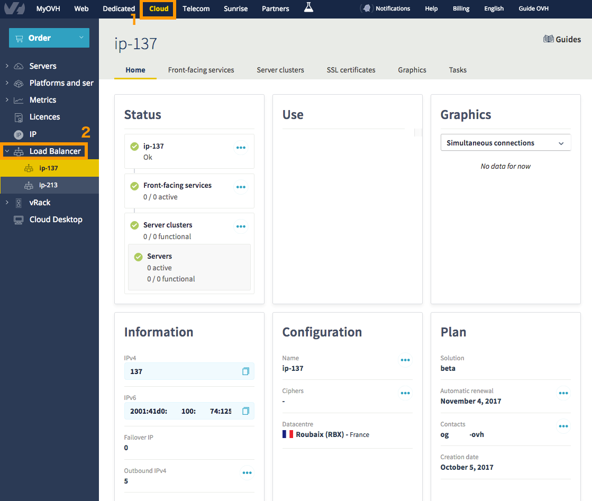
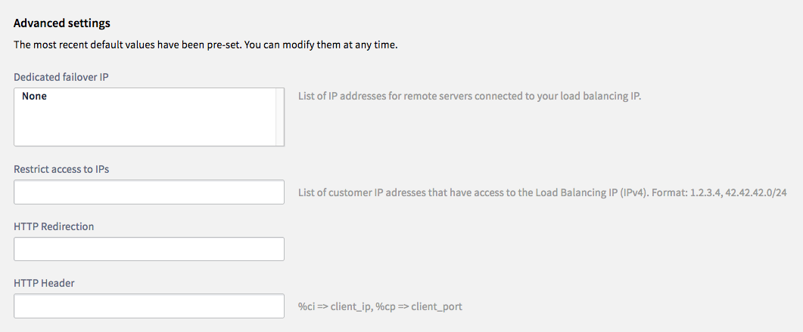
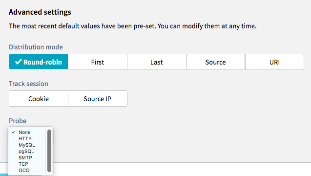
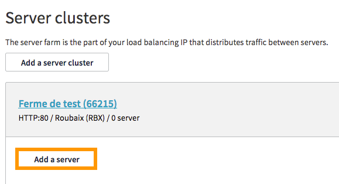
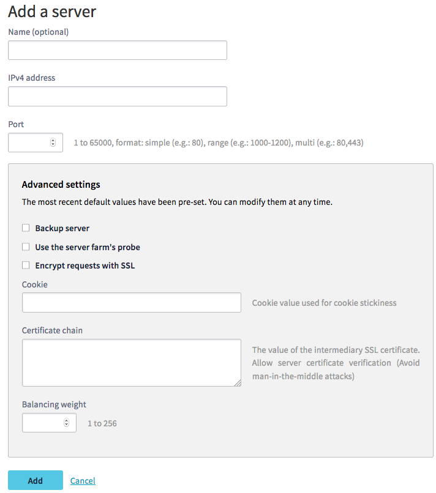
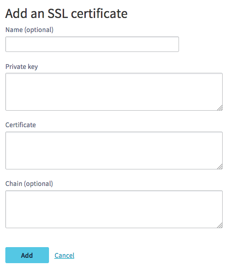

## Cíl

V této příručce se seznámíte s hlavními funkcemi a základními ovládacími prvky služby OVH Load Balancer.

## Prerekvizity

- Přístup do Zákaznického prostoru OVH
- Služba [Load Balancer](https://www.ovh.cz/reseni/ip-load-balancing/){.external}

## Postup

### Správa služby Load Balancer prostřednictvím Zákaznického prostoru OVH
Ze všeho nejdříve přejděte do sekce `Cloud` (1) v Zákaznickém prostoru OVH a v levém postranním panelu vyberte službu `Load Balancer` (2). Následně se zobrazí základní administrační rozhraní služby:

{.thumbnail}

V tomto rozhraní naleznete následující informace:

|Karta|Funkce|
|---|---|
|Stav|Základní informace o stavu Vašeho Load Balanceru, IP adresách, frontendech, farmách serverů a jednotlivých serverech.|
|Využití|Přehled využití Vašeho Load Balanceru.|
|Grafy|Zde naleznete grafy znázorňující počet simultánních připojení či požadavků za minutu.|
|Informace|Přehled Vašich IPv4, IPv6 a fail-over IP adres, stejně tak jako odchozích IPv4 adres (detailní informace se zobrazí po kliknutí na tři tečky).|
|Konfigurace|Zde můžete změnit název své služby, zobrazující se v levém postranním panelu. Dále zde naleznete informace o šifrovacích algoritmech Cipher, stejně tak jako o datacentru, v němž je Vaše služba alokována.|
|Předplatné|Zde naleznete detailní informací týkající se  administračního aspektu Vaší služby.|

Pro přidání `frontendů`{.action} či `farem serverů`{.action} jednoduše klikněte na příslušné tlačítko v jednotlivých záložkách. Po kliknutí na tlačítko se zobrazí kontextová nabídka, v jejímž rámci budete moci nakonfigurovat jednotlivé aspekty své služby.

### Správa frontendů

Pro přidání frontendu přejděte do záložky `Frontendy`{.action} a klikněte na tlačítko `Přidat frontend`{.action}. Zobrazí se následující kontextová nabídka:

{.thumbnail}

Nastavení frontendu:

|Prvek|Funkce|
|---|---|
|Název|Každý frontend můžete pojmenovat. Tato funkce usnadňuje orientaci v případě většího množství frontendů.|
|Protokol|Vybírat můžete z následujících protokolů: HTTP, HTTPS, TCP, SSL TCP (nebo TLS) a UDP.|
|Port|Vyberte, jaký port má být otevřen pro příchozí komunikaci.|
|Datacentrum|Při vytváření frontendu můžete vybírat mezi svým nebo všemi datacentry.|
|Výchozí farma|Pokud disponujete nakonfigurovanými farmami, můžete z nich pro každý frontend jednu vybrat jako výchozí.|

Pokročilé nastavení:

{.thumbnail}

|Prvek|Funkce|
|---|---|
|Dedicated IP failover|Seznam IP adres vzdálených serverů, k nimž je Váš Load Balancer připojen.|
|Omezit přístup k IP adresám|Seznam umožňující omezit vzdálený přístup k Load Balanceru, pouze pro IPv4 adresy.|
|Přesměrování HTTP|Přidání URL adresy pro HTTP přesměrování.|
|Hlavička HTTP|Přidání HTTP hlavičky.|

### Správa farem serverů
Pro přidání farmy serverů přejděte do záložky `Farmy serverů`{.action} a klikněte na tlačítko `Přidat farmu serverů`{.action}. Základní kontextová nabídka nabízí stejné možnosti, jako v případě frontendů. Pokročilé nastavení se však liší:

{.thumbnail}

|Prvek|Funkce|
|---|---|
|Režim distribuce|Na výběr máte z následujících režimů:  Round-robin, First, Last, Source nebo URI.|
|Sledování relací|Na výběr máte ze dvou režimů: Cookie a IP Source.|
|Monitorovací sonda|Výběr a aktivace sondy.|

### Správa serverů

Jakmile je Vaše farma serverů vytvořena, nezbývá než k ní začít přidávat jednotlivé servery. Níže nabízíme přehled základních i pokročilých funkcí:

{.thumbnail}

{.thumbnail}

|Prvek|Funkce|
|---|---|
|Název|Každý server můžete pojmenovat. Tato funkce usnadňuje orientaci ve větším množství serverů.|
|Adresa IPv4|IPv4 adresa serveru|
|Port|Port serveru|
|Záložní server|Vyberte, pokud se jedná o záložní server.|
|Používat sondu pro dostupnost farmy|Vybere sondu, která byla schválena při vytváření farmy.|
|Šifrovat požadavky pomocí SSL|Požadavky budou šifrovány prostřednictvím certifikátu SSL.|
|Cookie|Hodnota určující dobu platnosti cookies|
|Certifikační řetězec|Hodnota certifikátu SSL Intermediary. Umožňuje ověření serverového certifikátu (prevence před útoky typu Man-in-the-middle).|
|Poměr zatížení|Poměr redistribuce datové zátěže|

### Správa SSL certifikátů

SSL certifikát lze ke službě Load Balancer přidat v sekci `SSL certifikát`{.action}. Na výběr máte ze dvou možností: objednání nového SSL certifikátu prostřednictvím OVH nebo připojení externího certifikátu.

#### OVH SSL certifikát

Pro objednání nového SSL certifikátu přejděte do záložky `SSL certifikát`{.action} a klikněte na tlačítko `Objednat SSL certifikát`{.action}.

{.thumbnail}

|Prvek|Funkce|
|---|---|
|Název|Každý certifikát můžete pojmenovat. Tato funkce usnadňuje orientaci v případě většího množství certifikátů.|
|Typ certifikátu|Bezplatný (Let's Encrypt), Comodo DV nebo Comodo EV (detailní informace naleznete na následujícím odkazu: <https://www.ovh.cz/ssl/>).|
|Fully Qualified Domain Name (FQDN)|Doména, pro níž certifikát objednáváte|

#### Připojení externího SSL certifikátu

Pokud již SSL certifikát vlastníte, můžete ho ke své službě připojit:

{.thumbnail}

|Prvek|Funkce|
|---|---|
|Název|Každý certifikát můžete pojmenovat. Tato funkce usnadňuje orientaci v případě většího množství certifikátů.|
|Privátní klíč|Do tohoto pole vložte svůj privátní klíč.|
|Certifikát|Do tohoto pole vložte svůj certifikát.|
|Řetězec|Do tohoto pole lze v případě potřeby vložit kořenový certifikát.|

## Kam dál
Přidejte se k naší uživatelské komunitě na <https://community.ovh.com/en/>.