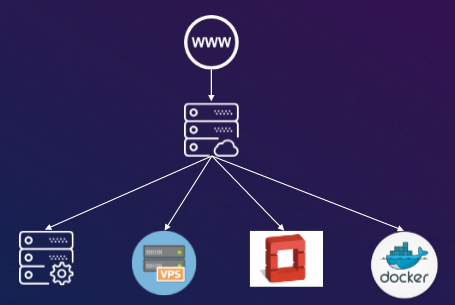

**Última atualização: 19/03/2018**

## Sumário

O Load Balancer OVH é um repartidor de carga (balanceador de carga) caracterizado pela facilidade de configuração e pela fiabilidade. Configure os seus produtos com o Load Balancer OVH. Nós tratamos do resto!

**Descubra agora o Load Balancer da OVH**

## Requisitos

- Sem requisitos específicos.

## Descrição

 
O novo Load Balancer assenta nas melhores soluções open source: Haproxy para o tráfego TCP e Nginx para o tráfego UDP.

 Além disso, a nova solução pode ser usada com diferentes protocolos:

|Tipo|Descrição|Vantagens|Tecnologia|
|---|---|---|---|
|HTTP|Qualquer tipo de serviço web HTTP/HTTPS|Otimizado para processamento L7 (aplicações)|Haproxy|
|TCP|Qualquer serviço de rede que não seja HTTP|Compatível com todas as aplicações TCP|Haproxy|
|UDP|Qualquer tipo de tráfego UDP|Compatível com todas as aplicações UDP|Nginx|

Características do serviço:

- proteção Anti-DDoS OVH;
 - replicação DNS em várias zonas geográficas (Anycast);
 - funções avançadas para HTTP/HTTPS (reencaminhamento, headers, ACL...);
 - compatibilidade com IP Failover;
 - compatibilidade com vRack;
 - redundância: o Load Balancer funciona em instâncias diferentes, alojadas em equipamentos separados, protegidos por sistemas redundantes.

### Principais elementos

- A nova oferta Load Balancer OVH é composta por três elementos principais:

{.thumbnail}

|Principais elementos|Função|
|---|---|
|Frontend|O Frontend permite definir o tipo de protocolo (HTTP/TCP/UDP) do serviço Load Balancer OVH. Este inclui ainda a porta de escuta do serviço|
|Farm|A Farm recebe o tráfego proveniente do Frontend; esta é a componente associada à repartição da carga|
|Server|Servidores que recebem o tráfego final e que respondem através da aplicação|

Os elementos principais do Load Balancer permitem configurar praticamente qualquer tipo de load balancing.

### Vantagens do Load Balancer OVH

#### Repartir o tráfego

A distribuição do tráfego é a função básica de um Load Balancer, mas a solução da OVH faz muito mais do que isso.

{.thumbnail}

#### Eliminar os riscos de downtime

O Load Balancer OVH deteta automaticamente a ausência de resposta de um servidor. Nessa altura, redireciona o tráfego do servidor indisponível para outro servidor. Resultado: o problema é resolvido sem qualquer interrupção do serviço.

{.thumbnail}

#### Ajustar capacidade da infraestrutura de forma fácil

A solução OVH permite adicionar ou eliminar uma Farm, um Frontend ou um servidor do Load Balancer OVH sem interrupção do serviço.

{.thumbnail}

#### Manutenção mais simples

A infraestrutura tem uma tarefa de manutenção agendada? Agora é possível desativar temporariamente uma server farm com toda a facilidade, para que esta deixe de receber tráfego durante o período da manutenção. Quando a intervenção terminar, pode adicionar novamente os servidores.

{.thumbnail}

#### Combinar vários serviços

O Load Balancer permite usar ou combinar diferentes serviços da OVH, como por exemplo:

- instâncias Public Cloud com IP Failover;
- VPS com IP Failover;
- servidores dedicados com IP Failover;
- vRack (redes privadas).

{.thumbnail}

#### Anycast

Com o Anycast, pode distribuir o tráfego dos serviços por diferentes zonas geográficas:

{.thumbnail}

#### Repartir qualquer tipo de tráfego

O Load Balancer OVH pode ser usado para repartir tráfego HTTP, TCP ou UDP. 

#### Servidor de e-mail

Também pode repartir o tráfego entre os servidores de e-mail:

{.thumbnail}

#### Base de dados

Equilibre o esforço das base de dados e crie redundâncias:

{.thumbnail}

## Quer saber mais? Consulte a informação abaixo

[Saber mais sobre o Load Balancer](https://pt.wikipedia.org/wiki/Balanceamento_de_carga){.external}.

[Saber mais sobre Haproxy](http://www.haproxy.org/#desc){.external}.

[Saber mais sobre Nginx](https://pt.wikipedia.org/wiki/Nginx){.external}.

Ou fale com a nossa comunidade de utilizadores: <https://community.ovh.com/en/>.