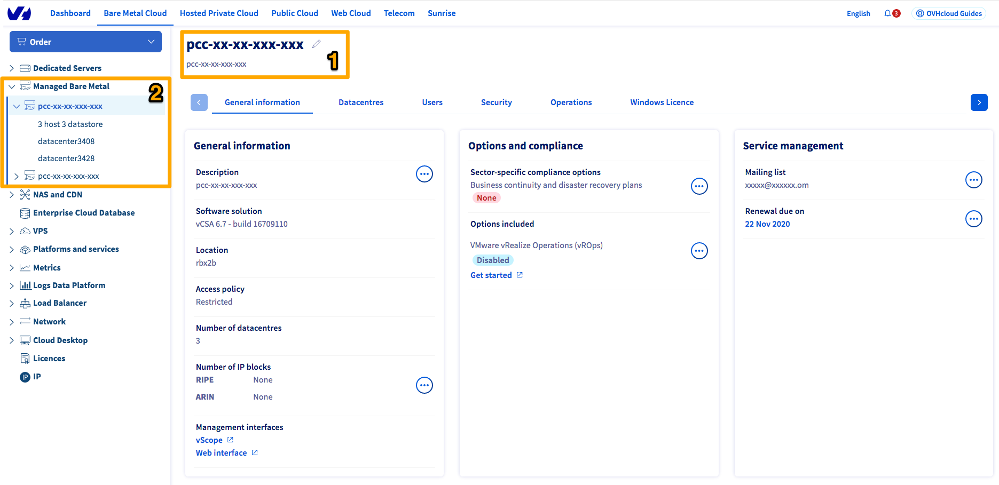
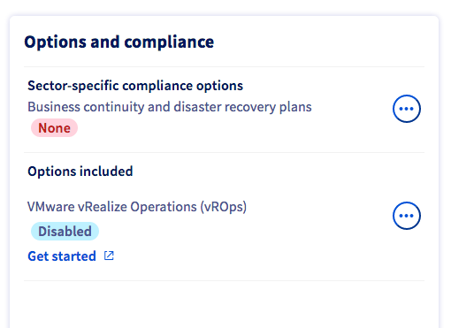

**Ostatnia aktualizacja z dnia 18-11-2020**

## Wprowadzenie

Panel klienta OVHcloud oferuje liczne opcje konfiguracji Twojej infrastruktury Managed Bare Metal.

**W tym przewodniku odkryjesz jego liczne możliwości.**

## Wymagania początkowe

- Dostęp do [Panelu klienta OVHcloud](https://www.ovh.com/auth/?action=gotomanager){.external} i przejście do sekcji `Bare Metal Cloud`{.action}, a następnie `Managed Bare Metal`{.action}
- Posiadanie usługi [Managed Bare Metal](https://www.ovhcloud.com/pl/managed-bare-metal/){.external}

## W praktyce

### Karta ogólna

W sekcji `Managed Bare Metal`{.action} znajdującej się w części `Bare Metal Cloud`{.action} [Panelu klienta OVHcloud](https://www.ovh.com/auth/?action=gotomanager){.external} masz dostęp do ogólnego podglądu infrastruktury Managed Bare Metal:

{.thumbnail}

U góry strony, `ozn. 1 na zdjęciu`, znajdziesz nazwę i opis Twojej usługi Managed Bare Metal. Możesz ją dowolnie personalizować, co jest szczególnie przydatne, gdy posiadasz kilka infrastruktur. 

Po lewej stronie, `ozn. 2 na zdjęciu`, znajdziesz Twoje infrastruktury Managed Bare Metal oraz wirtualne centra danych, które je tworzą.

#### Informacje ogólne

W tabeli po lewej stronie znajdują się informacje ogólne o usłudze Managed Bare Metal.

{.thumbnail}

- Opis usługi Managed Bare Metal (z możliwością zmiany nazwy)
- Wersja usługi Managed Bare Metal
- Centrum danych, a dokładniej strefa, w której jest zainstalowana Twoja infrastruktura
- Polityka dostępu do infrastruktury (`Otwarty` lub `Ograniczony`) z ograniczeniami według źródłowego adresu IP
- Liczba wirtualnych centrów danych w Twojej infrastrukturze
- Liczba bloków IP (z możliwością zamówienia dodatkowych bloków).

#### Opcje i zgodność

W środkowej tabeli znajduje się widok stanu aktywacji opcji Twojej infrastruktury Managed Bare Metal.

{.thumbnail}

#### Zarządzanie usługą

W tabeli po prawej stronie możesz zarządzać subskrypcją listy mailingowej usługi Managed Bare Metal OVHcloud.

Znajdziesz tam również informację o kolejnym odnowieniu usługi Managed Bare Metal. Po prawej stronie od daty znajduje się przycisk `...`{.action} umożliwiający zamówienie licencji lub usunięcie usługi Managed Bare Metal.

{.thumbnail}

#### Centra danych

W tej karcie znajdziesz krótkie podsumowanie wirtualnych centrów danych zawartych w Twojej ofercie Managed Bare Metal:

{.thumbnail}

Więcej szczegółów na temat wirtualnych centrów danych znajduje się w dalszej części tego przewodnika.

> [!primary]
>
> Na tej stronie możesz dodać inne centrum danych. Nie spowoduje to naliczenia dodatkowych opłat.
>

#### Użytkownicy

W tej części widoczni będą wszyscy użytkownicy, którzy mogą się zalogować do vSphere:

{.thumbnail}

Użytkownika możesz utworzyć, klikając przycisk `Utwórz użytkownika`{.action} po lewej stronie.

W przypadku każdego użytkownika znajdziesz jego uprawnienia i różne informacje mające zastosowanie w całej usłudze Managed Bare Metal:

- identyfikator,
- nazwa użytkownika (opcjonalnie),
- nazwisko użytkownika (opcjonalnie),
- adres e-mail (opcjonalnie),
- numer telefonu (opcjonalnie),
- uprawnienie *token validator* pozwalające na zatwierdzanie wrażliwych operacji w infrastrukturach Managed Bare Metal,
- uprawnienie *Ip* pozwalające na uzyskanie dostępu do wtyczki OVH network,
- uprawnienie *Ip Failover* pozwalające na zarządzanie trybem IP Failover związanym z infrastrukturą Managed Bare Metal,
- stan (Diagnostyka) pozwalający sprawdzić, czy użytkownik został prawidłowo utworzony.

Po kliknięciu przycisku `...`{.action} po prawej stronie tabeli pojawiają się następujące opcje:

- Zmień wpisy w tej tabeli (zmiana uprawnień wspomnianych powyżej, dodanie adresu e-mail lub numeru telefonu).
- Zobacz i zmień uprawnienia tego użytkownika według centrum danych.
- Zmień hasło użytkownika.
- Usuń tego użytkownika.

Poniżej przyjrzymy się bliżej zmianie uprawnień według centrum danych:

{.thumbnail}

- `vSphere access`{.action} — są to uprawnienia globalne użytkownika w interfejsie vSphere:

|Uprawnienia|Opis|
|---|---|
|Brak|Brak dostępu|
|Do odczytu|Dostęp tylko do odczytu|
|Odczyt/Zapis|Dostęp do odczytu i zapisu|
|Operator|Dostęp zarezerwowany dla administratorów OVHcloud|

- `Dostęp do sieci VM`{.action} — jest to zarządzanie uprawnieniami dotyczącymi części sieci publicznej (nazywanej `VM Network` w interfejsie vSphere):

|Uprawnienia|Opis|
|---|---|
|Brak|Brak dostępu|
|Do odczytu|Dostęp tylko do odczytu|
|Operator|Może konfigurować maszyny wirtualne (VM) w sieci publicznej|

- `Dodaj zasoby`{.action} — ten przycisk pozwala na przyznanie (lub cofnięcie) uprawnień do dodawania dodatkowych zasobów przez wtyczkę OVH w interfejsie vSphere klienta.

#### Bezpieczeństwo

W tej karcie można skonfigurować politykę dostępu do interfejsu vCenter:

{.thumbnail}

Elementy wymienione powyżej i w tabeli można konfigurować za pomocą przycisków dostępnych po prawej stronie tabeli. Można skonfigurować następujące elementy:

- termin wygaśnięcia sesji połączenia;

- liczba dozwolonych jednoczesnych połączeń;

- polityka dostępu (ograniczony lub nie), z zezwoleniem według źródłowego adresu IP. Adresy IP są przedstawione w tabeli.
Można modyfikować lub usunąć adres IP lub zakres, klikając przycisk `...`{.action} po prawej stronie tabeli.

> [!warning]
>
> Jeśli polityka dostępu będzie ustawiona na tryb ograniczony i nie wprowadzisz żadnego adresu IP, żaden użytkownik nie będzie mógł się zalogować do klienta vSphere. Maszyny wirtualne pozostaną jednak dostępne.
>

- polityka wylogowania polega na wylogowaniu pierwszego lub ostatniego zalogowanego użytkownika.
Jeśli na przykład jest zalogowanych 50 użytkowników i zaloguje się 51, to rozłączona zostanie pierwsza osoba, która się zalogowała.

Druga tabela dotyczy opcji *VM encryption*.

Więcej szczegółów na temat tej opcji znajdziesz w [tym przewodniku](../szyfrowanie-vm/).

#### Operacje

W tej karcie znajdziesz operacje trwające w Twojej infrastrukturze:

{.thumbnail}

Możesz sprawdzić, czy nie występują błędy w operacjach lub czy jest zaplanowana konserwacja.

Możesz zmienić datę konserwacji, klikając przycisk `...`{.action} po prawej stronie tabeli.

> [!primary]
>
> Jeśli dostęp do interfejsu vSphere jest niemożliwy, może to oznaczać trwającą konserwację — w tej karcie możesz to sprawdzić.
>

#### Licencja Windows

Karta `Licencja Windows`{.action} pozwala aktywować licencje SPLA Windows w Twojej usłudze Managed Bare Metal. W tym celu kliknij przycisk po prawej stronie:

{.thumbnail}

Cennik znajdziesz [tutaj](https://www.ovhcloud.com/pl/managed-bare-metal/images-licenses/){.external}.

### Widok centrum danych

W usłudze Managed Bare Metal można mieć kilka centrów danych Kliknij Twoją Managed Bare Metal, aby je zobaczyć:

{.thumbnail}

Kliknij ikonę ołówka, aby dostosować nazwę centrum danych lub dodać spersonalizowany opis.

Znajdziesz tu podstawowe informacje o Twoim centrum danych, gamie, liczbie hostów i magazynów danych.

#### Hosty

Tutaj są przedstawione hosty Twojego centrum danych:

{.thumbnail}

W tej części znajdziesz takie informacje jak:

- nazwy hostów,
- ich profile (M, L, L+...),
- tryb płatności: jeśli Twój host jest płatny za godzinę, możesz przejść na płatności miesięczne, klikając przycisk po prawej stronie tabeli;
- status hosta,
- liczba wykorzystanych godzin (tylko w przypadku zasobów na godziny).

W lewym górnym rogu tej tabeli możesz zamówić nowego hosta z abonamentem miesięcznym.

#### Magazyny danych

Tabela magazynów danych przypomina tabelę hostów:

{.thumbnail}

W tej części znajdziesz takie informacje jak:

- nazwy magazynów danych,
- ich profile,
- ich typy (hybrydowe lub full SSD),
- ich rozmiary,
- tryb płatności,
- status magazynu danych informujący o tym, czy jest on prawidłowo zainstalowany,
- liczba wykorzystanych godzin (tylko w przypadku zasobów na godziny).

W lewym górnym rogu tej tabeli możesz zamówić nowy magazyn danych z abonamentem miesięcznym.

#### Backup

Karta Backup umożliwia aktywację rozwiązania `Veeam Backup`.

{.thumbnail}

Więcej informacji na temat tego rozwiązania znajdziesz w tym [przewodniku](../veeam-backup-as-a-service/){.external}.

## Sprawdź również

Dołącz do społeczności naszych użytkowników na stronie <https://community.ovh.com/en/>.
