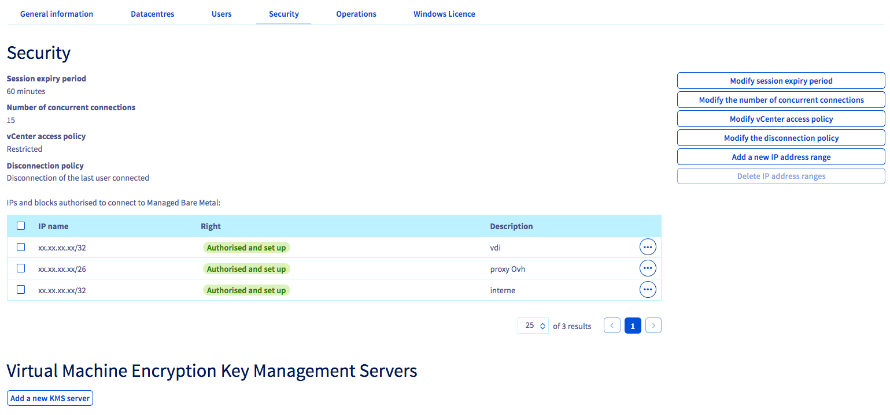
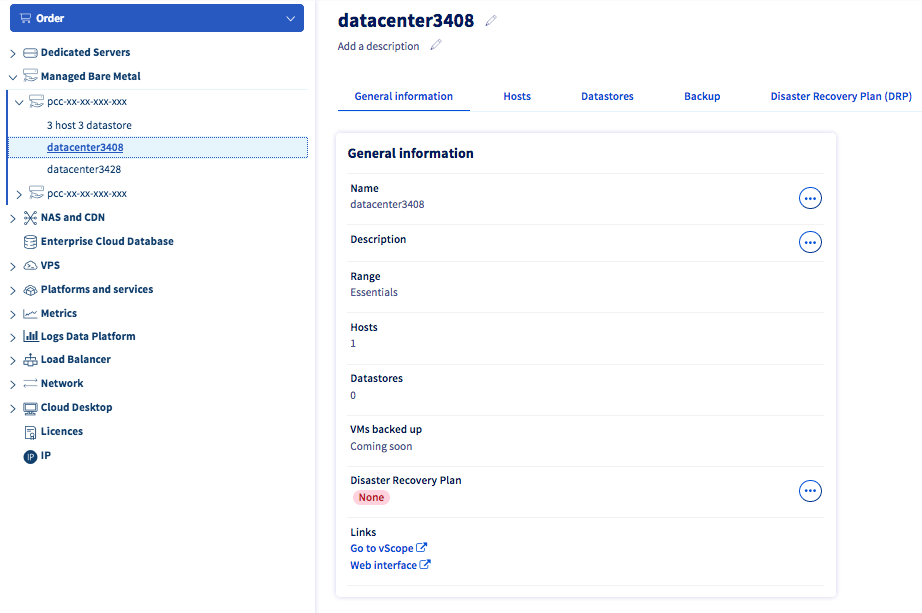

**Última atualização: 18/11/2020**

## Objetivo

A Área de Cliente OVHcloud oferece-lhe várias opções de personalização da sua infraestrutura Managed Bare Metal.

**Este guia dá-lhe a conhecer as múltiplas possibilidades.**

## Requisitos

- Estar ligado à [Área de Cliente OVHcloud](https://www.ovh.com/auth/?action=gotomanager){.external} e aceder à secção `Bare Metal Cloud`{.action} e, depois, `Managed Bare Metal`{.action}.
- Ter um produto [Managed Bare Metal](https://www.ovhcloud.com/pt/managed-bare-metal/){.external}.

## Instruções

### Separador geral

Depois de aceder à secção  `Bare Metal Cloud`{.action} e `Managed Bare Metal`{.action} da [Área de Cliente OVHcloud](https://www.ovh.com/auth/?action=gotomanager){.external}, visualizará um panorama geral da sua Managed Bare Metal:

{.thumbnail}

Ao cimo da página, `1 na imagem`, encontrará o nome e a descrição da sua Managed Bare Metal. Não hesite em personalizá-la, o que lhe será de grande utilidade se possuir várias infraestruturas. 

À esquerda,  `2 na imagem`, encontrará a(s) sua(s) Managed Bare Metal(s), bem como o(s) datacenter(s) virtual/ais que a compõem.

#### Informações gerais

No quadro à esquerda, encontrará informações gerais a respeito da sua Managed Bare Metal.

{.thumbnail}

- A descrição da sua Managed Bare Metal (com a possibilidade de lhe alterar o nome).
- A versão da sua Managed Bare Metal.
- O datacenter e, mais precisamente, a zona na qual a sua infraestrutura se encontra instalada.
- As regras de acesso à sua infraestrutura (`Aberta` ou `Restrita`), com as restrições por IP fonte.
- O número de datacenters virtuais na sua infraestrutura.
- O número de blocos de endereços IP (com a possibilidade de encomendar blocos suplementares).

#### Opções e conformidade

No quadro central, terá um panorama relativo ao estado de ativação das opções da sua Managed Bare Metal.

{.thumbnail}

#### Gestão do serviço

No quadro à direita, poderá gerir a sua subscrição à lista de difusão Managed Bare Metal da OVHcloud.

Nele também está indicada a próxima renovação do seu serviço Managed Bare Metal. À direita desta data, o botão `...`{.action} permite-lhe encomendar uma licença ou suprimir o serviço Managed Bare Metal.

{.thumbnail}

Para mais informações sobre o cancelamento de um serviço Managed Bare Metal, consulte [este guia](../como-rescindir-o-managed-bare-metal/).

#### Datacenters

Encontrará neste separador um curto resumo dos datacenters virtuais presentes no seu serviço Managed Bare Metal:

{.thumbnail}

Mais abaixo neste guia, encontrará uma visão mais pormenorizada dos datacenters virtuais.

> [!primary]
>
> Pode adicionar outro datacenter a partir desta página, operação que não acarretará nenhum custo suplementar.
> 

#### Utilizadores

Todos os utilizadores aptos a aceder ao vSphere estarão presentes nesta secção:

{.thumbnail}

Pode criar um utilizador clicando no botão  `Criar um utilizador`{.action}, à esquerda.

Para cada utilizador, encontrará diferentes informações, bem como as permissões aplicadas ao conjunto da Managed Bare Metal:

- ID de utilizador.
- Nome (facultativo).
- Sobrenome (facultativo).
- Endereço de e-mail (facultativo).
- Número de telefone (facultativo).
- A permissão *Token validator*, que permite validar operações sensíveis nas Managed Bare Metals.
- A permissão *IP*, que permite aceder ao plugin OVH Network.
- A permissão *IP Fail-Over*, que permite gerir os IPs Fail-Over associados à sua Managed Bare Metal.
- O estado (Diagnóstico), que permite ver se o utilizador foi de facto criado.

Ao clicar no botão `...`{.action} à direita do quadro, serão apresentadas várias hipóteses:

- Alterar as entradas deste quadro (modificação das permissões vistas anteriormente, acrescento de um endereço de e-mail ou de um número de telefone).
- Ver e alterar as permissões deste utilizador por datacenter.
- Alterar a palavra-passe do utilizador.
- Eliminar este utilizador.

Vejamos mais pormenorizadamente a alteração de permissões por datacenter:

{.thumbnail}

- `Acesso vSphere`{.action} \- trata-se das permissões globais do utilizador no vSphere:

|Permissões|Descrição|
|---|---|
|Nenhuma|Sem acesso|
|Apenas leitura|Acesso só de leitura|
|Leitura/Escrita|Acesso em leitura e escrita|
|Operador|Acesso reservado aos administradores OVHcloud|

- `Acesso ao VM Network`{.action} \- trata-se da gestão das permissões na secção Rede Pública (chamada `VM Network` na interface vSphere):

|Permissões|Descrição|
|---|---|
|Nenhuma|Sem acesso|
|Apenas leitura|Acesso só de leitura|
|Operador|Permite configurar máquinas virtuais (MV) na rede pública.|

- `Adicionar recursos`{.action} \- este botão permite dar ou não permissão ao acrescento de recursos suplementares através do plugin OVHcloud no cliente vSphere.

#### Segurança

As regras de acesso ao seu vCenter são parametrizáveis neste separador:

{.thumbnail}

Pode configurar os elementos por cima e no interior do quadro, através dos botões disponíveis à direita deste último. É possível configurar:

- O prazo de expiração de uma sessão.

- O número de ligações simultâneas permitidas.

- As regras de acesso, restritas ou não, com uma permissão por IP fonte. Os IPs estarão presentes no quadro.
É possível alterar ou eliminar o IP ou o intervalo de IPs clicando no botão `...`{.action}, à direita deste quadro.

> [!warning]
>
> Se optar por regras de acesso restritas e não informar nenhum IP, nenhum utilizador poderá ligar-se ao cliente vSphere. No entanto, as máquinas virtuais permanecerão acessíveis.
> 

- A política de desconexão consiste em desconectar o primeiro ou o último utilizador conectado.
Neste exemplo, se estiverem conectados 50 utilizadores e um 51.º se conectar, o primeiro a ter estabelecido a conexão será desconectado.

Está disponível um segundo quadro relativamente à opção *VM encryption*.

Encontrará mais informações sobre essa opção [neste guia](../vm-encrypt/).

#### Operações

Neste separador, encontrará as operações em curso na sua infraestrutura:

{.thumbnail}

Pode verificar se uma operação encontrou problemas, se está planificada uma manutenção...

Pode alterar a data de uma manutenção clicando no botão `...`{.action}, à direita deste quadro.

> [!primary]
>
> Se não conseguir aceder ao cliente vSphere, é possível que esteja em curso uma manutenção. Este separador permite verificar isso.
>

#### Licence Windows

O separador `Licença Windows`{.action} permite ativar as licenças SPLA Windows na sua Managed Bare Metal. Para isso, clique no botão situado à direita:

{.thumbnail}

Encontrará a página das tarifas [aqui](https://www.ovhcloud.com/pt/managed-bare-metal/images-licenses/).

### Panorama datacenter

Numa Managed Bare Metal, pode dispor de vários datacenters. Vai encontrá-los se clicar na sua Managed Bare Metal:

{.thumbnail}

Pode personalizar o nome do seu datacenter ao clicar no lápis, bem como acrescentar uma descrição personalizada.

Encontrará as principais informações sobre o datacenter, a gama, o número de hosts e de datastores.

#### Hosts

Aqui estão presentes os hosts do seu datacenter:

{.thumbnail}

Nesta secção, vai encontrar:

- Os nomes dos hosts.
- Os seus perfis (M, L, L+...).
- O modo de faturação: se a faturação do seu host for à hora, pode optar por uma faturação mensal se clicar no botão à direita do quadro.
- O estado do host.
- O número de horas utilizadas (apenas no âmbito de um recurso horário).

Em cima e à esquerda deste quadro, pode encomendar um novo host num modo de pagamento mensal.

#### Datastores

O quadro dos datastores é semelhante ao dos hosts:

{.thumbnail}

Nesta secção, vai encontrar:

- Os nomes dos datastores.
- Os seus perfis.
- Os seus tipos (Hybrid ou Full SSD).
- As suas dimensões.
- O modo de faturação.
- O estado do datastore, de modo a saber se ele se encontra instalado corretamente.
- O número de horas utilizadas (apenas no âmbito de um recurso horário).

Em cima e à esquerda deste quadro, pode encomendar um novo datastore num modo de pagamento mensal.

#### Backup

O separador Backup permite-lhe ativar a solução `Veeam Backup`.

{.thumbnail}

Para mais informações acerca desta opção, consulte [este guia](https://docs.ovh.com/gb/en/managed-bare-metal/veeam-backup-as-a-service/){.external}.

## Quer saber mais?

Fale com a nossa comunidade de utilizadores em <https://community.ovh.com/en/>.
