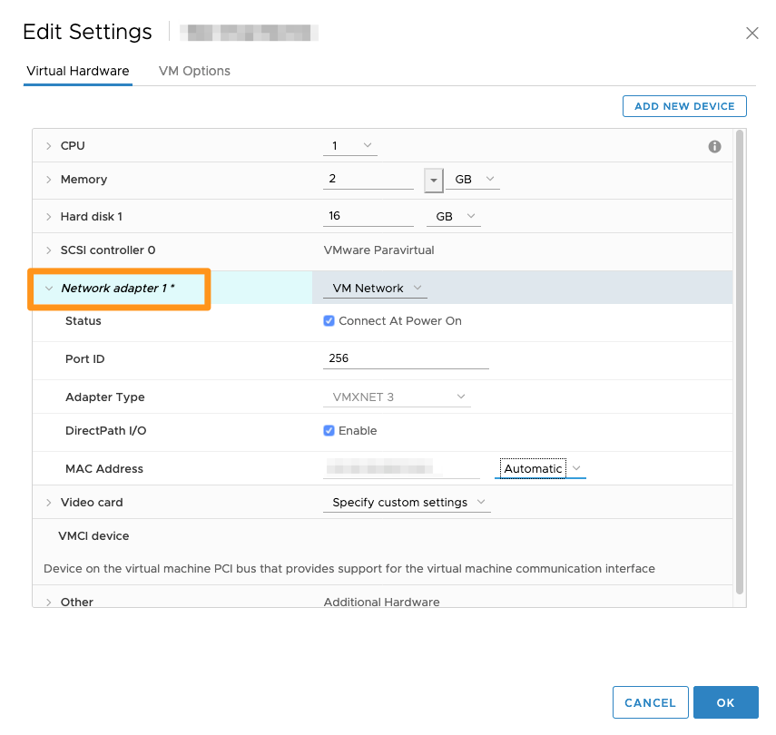
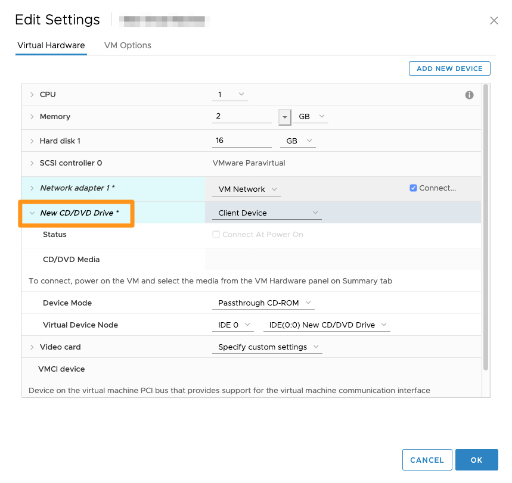

**Ostatnia aktualizacja z dnia 05-11-2020**

## Wprowadzenie

Po utworzeniu maszyny jej zasoby nie są przypisane na stałe. Nie licząc kilku ograniczeń, można nimi dowolnie zarządzać, by zapewnić większą elastyczność infrastruktury.

**Z tego przewodnika dowiesz się, jak wprowadzić zmiany w maszynie wirtualnej.**

## Wymagania początkowe

- Utworzenie maszyny wirtualnej
- Dostęp do interfejsu vSphere HTML

## W praktyce

Wszystkie opisane poniżej zmiany należy wprowadzać z poziomu Managed Bare Metal w vSphere po kliknięciu prawym przyciskiem maszyny wirtualnej i wybraniu opcji `Zmień ustawienia`{.action}.

{.thumbnail}

W tym menu możesz zwiększyć zasoby przypisane do maszyny wirtualnej. 

{.thumbnail}

U góry obrazka można zauważyć, że istnieje możliwość dodania urządzeń peryferyjnych, co opiszemy w dalszej części przewodnika.

### Procesor (CPU)

Liczba procesorów jest ograniczona do liczby slotów dostępnych w hoście.

Jeśli maszyna wirtualna migruje do hosta, który ma mniej procesorów niż jest przydzielonych do maszyny, będzie ona miała status `CPU ready`, co spowoduje spadek wydajności.

{.thumbnail}

Istnieje również możliwość zarezerwowania częstotliwości (minimalnej i maksymalnej) oraz wyboru liczby rdzeni na gniazdo.

Po zaznaczeniu pola `Dodawanie CPU bez przerwy w pracy`{.action} możesz zmieniać te ustawienia po uruchomieniu maszyny wirtualnej.

W zależności od systemu operacyjnego, dodawanie procesorów w trybie „hot swap” może być niewłaściwie obsługiwane i powodować nieprawidłowe działanie hosta.

Można dokonać rezerwacji, co oznacza, że do maszyny wirtualnej możesz przydzielić minimalną ilość *MHz* (megaherców).

Limit, domyślnie ustawiony na „brak”, umożliwia ograniczenie procesora Twojej maszyny wirtualnej do wartości wyrażonej w *MHz*. Można na przykład ograniczyć wydajność maszyny wirtualnej wykorzystywanej do rozwoju aplikacji.

### Pamięć (RAM)

Podobnie jak w przypadku procesora, pamięć (RAM) jest ograniczona do zasobów hosta.

Istnieje również możliwość dokonania rezerwacji, tak aby maszyna wirtualna zawsze dysponowała zarezerwowaną minimalną ilością pamięci RAM.

{.thumbnail}

### Dysk twardy

W przypadku dysku twardego można zwiększyć jego wielkość w zależności od wolnego miejsca w magazynie danych, który wykorzystuje maszyna wirtualna.

{.thumbnail}

Zaleca się używanie kontrolerów SCSI zamiast IDE. W razie kontrolera IDE niemożliwe jest na przykład wykonanie kopii zapasowej przy pomocy rozwiązania Veeam.

Możesz również wybrać tryb dysku:

- `Zależny`: dysk będzie objęty snapshotem;

- `Niezależny – trwały`: umożliwia zachowanie danych przy restarcie maszyny, ale dysk nie będzie objęty snapshotem;

- `Niezależny – nietrwały`: nie zachowa danych: po restarcie maszyny wszystkie dane zostaną skasowane.

### Karta sieciowa

W maszynie wirtualnej masz możliwość zmiany karty sieciowej, podłączenia karty przy uruchamianiu maszyny wirtualnej, zmiany typu karty, sprawdzania numeru portu i Twojego adresu MAC.

{.thumbnail}

Ten interfejs może być przydatny w przypadku niewłaściwego działania sieci. Możesz się upewnić, że *port ID* odpowiada wprowadzonemu w zakładce `Networking`{.action} oraz `Ports`{.action} dla danej karty.

### Napęd CD/DVD

Napęd CD/DVD umożliwia na przykład zamontowanie obrazu ISO w Twojej maszynie wirtualnej.

{.thumbnail}

Po zakończeniu korzystania z napędu CD/DVD zalecane jest jego usunięcie. W innym przypadku może on uniemożliwić przenoszenie maszyny wirtualnej.

### Dodawanie urządzeń peryferyjnych

W prawym górnym rogu tego okna masz możliwość dodawania urządzeń peryferyjnych.

Możesz dodawać dyski pochodzące z innego magazynu danych lub karty sieciowe, jeśli Twoje działania wymagają korzystania z kilku sieci prywatnych.

{.thumbnail}

## Sprawdź również

Dołącz do społeczności naszych użytkowników na stronie <https://community.ovh.com/en/>.
