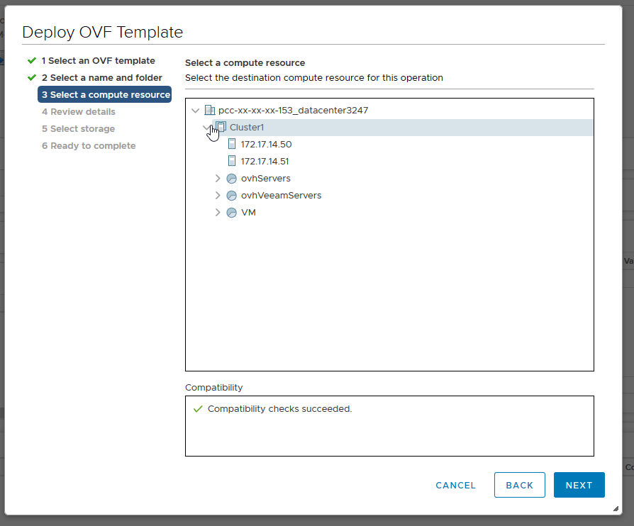
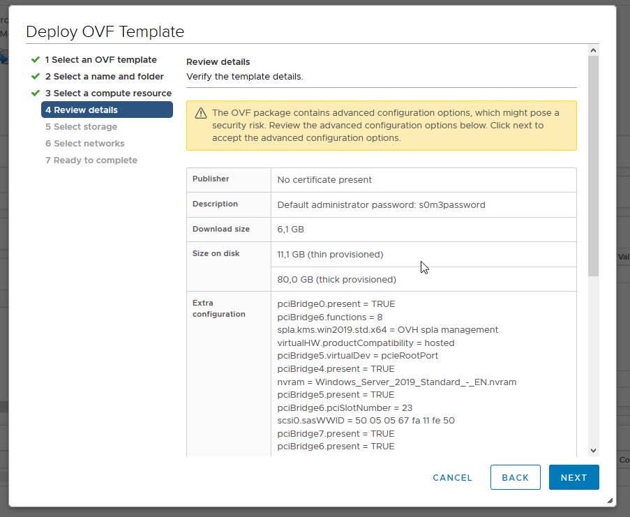
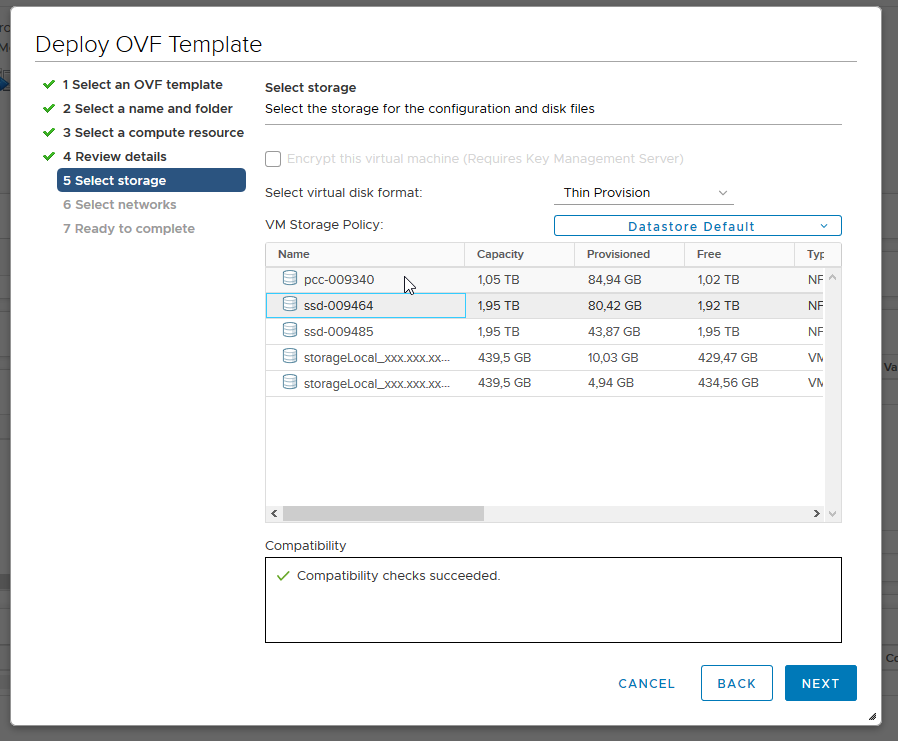
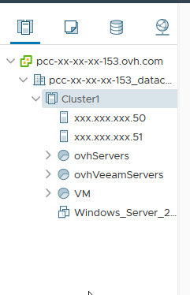
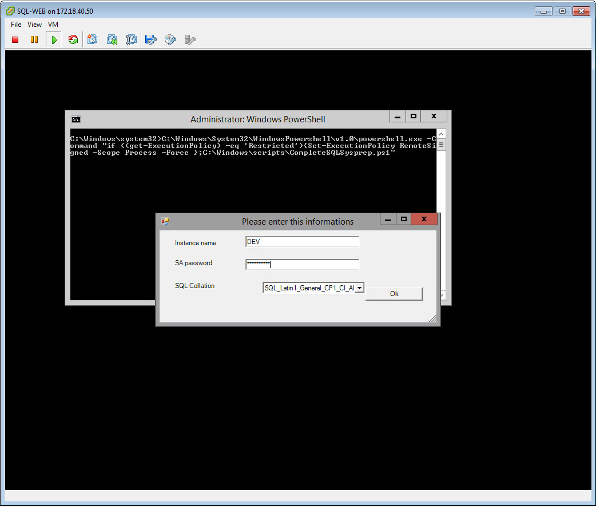

**Dernière mise à jour le 18/11/2020**

## Objectif

OVHcloud propose des templates Linux, Windows Server et Windows SQL server (au format OVF) que vous pouvez déployer directement depuis votre client Web (HTML 5).

Les VM Windows déployées à partir d'un template utilisent automatiquement les licences SPLA fournies par OVHcloud. Le déploiement d'une VM Windows déclenchera donc automatiquement une facturation supplémentaire.

**Ce guide vous explique où trouver les sources et comment procéder au déploiement.**

> [!primary]
> 
> Retrouvez sur cette [page](https://www.ovhcloud.com/fr-ca/managed-bare-metal/images-licenses/){.external} les tarifs des images proposées par OVHcloud.
>

## Prérequis

- Avoir accès au client Web (HTML5)
- [Avoir activé les licences Windows](../manager-ovhcloud/#licence-windows) depuis votre [espace client OVHcloud](https://ca.ovh.com/auth/?action=gotomanager){.external}

## En pratique

### Récupérer l'URL du template OVF

Depuis un navigateur internet, rendez-vous sur la page d'accueil de votre Managed Bare Metal puis cliquez sur `OVH Template`{.action}.

{.thumbnail}

Dans l'écran `OVH Templates` qui s'affiche, vous accédez au détail des templates Linux, Windows et SQL proposés. 

Sélectionnez le template souhaité, une fenêtre s'ouvrira et vous proposera les liens qui vous serviront pour le déploiement en fonction de votre version de vSphere.

{.thumbnail}

### Déployer le template OVF

Une fois connecté au client web vSphere, rendez-vous sur la page `Hôtes et clusters`{.action} puis faites un clic droit sur votre datacenter et cliquez sur `Déployer le modèle OVF...`{.action} :

{.thumbnail}

Le menu contextuel s'ouvre, la configuration du déploiement va pouvoir commencer. Dans la première étape, il faut ajouter le lien que vous avez récupéré précédemment :

{.thumbnail}

L'étape suivante vous permet de choisir le datacenter :

{.thumbnail}

Choisissez ensuite le cluster dans lequel la machine virtuelle va être déployée :

{.thumbnail}

Vous retrouvez tous les détails du template et, notamment, le mot de passe par défaut. Pour des raisons de sécurité, il est important de le changer dès votre première connexion :

{.thumbnail}

Choisissez le datastore dans lequel la machine virtuelle va être stockée ainsi que le format du disque :

{.thumbnail}

Vous devez maintenant choisir le réseau qui sera utilisé.

{.thumbnail}

La configuration est quasiment terminée, vous avez accès à un résumé de la configuration souhaitée :

{.thumbnail}

Après avoir cliqué sur `Terminer`{.action}, une tâche est créée et vous permet de suivre le déploiement :

{.thumbnail}

Une fois le déploiement terminé, vous pouvez fermer cette fenêtre.

Vous retrouvez alors la machine virtuelle déployée dans votre inventaire.

{.thumbnail}

### Finalisation de l'installation pour SQL Server

Démarrer votre machine virtuelle fraichement déployée et ouvrez la console.

Ouvrez la session Windows et renseignez le nom de votre instance SQL, le mot de passe et le jeux de caractère souhaité dans la fenêtre prévue à cet effet.

{.thumbnail}

> [!primary]
> 
> Il est recommandé de mettre en place un mot de passe respectant ces critères :
> 
> * Comporter au minimum huit caractères.
> * Comporter au minimum trois types de caractères (Majuscules, minuscules, chiffres, caractères spéciaux).
> * Ne pas être tiré du dictionnaire.
> * Ne pas comporter d’informations personnelles (votre prénom, nom ou date de naissance).
>

Une fois ces informations renseignées, cliquez sur `OK`{.action}.

Une fenêtre montrant le déploiement s'ouvrira. A la fin de celui ci, une dernière fenêtre vous informant de la réussite du déploiement s'ouvrira.

Cliquez à nouveau sur `OK`{.action} pour que l'installation se termine et que votre machine virtuelle redémarre.

Suite à ce redémarrage vous pourrez commencer à utiliser votre machine virtuelle.

## Aller plus loin

Échangez avec notre communauté d'utilisateurs sur <https://community.ovh.com>.
