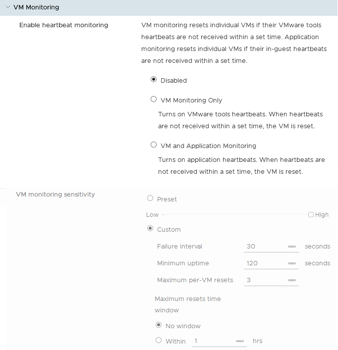

**Last updated November 5th 2020**

## Objective

The primary function of **VMware HA** (High Availability) is to restart the virtual machines on another host in the cluster if a hardware failure occurs. **HA** also monitors VMs and applications.

{.thumbnail}

**This guide explains the setting of this function.**

## Instructions

### Activation

HA is enabled by default in the first cluster that OVHcloud provides you when we deliver your Managed Bare Metal.
If a new cluster is created, you can enable it when it is created, or after.

If HA is not enabled in your cluster, go to the `Configure`{.action} tab of your cluster and then to the `vSphere Availability`{.action} tab available in `Services`{.action}.

Click `Edit`{.action} and slide the cursor to enable the HA feature.

It is also important to enable host monitoring. This setting allows pulsing signals to be sent between ESXi hosts to detect a possible failure.
Disabling it is required to perform update operations with Update Manager.

{.thumbnail}

### Settings

#### Host Failure Response

This first category allows you to set your VMs reboot policy based on the different possible failures.

##### Failure Response

This category will set your policy to restart VMs if a host is lost.

This allows you to choose whether to restart your virtual machines automatically or not.
Default restart management on the cluster is also possible. You can refine this by virtual machine in the tab `VM Overrides`{.action}.

You can also select a condition other than the default (Allocated Resources), which vSphere HA will verify before restarting.

{.thumbnail}

##### Response for Host Isolation

This category allows you to define actions to take if network connectivity is lost on a host.

You can choose : 

- No action will be taken on the affected VMs. 
- All affected VMs will be powered off and vSphere HA will attempt to restart the VMs on hosts that still have network connectivity.
- All affected hosts will be gracefully shut down and vSphere HA will attempt to restart the VMs on hosts that are still online. 

{.thumbnail}

##### Datastore with PDL

If a datastore fails with a permanent device loss (PDL) state, you can set the actions to take:

- No action will be taken to the affected VMs.
- No action will be taken to the affected VMs, events will be generated.
- All affected VMs will be terminated and vSphere HA will attempt to restart the VMs on hosts that still have connectivity to the datastore.

{.thumbnail}

##### Datastore with APD

If a datastore fails with an all path down status, you can set the actions to take :

- No action will be taken on the affected VMs.
- No action will be taken on the affected VMs. Events will be generated.
- A VM will be powered off, if HA determines the VM can be restarted on a different host.
- A VM will be powered off, If HA determines the VM can be restarted on a different host, or if HA can not detect the resources on other hosts because of network connectivity loss (network partition).

{.thumbnail}

##### VM Monitoring

VM monitoring is available after [VMware tools](../install_vmware_tools/){.external} is installed, in case of non-response via the **tools** (heartbeat signals) the virtual machine will be automatically restarted. Advanced configuration is possible for this feature (for example, reboot interval).

{.thumbnail}

#### Admission control

vSphere HA uses the Admission control to ensure that sufficient resources are reserved for recovering virtual machines in the event of a host failure.

Admission control places constraints on resource use. Actions that may violate these constraints are not allowed. Actions that may not be allowed include the following examples:

- Power on a virtual machine.
- Migrating a VM.
- Increased CPU or memory reserve of a virtual machine.

The basis of the vSphere Admission control is the number of host failures that the cluster is allowed to tolerate and that continues to ensure failover. The failover capacity of hosts can be defined in three different ways:

- [Cluster resource Percentage](https://docs.vmware.com/en/VMware-vSphere/6.7/com.vmware.vsphere.avail.doc/GUID-FAFEFEFF-56F7-4CDF-A682-FC3C62A29A95.html){.external}
- [Slot Policy (powered-on VMs)](https://docs.vmware.com/en/VMware-vSphere/6.7/com.vmware.vsphere.avail.doc/GUID-85D9737E-769C-40B6-AB73-F58DA1A451F0.html){.external}
- [Dedicated failover hosts](https://docs.vmware.com/en/VMware-vSphere/6.7/com.vmware.vsphere.avail.doc/GUID-C4F5F9EE-4235-4151-BEBE-FCB2A752407B.html){.external}

#### Heartbeat datastore

When the primary host of an HA cluster can not communicate with a subordinate host on the management network, the primary host uses the database heartbeat signal to determine if the subordinate host is failing, is in a network partition, or is isolated from the network.

#### Advanced options

Multiple advanced configuration settings can be used in your cluster.

You can find settings on [this page](https://docs.vmware.com/en/VMware-vSphere/6.7/com.vmware.vsphere.avail.doc/GUID-E0161CB5-BD3F-425F-A7E0-BF83B005FECA.html){.external}.

### HA rules

In the `configuration`{.action} section and then in the `VM/Host Rules`{.action} tab, you can create a rule of type "VMs".

This will add a reboot condition to ensure that all virtual machines in the first group are started before starting the ones in the second group.

This rule can be added to the configurable restart priorities in the `VM Overrides`{.action}.

## Go further

Join our community of users on <https://community.ovh.com/en/>.
