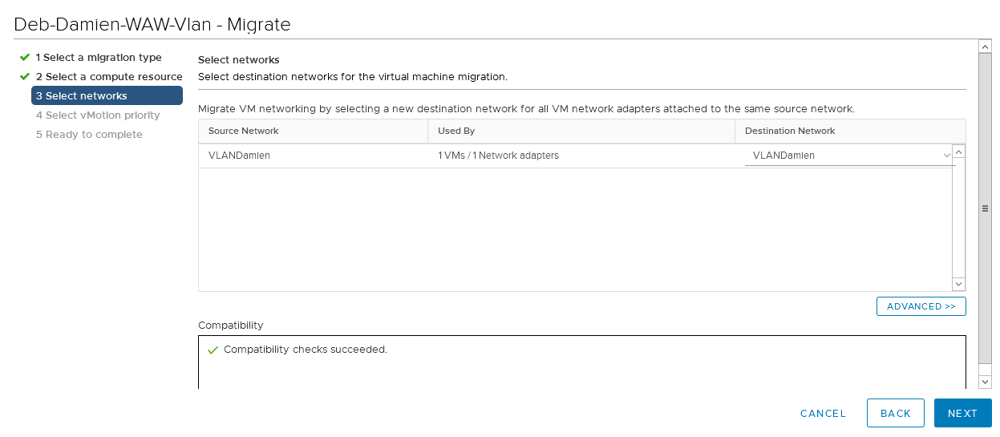

**Stand 05.11.2020**

## Einleitung

**vMotion** stellt eine Migration einer laufenden virtuellen Maschine **(Hot-Swap)** von einem Host auf einen anderen, einen Ressourcen-Pool oder Vapp innerhalb eines **Clusters** dar.

**Diese Anleitung führt Sie durch diese Operation.**

## Praktische Anwendung

### Eine virtuelle Maschine verlagern

Wird ein Token per SMS empfangen, muss dieser im sicheren Interface eingegeben werden, um die wartende Operation 
 auf einer anderen Ressource zu starten.

Um eine virtuelle Maschine zu verlagern müssen Sie nur mit der rechten Maustaste auf die laufende virtuelle Maschine klicken. Wählen Sie dann das Menü `Migrate...`{.action}.

{.thumbnail}

## Wahl des vMotion-Typs

Das Menü schlägt Ihnen verschiedene Optionen für vMotion vor. In unserem Beispiel möchten wir nur die virtuelle Maschine auf einen anderen Host verlagern. Daher wählen wir „Change compute resource only“.

Mit der Option „Change storage only“ können Sie die virtuelle Maschine in einen anderen Datastore verlegen. Diese Aktion wird **Storage vMotion** genannt und in [dieser Anleitung beschrieben](../vmware-storage-vmotion-neu/).

{.thumbnail}

### Wahl der Ressource

Wählen Sie aus, zu welcher Ressource die virtuelle Maschine migriert werden soll. Die virtuelle Maschine kann auf einen Host, Ressourcen-Pool oder Vapp migriert werden.

In unserem Beispiel verlagern wir sie auf den Host .50.

{.thumbnail}

### Wahl des Netzwerks

In diesem Schritt können Sie das Netzwerk auswählen, das der virtuellen Maschine zugewiesen wird. In unserem Beispiel belassen wir die virtuelle Maschine in ihrem ursprünglichen VLAN.

{.thumbnail}

### Wahl der Priorität

Wir empfehlen Ihnen, die Migration mit hoher Prioritätsstufe durchzuführen. Dazu wählen Sie „Schedule vMotion with high priority“.

{.thumbnail}

### vMotion abschließen

Klicken Sie auf `Finish`{.action} , um den Migrationsprozess zu starten.

{.thumbnail}

## vMotion nachverfolgen

In den aktuellen Tasks können Sie den Stand der Migration ersehen. Je nach zugewiesenem Arbeitsspeicher, Auslastung der virtuellen Maschine und verwendeter Bandbreite erfolgt sie schneller oder langsamer.

{.thumbnail}

## Weiterführende Informationen

Für den Austausch mit unserer User Community gehen Sie auf <https://community.ovh.com/en/>.
