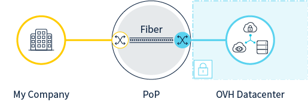

**Last updated 4th May 2020**

## What is OVHcloud Connect ?

It's a connection between your vRack and an external network.

{.thumbnail}

## Benefits

### Dedicated

Dedicated Mode is a direct connection with OVHcloud devices. You can manage differents configurations, from an single connection to a multiple using LACP (Layer2) or BGP-ECMP (Layer3) with port speed at 1Gb or 10Gb. Interface and bandwidth are not shared with others customers.

### Private

Your trafic is isolated from Internet, you manage your own Vlans (Layer2) and/or your own IP addresses (Layer3). Even BGP instances are private and you can configure your choice's ASN.

OVHcloud Connect is connected to your vRack with all compatible services.

### Network Extension

OVHcloud Connect can be connected either to your WAN or your Datacenter Network, allowing extension to the cloud or even ease your migration by keeping Vlans topology or IP addresses.

### High Availibility

Using BGP, you can inter-connect your network through several POP and reach several OVHcloud Datacenter. From vRack, configure BGP to enable maximum resiliency with distributed services.

## Components

### POP - EntryPoint

Point-of-Presence are facilities like Equinix, InterXion, Telehouse or Global Switch. POP is OVHcloud Connect's service Entry: we call it EntryPoint.

### DC - EndPoint

OVHcloud Datacenter is the service terminaison, the EndPoint.

### Cross-connect

A cross-connection is a physical link (monomode fiber) managed by the local facility team in the POP. The cross-connection is established in the MMR (Meet-Me-Room) between the position given by OVHcloud and the position owned by the customer. Customer must order and manage the cross-connect for OVHcloud Dedicated Connect. 

### vRack

OVHcloud Private Network, available on compute ressources between all OVHcloud Datacenters.

### BGP

Routing protocol to use when using Layer-3 mode.

## Principles

The OVHcloud Connect  is  based on a virtual  link between  an  EntryPoint  and  an  EndPoint. The  EntryPoint  is 
where you want to make the inter-connection with OVHcloud. The EndPoint is the OVHcloud Datacenter with your services. You can choose any Datacenter in the same region than the POP. 

### Layer-2 Mode

The Virtual link is a L2 tunnel for OVHcloud Connect L2. Only 1x POP/EntryPoint with 1x DC/EndPoint can be configured.

### Layer-3 Mode

The Virtual link is a full mesh IP network between any POP/EntryPoint and any DC/EndPoint of the same region.
