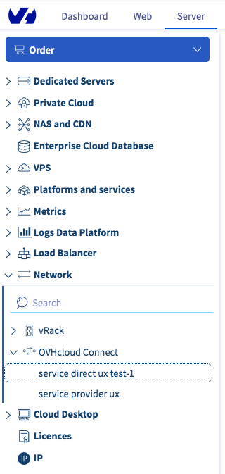
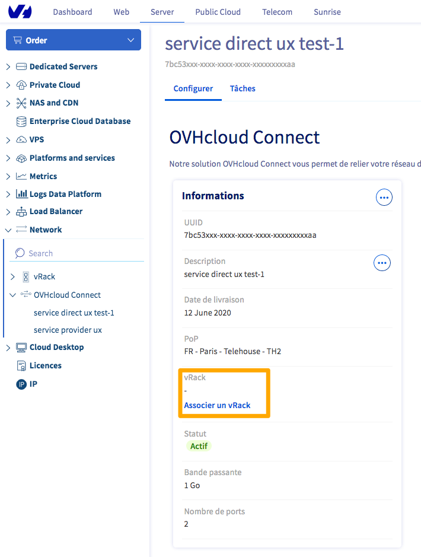
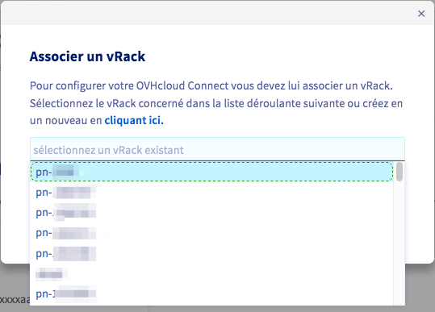
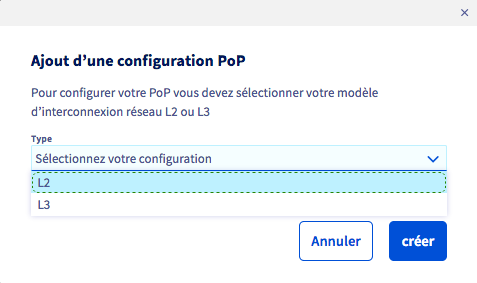
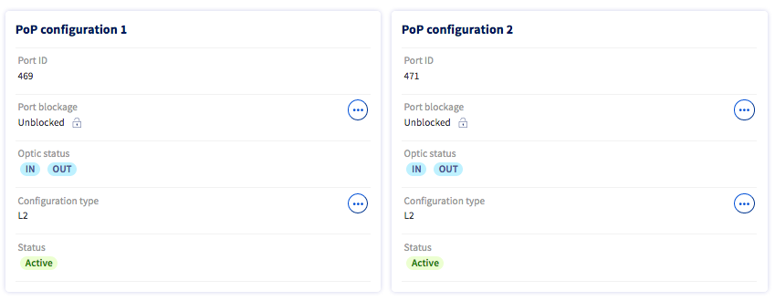
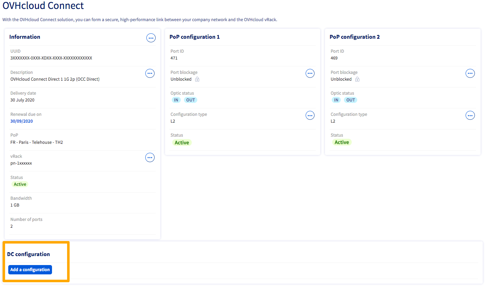
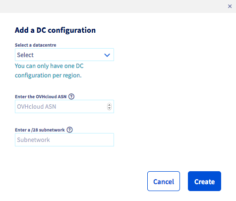
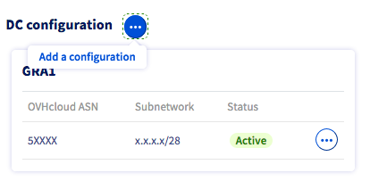

**Dernière mise à jour le 24/08/2020**

## Objectif

OVHcloud Connect permet d’étendre votre réseau d’entreprise avec votre réseau privé OVHcloud vRack sans passer par la création d’un tunnel VPN à travers Internet. Cette connexion sera ainsi plus rapide, plus fiable et avec une bande passante garantie. 

**Ce guide vous présente la mise en service de l'offre OVHcloud Connect Direct depuis l'espace client OVHcloud**

## Prérequis

- Posséder une [offre OVHcloud Connect Direct](hhttps://www.ovh.com/fr/solutions/ovhcloud-connect/) {.external}.
- Disposer d'un [vRack OVHcloud](https://www.ovh.com/fr/solutions/vrack/)
- Être connecté à votre [espace client OVHcloud](https://www.ovh.com/auth/?action=gotomanager){.external}.

## En pratique

Connectez-vous à [l’espace client OVHcloud](https://www.ovh.com/auth/?action=gotomanager){.external}, cliquez sur `Server`{.action} en haut à gauche puis sélectionnez l'onglet `Network`{.action}. Cliquez alors sur `OVHCloud Connect`{.action} puis sur votre offre.

{.thumbnail}

### Étape 1: associer un vRack

Vous devez commencer par associer un vRack à votre offre. Cliquez sur le bouton  `Associer un vRack`{.action} et sélectionnez un vRack existant dans le menu déroulant. 

{.thumbnail}

{.thumbnail}

Un message vous confirmera l'association du vRack.

{.thumbnail}

### Étape 2: ajouter une configuration PoP

> [!warning]
> Un changement de configuration PoP de L2 à L3, ou inversement, nécessiterait de supprimer toute la configuration. Nous vous conseillons donc de bien réfléchir à votre choix de configuration avant d'aller plus loin.
>

> [!primary]
> Pour plus de détails sur les différences entre les niveaux L2 et L3, consultez notre [FAQ](../occdedicated-faq/#3-comment-choisir-entre-une-interconnexion-de-niveau-2-ou-de-niveau-3-du-modele-osi).
>

#### Configuration L2 

Une fois votre vRack associé, cliquez sur `Ajouter une configuration PoP`{.action} et sélectionnez dans le menu déroulant la configuration L2 puis validez. 

{.thumbnail}

{.thumbnail}

Deux menus `Configuration PoP` apparaîtront alors automatiquement.

{.thumbnail}

#### Configuration L3 

Une fois votre vRack associé, cliquez sur `Ajouter une configuration PoP`{.action} et sélectionnez la configuration L3 dans le menu déroulant.

{.thumbnail}

Vous devrez alors saisir votre ASN, l'ASN OVHcloud ainsi que que l'adresse réseau en /30.

{.thumbnail}

Le menu `Configuration PoP` apparaîtra alors.

{.thumbnail}

Vous pouvez également ajouter une seconde configuration PoP L3 via le deuxième menu `Configuration PoP` qui vous sera présenté.

### Étape 3: ajout d'une configuration Datacentre

#### Configuration L2 

Lorsque votre configuration PoP a été définie, cliquez sur `Ajouter une configuration`{.action} sous le menu `Configuration Datacentre`. Sélectionnez un Datacentre dans le menu déroulant et validez.

{.thumbnail}

{.thumbnail}

#### Configuration L3 

Lorsque votre configuration PoP a été définie, cliquez sur `Ajouter une configuration`{.action} sous le menu `Configuration Datacentre`. Sélectionnez un Datacentre dans le menu déroulant puis renseignez votre ASN OVHcloud ainsi que l'adresse du réseau en /30. 

{.thumbnail}

Vous pouvez ajouter des configurations Datacentre supplémentaires en cliquant sur le bouton `...`{.action} puis sur `Ajouter une configuration`{.action}.

{.thumbnail}

Vous devez également ajouter une configuration de routage.

##### **Ajout d'une configuration de routage**

Cliquez sur le bouton `(...)`{.action} sur le Datacentre voulu puis sur `Ajouter configuration de routage`{.action}.

{.thumbnail}

Choisissez alors le type de routage entre « Network » et « BGP ». 
{.thumbnail}

Si vous choisissez le type « BGP », saisissez alors votre ASN OVHcloud ainsi que l'adresse IP Neighbor.

{.thumbnail}

Vous pouvez ajouter plusieurs configurations de routage au sein d'un même Datacentre. Le type de configuration choisi sur votre première configuration s'appliquera alors aux suivantes sur le même Datacentre.

## Aller plus loin

Échangez avec notre communauté d'utilisateurs sur <https://community.ovh.com/>.
