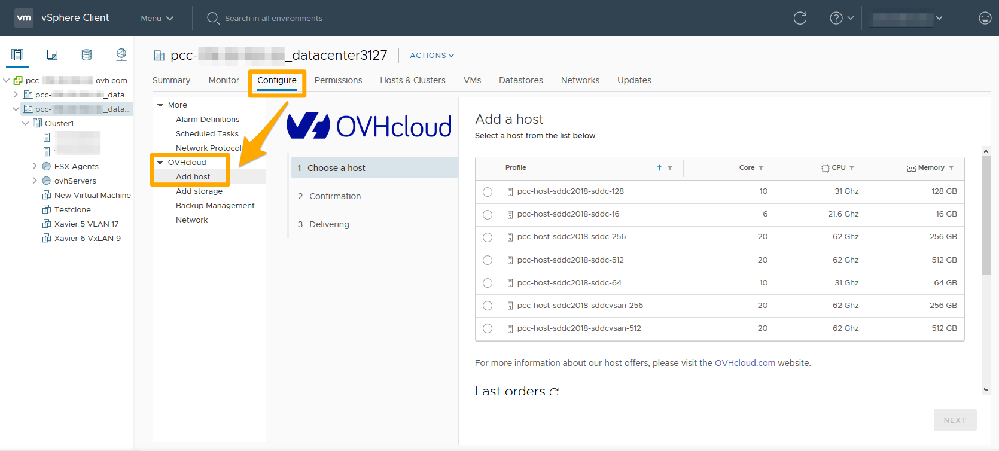

**Ultimo aggiornamento: 12/12/2018**

## Obiettivo

Il servizio [Private Cloud](https://www.ovh.it/private-cloud/){.external} consente di aggiungere risorse con fatturazione oraria.

**Questa guida ti mostra come aggiungere una risorsa oraria dall’interfaccia di gestione vSphere del Private Cloud.**

## Prerequisiti

* Disporre di una soluzione [Private Cloud](https://www.ovh.it/private-cloud/){.external}
* Possedere un account con i permessi necessari per aggiungere risorse nel datacenter selezionato direttamente dallo [Spazio Cliente OVH](https://www.ovh.com/auth/?action=gotomanager){.external}
* Essere connesso al client vSphere

## Procedura

### Seleziona la risorsa

Per accedere all’interfaccia che ti consente di aggiungere risorse orarie, seleziona il datacenter dopodiché apri la scheda `Configure`{.action}.

{.thumbnail}

Per aggiungere un host con fatturazione oraria, clicca su `Add OVH Host...`{.action}, seleziona il modello e poi clicca su `Next`{.action}. Se al posto di un host vuoi aggiungere un datastore, è sufficiente selezionare la scheda `Add OVH Storage...`{.action}.

{.thumbnail}

### Conferma l’ordine

Per confermare e concludere l’ordine, clicca di nuovo sul pulsante `Next`{.action}.

{.thumbnail}

### Segui il processo d’installazione

Dopo aver confermato l’ordine, puoi seguire l’andamento dell’installazione della risorsa.

{.thumbnail}

Inoltre, è possibile seguire l’operazione dalla sezione delle attività recenti di vSphere. 

## Per saperne di più

Contatta la nostra Community di utenti all’indirizzo <https://www.ovh.it/community/>.