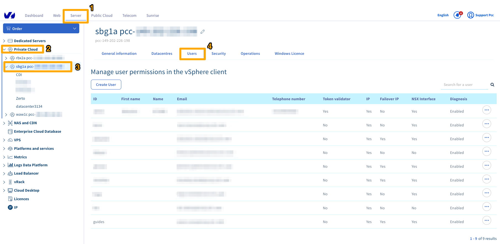
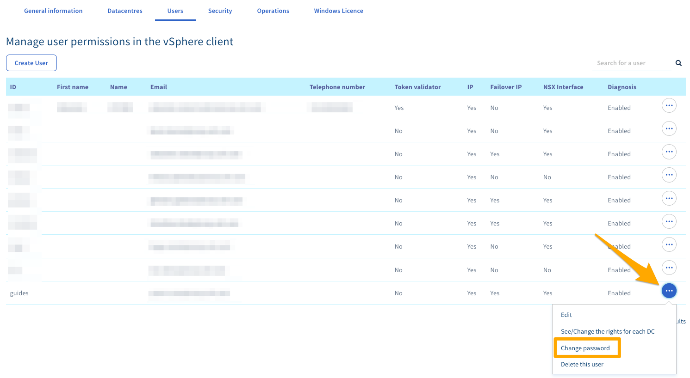

**Letzte Aktualisierung am 17.06.2020**
 
## Ziel

Die Berechtigungen und Passwörter von Nutzern des vSphere Clients werden im OVHcloud Kundencenter verwaltet.

**Diese Anleitung erklärt, wie Sie Ihr Nutzerpasswort ändern können.**

## Voraussetzungen

- Sie haben Zugriff auf Ihr [OVHcloud Kundencenter](https://www.ovh.com/auth/?action=gotomanager).
- Im OVHcloud Kundencenter wurde ein Nutzeraccount für Sie angelegt.  Bitte entnehmen Sie [dieser Anleitung](../manager-ovh-private-cloud/#nutzer) weitere Informationen.

## In der praktischen Anwendung

### Passwort ändern

Loggen Sie sich in Ihrem [OVHcloud Kundencenter](https://www.ovh.com/auth/?action=gotomanager) ein und wählen Sie dann den Bereich `Hosted Private Cloud` (1). Klicken Sie im linken Menü auf `Private Cloud` (2) und wählen Sie die betreffende Infrastruktur aus (3). Klicken Sie dann auf den Tab `Nutzer`{.action} (4).

{.thumbnail}

Klicken Sie auf die Schaltfläche `(...)`{.action} rechts neben dem jeweiligen Nutzer, dann auf `Passwort ändern`{.action}.

{.thumbnail}

Geben Sie nun ein neues Passwort ein und bestätigen Sie es.

{.thumbnail}

> [!primary]
> Wenn Sie kein neues Passwort eingeben, wird ein zufällig generiertes Passwort per E-Mail an die Adresse gesendet, die mit dem Nutzer verbunden ist.
> 

> [!warning]
>
>Um die Sicherheit Ihrer Infrastruktur nicht zu gefährden empfehlen wir Ihnen, diese bewährte Verfahren zu befolgen. Ihr Passwort muss:
>
> - Aus mindestens 8 Zeichen bestehen.
> - Mindestens 3 verschiedene Zeichentypen enthalten.
> - Es darf kein Wort aus dem Wörterbuch sein.
> - Es darf keine privaten Informationen enthalten.
> - Es darf nicht für mehrere Zugänge verwendet werden.
> - In einem Passwort-Manager gespeichert sein.
> - Alle drei Monate geändert werden.
> - Sich von den vorherigen Passwörtern unterscheiden.
>

## Weiterführende Informationen

[Vorstellung des Private Cloud Kundencenters von OVHcloud](../manager-ovh-private-cloud/)

[Die Rechte eines Nutzers ändern](../rechte-eines-nutzers-aendern/)

[Das Passwort Ihres OVHcloud Accounts anlegen und verwalten](../../customer/Passwort-verwalten/)

Für den Austausch mit unserer User Community gehen Sie auf <https://community.ovh.com/>.
