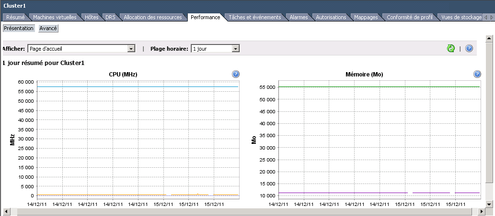

## 
Poniżej przedstawiamy sposób diagnozowania spowolnień na wirtualnej maszynie. 

Należy zalogować się do vSphere (poprzez program lokalny lub za pomocą połączenia RDP dostarczonego podczas aktywacji usługi Private Cloud).

## Weryfikacja wirtualnych maszyn:
Najpierw należy wybrać wirtualna maszynę, która sprawia problemy i wybrać zakładkę « Performance ». W zakładce tej będą widoczne wykresy wykorzystania zasobów procesora, pamięci RAM, itp. Jeśli w tej części zauważymy podwyższone zużycie zasobów, problem z pewnością jest związany z wirtualną maszyną. 
W takim przypadku możesz zwiększyć zasoby przypisane do VM (po sprawdzeniu, czy nie ma ograniczeń w zakładce Edit Settings => Ressources).

## Weryfikacja klastra / zasobów
W przypadku klastra i zasobów należy wybrać zakładkę Performances. Wyświetlą się wykresy wykorzystanych zasobów:

{.thumbnail}
W sekcji dotyczącej przyznawania zasobów możesz sprawdzić całkowite wykorzystanie zasobów przez wirtualne maszyny:

{.thumbnail}
Mogą wystąpić dwie sytuacje: 

- Jeśli dany host jest zbyt obciążony, możesz ręcznie przenieść swoją wirtualną maszynę na inny host lub wykonać migrację za pomocą vMotion.

Jeśli korzystasz z licencji Enterprise, możesz skorzystać z funkcji DRS, która pozwala na automatyczne zarządzanie takimi operacjami, w zależności o wykorzystania zasobów przez hosty. 

- Jeśli wszystkie hosty są przeciążone, można dodać kolejne w zakładce Private Cloud OVH lub Stockage OVH.

## Weryfikacja przestrzeni dyskowej
Możesz również monitorować przestrzeń dyskową. Jeśli korzystasz z widoku Datastore, wybierz swój NAS i zakładkę « Performance »:

{.thumbnail}

## Weryfikacja sieci
Możesz także sprawdzić stan sieci. Panelu klienta Manager możesz sprawdzić wykorzystywane łącze oraz ograniczenia, które wprowadziłeś w swojej sieci VLAN:

- Manager v5 -> Private Cloud -> Podsumowanie

