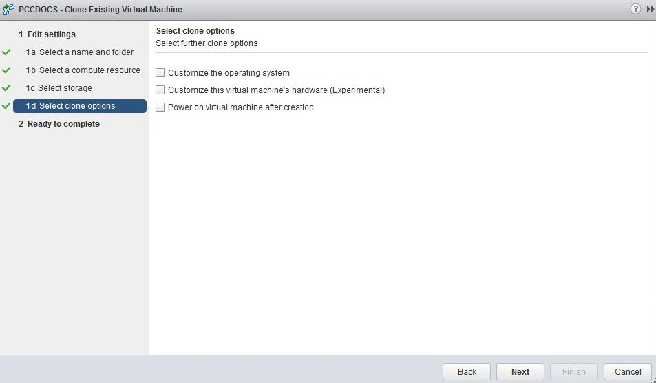
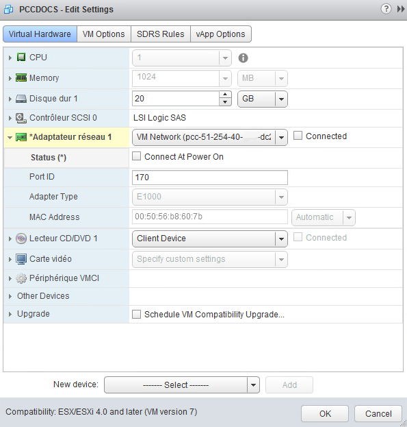

Faites un clic droit sur la VM à cloner puis sélectionnez « Clone », « Clone To virtual Machine ».Spécifiez le nom de votre nouvelle VM et son emplacement dans votre arborescence :

{.thumbnail}

Sélection de la ressource
-------------------------

Spécifiez le cluster, host principal, Vapp ou ressource pool de cette VM :

{.thumbnail}

Choix du stockage
-----------------

Indiquez maintenant le filer ou sera stocké l’espace-disque de cette VM. Sélectionnez, pour notre exemple, la VM de destination qui possède (ou non,) le même format que sa source. Vous pouvez utiliser :

- Same Format as Source : la VM créée sera identique en tous points à la source ;
- Thin provisioned format : créera le disque, mais n’utilisera que l’espace disque réellement employé sur le filer ;
- Thick Format : utilisera l’ensemble de l’espace disque correspondant à la VM sur le filer.

[Quel format de disque choisir]({legacy}1441955)

Lors du choix de: "VM Storage Policy", actuellement seul le réglage.

{.thumbnail}

Configuration système
---------------------

Nous arrivons maintenant à la configuration réseau à appliquer à cette VM. Vous avez deux choix :

- Si vous ne cochez rien, cela ne fera aucun changement sur la configuration réseau de la nouvelle VM par rapport à la source ;
- Customize using the operating system : cette option vous permettra de spécifier les nouvelles configurations que vous souhaitez mettre en place sur cette nouvelle VM.

{.thumbnail}

**ATTENTION ! ! !SI vous n'avez pas fait de Custom de la machine virtuelle, il est nécessaire de modifier la configuration du Clone avant de la démarrer, afin d'éviter un conflit d'IP / MACDans ce cas, il vous suffit simplement de décocher la carte réseau dans les paramètres de la machine virtuelle une fois celle ci clonée, juste avant de la démarrer**

{.thumbnail}
