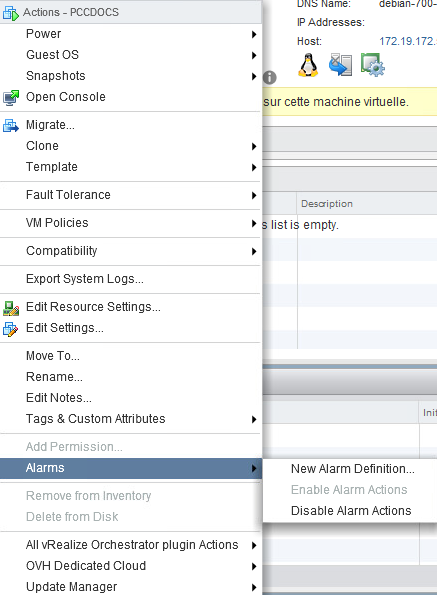

Il est possible de créer une alerte sur tous les éléments de votre Dedicated Cloud : le datacentre lui-même, les clusters, les VM, les datastores, le réseau...Pour cela, faites un clic droit sur le datacentre ou tout autre élément à surveiller, puis sélectionner « Alarms » et enfin « New Alarm Definition ».

{.thumbnail}

Création de l'alarme
--------------------

Sur l’onglet « General», indiquez le nom de votre alerte, et sélectionnez le type d’alarme :

{.thumbnail}

Les déclencheurs (Triggers)
---------------------------

L’onglet « Triggers », vous permet d’indiquer les paramètres que vous allez surveiller, ainsi que les conditions d’alerte. Le bouton « + » vous permet de personnaliser la règle.Vous pouvez ainsi surveiller la RAM d’un host par exemple, en indiquant un seuil à ne pas dépasser avant que son statut ne passe en alerte et que vous ne recevrez un e-mail d'avertissement.

{.thumbnail}

Les actions
-----------

Sur l’onglet « Actions », vous allez définir l’action à mener une fois l’alarme détectée : un envoi de mail, un arrêt de VM par exemple. Vous pouvez également configurer via cet onglet la fréquence de répétition des alertes:

{.thumbnail}
