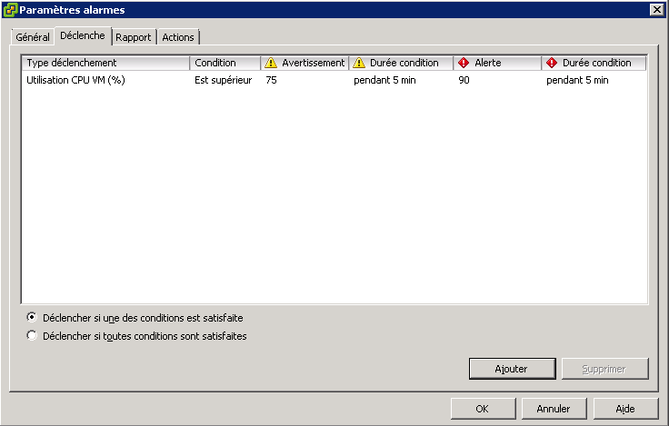

## 
Należy zalogować się do panelu vSphere (za pomocą lokalnego programu lub połączenia RDP dostarczonego po aktywacji usługi PCC).

## 
Możesz skonfigurować alert dla każdego elementu usługi Private Cloud: dla Private Cloud, klastrów, wirtualnych maszyn, datastore, sieci...
Aby to zrobić, kliknij prawym przyciskiem myszy na Private Cloud lub na inny element, który chcesz monitorować, wybierz « Alarm » i « Add Alarm ».

{.thumbnail}
W zakładce « General » podaj nazwę alertu i wybierz typ alarmu:

{.thumbnail}
Zakładka « Triggers » pozwala na wskazanie parametrów do monitorowania i warunków alertu. Przycisk « Add » pozwala na dostosowanie reguły. Możesz monitorować na przykład pamięć RAM hosta wskazując próg, którego nie można przekroczyć i po przekroczeniu którego otrzymasz e-mail z powiadomieniem.

{.thumbnail}
W zakładce « Reporting » możesz wskazać margines, który ma być brany pod uwagę przed uruchomieniem alertu oraz częstotliwość jego powtarzania. 
Jeśli na przykład twój host przekracza 95% zużycia przez 5 minut, otrzymasz powiadomienie na e-mail. 

W zakładce « Action » możesz zdefiniować operację do wykonania po wykryciu alarmu: wysyłka na e-mail, zatrzymanie działania VM, wykonanie zamówienia.

{.thumbnail}

