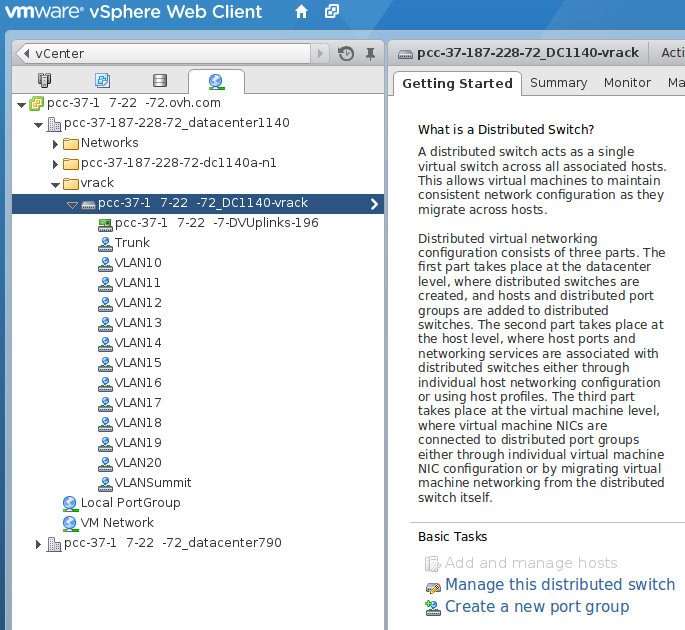
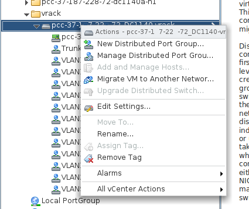
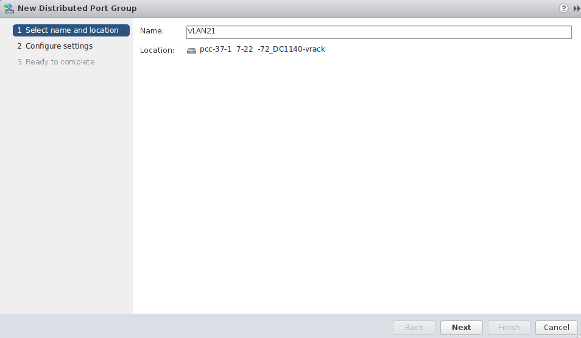
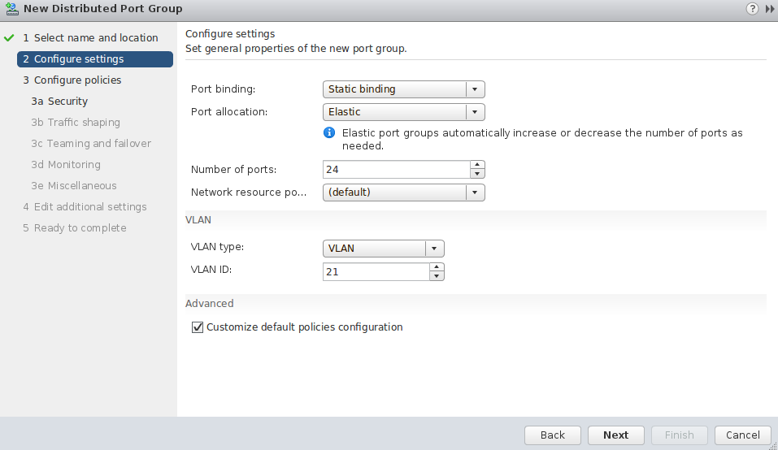
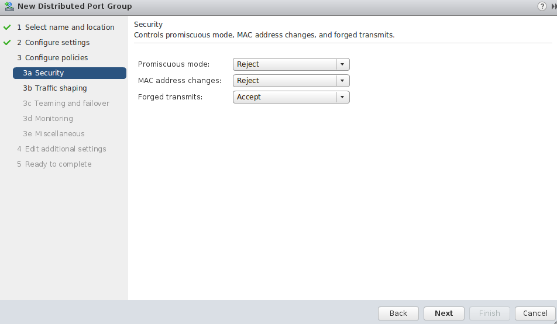
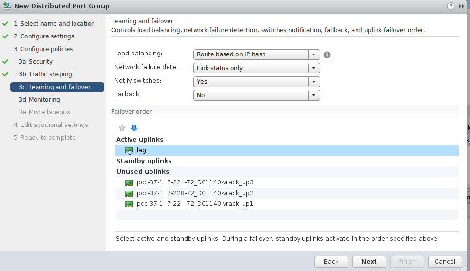
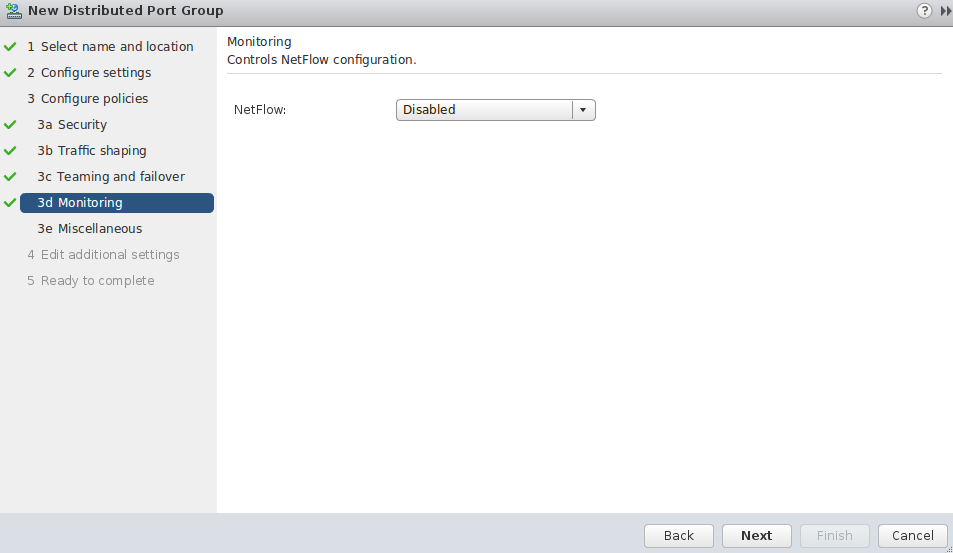
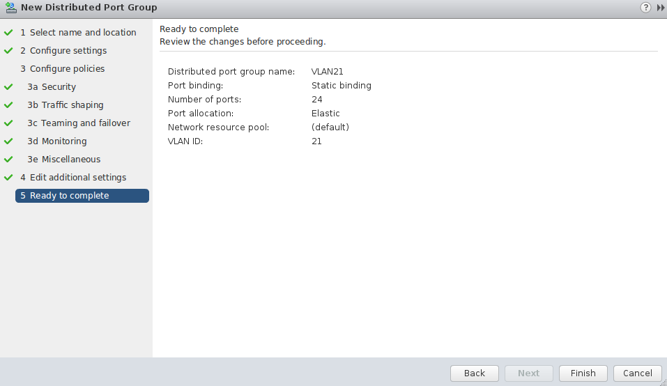

Avec la gamme [SDDC](https://www.ovh.com/fr/sddc/){.external-link}*(ex Infrastructure)*, vous pouvez créer grâce au vDS des vlans **supplémentaires** sur les 10 déjà présents, pour la gamme [Dedicated Cloud](https://www.ovh.com/fr/dedicated-cloud/){.external-link}*(ex Enterprise)* il est nécessaire de prendre contact avec notre service client par [ticket](https://www.ovh.com/manager/dedicated/login/){.external-link} pour réaliser cette opération.

La création de vXlan s'effectuent actuellement uniquement par le biais du **WebClient** et non du **client lourd**.

En premier lieu **dirigez-vous** dans l'inventaire du network et déployez le dossier **vrack** puis clic droit sur le **DVS** finissant par -vrack et enfin **New Distributed Port Group**.

{.thumbnail}

{.thumbnail}

La prochaine étape est de nommer votre **PortGroup** en suivant les images ci-dessous qui correspond à la configuration de**OVH** recommandée.

- **Port Binding** : Static (Réservation et assignation du port à une machine virtuelle)
- **Port allocation** : Elastic (Permet d'élargir à chaud le nombre de port)
- **Number of ports** : 24
- **VLAN type** : VLAN (Les autres sont PVLAN et Trunk)
- **VLAN ID** : 21 (Sachant que l'ID peut-être configuré de 1 à 4096)
- Cochez l'option "Customize default policies configuration)

{.thumbnail}

{.thumbnail}

Vous avez **3** contrôles de sécurité, nous avons activé le **Forged transmits** qui accepte les paquets modifiés en sortie. Sinon comme vous pouvez le constater **le lissage de trafic** est désactivé.

{.thumbnail}

{.thumbnail}

Attention au niveau de de la configuration du **Teaming et Failover**, il est nécessaire de mettre l'uplink "**lag1**" en Active (connexion entre le réseau virtuel et le réseau physique).

Au niveau du Load Balancing selectionnez "**Route Based on IP hash**" qui est la meilleure méthode en terme de redondance et répartition.

{.thumbnail}

Le**Netflow** est desactivé (rapport d'activité sur les flux de trafic)

{.thumbnail}

Enfin la finalisation de la création du **PortGroup** avec la possibilité de définir une description avec la gestion des politiques de droit suite à la création de celui-ci.

{.thumbnail}

{.thumbnail}

Nous constatons que le **VLAN21** est bien disponible et fonctionnel.

{.thumbnail}
