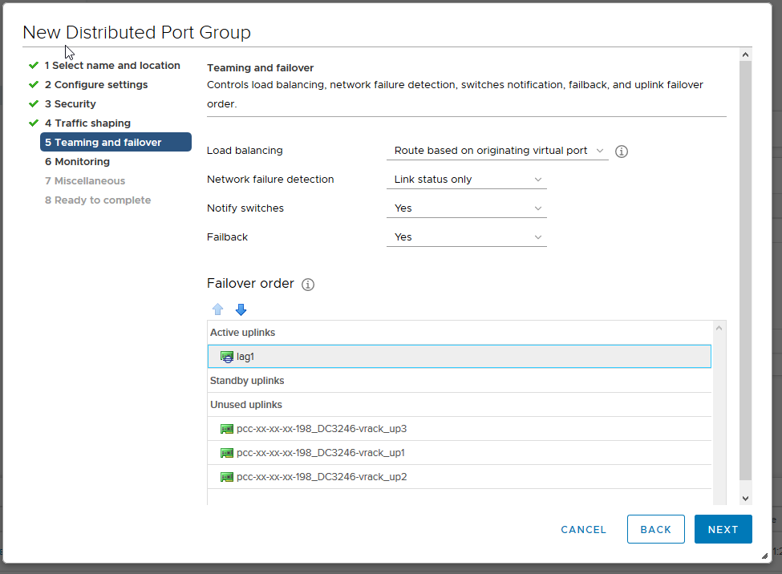

**Dernière mise à jour le 03/08/2020**

## Objectif

Dans une infrastructure Private Cloud, vous disposez de base de 10 VxLAN (SDDC et Dedicated Cloud) fournis par NSX, et de 11 VLAN (SDDC) fournis avec le vRack.

**Ce guide montre la création de V(x)LAN supplémentaires**

## Prérequis

- Avoir accès au client vSphere Web (HTML5)

## En pratique

Dans les offres Private Cloud, vous disposez d'un switch virtuel distribué (vDS) pour les **Dedicated Cloud** et de deux switchs virtuels distribués pour les **SDDC**. 

Ces *vDS* comportent plusieurs *portGroup* ayant chacun leur utilité.

Le premier vDS commun aux deux offres dispose de deux types de *portGroup* : 

- le VMnetwork permettant de communiquer vers Internet
- Des VxLAN gérés par NSX, permettant d'isoler des communications privées à l'intérieur du Private Cloud.

Le second vDS, disponible uniquement sur SDDC dispose d'un seul type de *portGroup* : 

- Des VLAN permettant d'isoler des communications privées à l'intérieur du Private Cloud et entre les différents services OVHcloud compatibles vRack (Serveur dédié, Public Cloud...). 

### VxLan - NSX 

Dans les offres SDDC et Dedicated Cloud vous disposez d'un premier switch virtuel. 

Sur ce switch, 10 VxLAN sont créés de base. En donnant le droit `NSX` dans [la gestion des utilisateurs de votre espace client](../manager-ovh-private-cloud/#utilisateurs), vous pourrez accéder à l'interface NSX et ansi créer des VxLAN supplémentaires.

En premier lieu, rendez vous dans la vue `Mise en réseau et sécurité` de votre client vSphere puis cliquez sur `Commutateurs logiques`{.action}.

Cliquez sur le bouton `+`{.action} pour commencer la création :

{.thumbnail}

La première étape est de nommer votre **portGroup** :

{.thumbnail}

Choisisez ensuite la zone de transport : 

{.thumbnail}

> [!primary]
>
> La zone de transport contrôle quels hôtes un commutateur logique peut atteindre. Dans une infrastructure Private Cloud, OVHcloud crée une zone de transport par datacenter virtuels.
> Il est possible de créer une zone de transport commune aux différents datacenters virtuels, ou bien d'étendre celles existantes.
>
> La mode de plan de contrôle d'une zone de transport est en monodiffusion permettant la gestion de la communication entre les hôtes à l'aide des contrôleurs NSX.
>

La découverte d'adresses IP permet de limiter la saturation du trafic ARP dans les segments VXLAN individuels, c'est-à-dire entre les machines virtuelles connectées au même commutateur logique.

L'apprentissage MAC construit une table d'apprentissage VLAN/MAC sur chaque vNIC. Cette table est stockée avec les données dvfilter. Dans vMotion, dvfilter enregistre et restaure la table au nouvel emplacement. Puis, le commutateur génère des RARP pour toutes les entrées VLAN/MAC de la table. Vous voudrez peut-être activer l'apprentissage MAC si vous utilisez des cartes réseau virtuelles effectuant la jonction VLAN.

OVHcloud recommande de n'utiliser que la découverte d'adresses IP.

Une fois tous ces éléments renseignés, vous pouvez confirmer la création :

{.thumbnail}

Votre portGroup est à présent créé et fonctionnel, vous le retrouverez dans le vue des commutateurs logiques : 

{.thumbnail}

Mais également dans la vue `Mise en réseau`

{.thumbnail}

### VLAN - vRack

Dans les offres SDDC, vous disposez d'un switch virtuel distribué (vDS) supplémentaire.

Sur ce switch, 11 VLANs sont créés de base (VLAN10 à VLAN20). En donnant le droit `administrateur` sur l'`Accès au V(x)LAN` dans [la gestion des utilisateurs de votre espace client](../manager-ovh-private-cloud/#utilisateurs){.external-link}, vous pourrez créer des VLAN supplémentaires.

En premier lieu, rendez vous dans la vue `mise en réseau` de votre client vSphere. Déployez le dossier **vrack** puis faites un clic droit sur le **dVS** finissant par *-vrack* et enfin cliquez sur `New Distributed Port Group`{.action}.

{.thumbnail}

{.thumbnail}

La prochaine étape est de nommer votre **PortGroup** :

{.thumbnail}

Puis configurer les paramètres recommandés par OVHcloud :

- **Port Binding** : Static (Réservation et assignation du port à une machine virtuelle)
- **Port allocation** : Elastic (Permet d'élargir à chaud le nombre de port)
- **Number of ports** : 24
- **VLAN type** : VLAN (Les autres sont [PVLAN](https://kb.vmware.com/s/article/1010691){.external} et Trunk)
- **VLAN ID** : 21 (Sachant que l'ID peut-être configuré de 1 à 4096)
- Cochez l'option *Customize default policies configuration*.

{.thumbnail}

Vous avez 3 paramètres de sécurité qui peuvent être activés en fonction de votre besoin : 

- *Promiscious mode* (Elimine tout filtrage de réception que l'adaptateur de machine virtuelle peut effectuer afin que le système d'exploitation invité reçoive tout le trafic observé sur le réseau.)
- *MAC address changes* (Affecte le trafic qu'une machine virtuelle reçoit. Lorsque l'option est définie sur **Accepter**, ESXi accepte les demandes de modification de l'adresse MAC effective en une adresse différente de l'adresse MAC initiale.)
- *Forged transmits* (Affecte le trafic transmis à partir d'une machine virtuelle. Lorsque l'option est définie sur **Accepter**, ESXi ne compare les adresses MAC source et effective).

> [!primary]
>
> L'utilisation la plus fréquente de ces 3 paramètres est le CARP, notamment utilisé sur **pfSense**.
> 

{.thumbnail}

Nous laissons le [lissage de trafic](https://docs.vmware.com/en/VMware-vSphere/6.5/com.vmware.vsphere.networking.doc/GUID-CF01515C-8525-4424-92B5-A982489BACE2.html){.external} désactivé.

{.thumbnail}

Au niveau du Load Balancing, selectionnez *Route Based on IP hash* qui est la meilleure méthode en terme de redondance et répartition.

> [!warning]
>
> Attention au niveau de de la configuration de l'ordre du basculement, il est nécessaire de mettre la liason montante `lag1` en *Active* (connexion entre le réseau virtuel et le réseau physique), sinon aucune communication entre les hôtes ne sera possible.
>

{.thumbnail}

Le `Netflow` est desactivé (rapport d'activité sur les flux de trafic)

{.thumbnail}

Laissez la valeur `Block All Ports` à « No ».

{.thumbnail}

Un résumé des modifications vous est alors présenté. Cliquez sur `Terminer` pour confirmer la création.

{.thumbnail}

Nous constatons ici que le **VLAN21** est bien disponible et fonctionnel.

{.thumbnail}

## Aller plus loin

Échangez avec notre communauté d'utilisateurs sur <https://community.ovh.com>.
