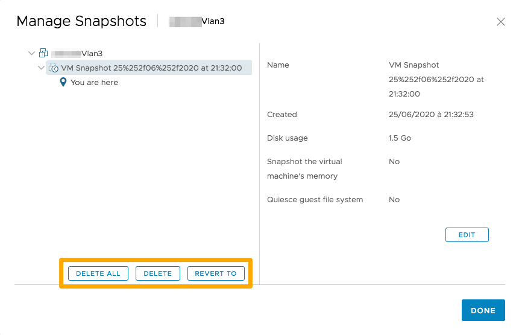

**Última actualización: 25/06/2020**

## Objetivo 

Es posible realizar un snapshot de una máquina virtual. Una vez realizado el snapshot, podrá restaurar todas las máquinas virtuales en el snapshot más reciente o eliminarlo.

**Esta guía explica cómo funcionan los snapshots.**

## Requisitos

- Haber contratado un [Hosted Private Cloud de OVHcloud](https://www.ovhcloud.com/es-es/enterprise/products/hosted-private-cloud/){.external}.
- Estar conectado al cliente vSphere HTML.

## Procedimiento

Los snapshots resultan muy útiles cuando es necesario volver en varias ocasiones al mismo estado, sin necesidad de crear múltiples máquinas virtuales. Con los snapshots podrá crear posiciones de restauración. 

De este modo, podrá conservar el estado de base de una MV antes de migrar hacia otro tipo de funcionamiento. 

Aunque los snapshots ofrecen una imagen «instantánea» del disco, es recomendable eliminar regularmente los snapshots presentes. De hecho, si conserva un gran número de snapshots, estos ocuparán mucho espacio en disco y limitarán el rendimiento de la MV.

> [!primary]
> 
> No es recomendable utilizar los snapshots como método de copia de seguridad de su máquina virtual.
> 

Los snapshots le permiten capturar el estado de su MV en el momento en el que se lanzan. El snapshot incluye, según sus preferencias:

- el estado de todos los discos de la máquina virtual;
- el contenido de la memoria de la máquina virtual.

> [!warning]
> 
> No es posible modificar el tamaño de un disco cuando se realiza un snapshot en una MV.
> 

### Crear un snapshot

Haga clic derecho sobre su MV y seleccione `Snapshots`{.action} > `Take Snapshot...`{.action}.

{.thumbnail}

Deberá indicar el nombre del snapshot, su descripción y especificar si desea que la memoria de la MV también se incluya en el snapshot.

Asimismo, tiene la posibilidad de crear un snapshot con o sin la RAM utilizada por la MV. Si integra la RAM en el snapshot, esta aumentará el tiempo de ejecución de la tarea, pero le permitirá no tener que reiniciar durante la restauración del snapshot. 

En caso contrario, como no existe una copia de seguridad de la RAM, la tarea será más rápida, pero tendrá que reiniciar la MV en caso de restauración.

{.thumbnail}

### Gestionar los snapshots

Es posible acceder a todos los snapshots de una MV en el gestor de snapshots. Para ello, haga clic derecho sobre su MV y seleccione `Snapshots`{.action} > `Manage Snapshots`{.action}.

{.thumbnail}

### Eliminar un snapshot

En el gestor de snapshots, seleccione el snapshot que desea eliminar y haga clic en `DELETE`{.action}.

También es posible eliminar todos los snapshots de la VM de una sola vez haciendo clic en `DELETE ALL`{.action}.

### Restaurar un snapshot

En el gestor de snapshots, seleccione el snapshot que desea restaurar y haga clic en `Restore`{.action}.

### Consolidar los snapshots

La presencia de discos redundantes puede afectar al rendimiento de las máquinas virtuales.

La consolidación de los snapshots resulta útil cuando no es posible comprimir los discos de snapshots tras una operación de supresión. Tras la consolidación, los discos redundantes se eliminarán, mejorando así el rendimiento de las máquinas virtuales y permitiendo liberar espacio de almacenamiento.

Para realizar una consolidación, haga clic derecho sobre su MV y seleccione `Snapshots`{.action} > `Consolidate`{.action}.

{.thumbnail}

Para más información, consulte la [documentación de VMware](https://docs.vmware.com/en/VMware-vSphere/6.7/com.vmware.vsphere.vm_admin.doc/GUID-2F4A6D8B-33FF-4C6B-9B02-C984D151F0D5.html){.external}.

## Más información

Interactúe con nuestra comunidad de usuarios en <https://community.ovh.com/en/>.
