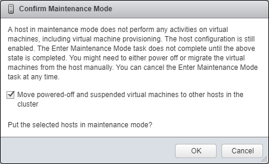

**Última atualização: 28/11/2018**

## Sumário

Em certas situações, pode ser útil eliminar um servidor host do seu cluster, por exemplo, para devolver um _spare_ não utilizado ou para migrar para uma gama superior.

**Este manual explica como remover, com toda a segurança, um servidor host da sua infraestrutura Private Cloud.**

## Requisitos

* Dispor do serviço [Private Cloud](https://www.ovh.com/pt/private-cloud/){.external}.
* Aceder à interface de gestão vSphere.

## Instruções

A eliminação de um servidor host passa por duas etapas: em primeiro lugar, deve pôr este recurso em modo de manutenção para, posteriormente, proceder à eliminação.

### Ativar o modo de manutenção

Uma vez ligado ao vSphere, aceda ao inventário da sua plataforma na janela `Hosts and Clusters`{.action} na coluna à esquerda. Clique com o botão direito no servidor host correspondente e selecione `Maintenance Mode`{.action} e, de seguida, `Enter Maintenance Mode`{.action}. Se houver máquinas virtuais (VM) em funcionamento neste servidor host, estas serão automaticamente registadas noutro servidor host presente no cluster (os modos HA e DRS devem estar ativados).

{.thumbnail}

Na caixa de diálogo, confirme a ativação do modo de manutenção clicando em `OK`{.action}.

{.thumbnail}

Poderá seguir o progresso da operação na secção `Recent Tasks`.

{.thumbnail}

### Eliminar o servidor host

Uma vez que o servidor host estiver em modo de manutenção, clique com o botão direito e selecione `OVH Private Cloud`{.action} e, a seguir, `Remove OVH Host`{.action}.

{.thumbnail}

Na nova janela que aparecerá, confirme que pretende eliminar o servidor host clicando no botão `Next`{.action}.

{.thumbnail}

O pedido de eliminação é imediatamente processado.

{.thumbnail}

Poderá seguir o progresso da operação na secção `Recent Tasks`.

{.thumbnail}

O servidor host será eliminado em poucos minutos e deixará de aparecer no inventário. 

> [!primary]
>
> Se adicionar algum ficheiro ou diretório que não estava inicialmente presente no armazenamento local do servidor host, ocorrerá um erro que irá impedir a eliminação do servidor. Apenas os diretórios de base e os ficheiros de vSwap não bloqueiam a operação de eliminação.
> 

## Quer saber mais?

Fale com a nossa comunidade de utilizadores em [https://community.ovh.com/en/](https://community.ovh.com/en/){.external}.
