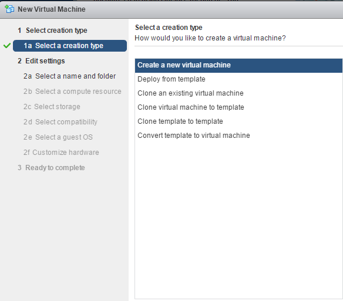
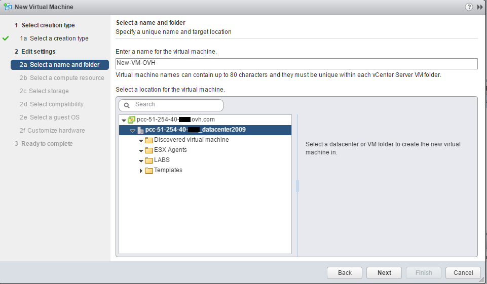
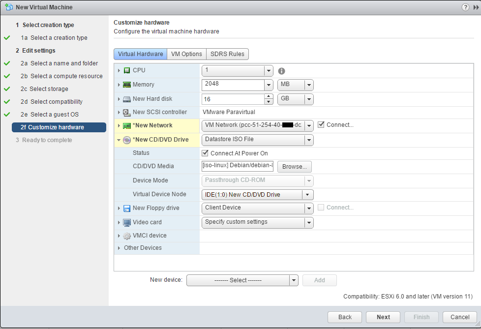

Depuis votre interface vSphere vous avez la possibilité de déployer des machines virtuelles de plusieurs manières. Nous allons voir ici comment déployer une machine virtuelle depuis un fichier ISO.

Déploiement de la machine virtuelle
-----------------------------------

Le déploiement de la nouvelle machine virtuelle s'effectue depuis le client vSphere, dans la vue "hôtes et clusters".

Faites un clic-droit sur le cluster de votre choix et cliquez sur "New Virtual Machine".

{.thumbnail}

Vous avez plusieurs possibilité lors de la création d’une machine virtuelle :

- La création depuis un ISO, qui sera dans votre datastore et que vous aurez pu importer en suivant [le guide de connexion en SFTP]({legacy}2163148)
- Vous pouvez également déployer une machine virtuelle depuis un template que vous pouvez avoir ou un [template OVH]({legacy}2162716)
- Vous pouvez cloner une machine virtuelle déjà existante (attention toutefois au risque de conflit d’adresse IP).
- Vous pouvez cloner un machine virtuelle en template, en vue d’un déploiement plus rapide de vos prochaines machines virtuelles.
- Vous pouvez cloner un template en un autre template pour, par exemple, avoir le template sur différents datastore et ne pas subir de baisse de performances lors d’un déploiement massif.
- Vous pouvez convertir un template en machine virtuelle, cela occasionnera la perte du template, mais cela est utile si vous souhaitez modifier celui-ci.

{.thumbnail}

Ici, nous allons voir comment déployer une machine virtuelle depuis un ISO.

En suivant les étapes, vous devrez choisir le nom de votre machine et dans quel datacentre, et dans un dossier en particulier. Si vous ne choisissez pas de dossier, elle sera à la racine du datacentre.

{.thumbnail}

Vous devrez ensuite choisir le cluster, l’hôte, [le pool de ressources](https://pubs.vmware.com/vsphere-55/index.jsp?topic=%2Fcom.vmware.vsphere.resmgmt.doc%2FGUID-60077B40-66FF-4625-934A-641703ED7601.html){.external-link}, ou [la vApp](https://pubs.vmware.com/vsphere-50/index.jsp#com.vmware.vsphere.vm_admin.doc_50/GUID-EBD7A954-3EB1-43AD-9DDA-975A3CFDE7B2.html){.external-link} où vous souhaitez la placer.

Dans ce cas, la machine virtuelle sera déployée selon les règles DRS configurées, et sera placée à la racine du cluster.

{.thumbnail}

Vous arrivez au niveau du choix de la banque de données.

Nous vous déconseillons de placer votre machine virtuelle dans un "storageLocal", qui correspond au stockage local de votre hôte. En cas de défaillance de votre hôte, votre machine virtuelle ne pourra pas redémarrer et ne sera plus accessible.

{.thumbnail}

Vous devrez choisir la compatibilité entre votre machine virtuelle et l’hôte. Sauf cas particulier, il est recommandé de prendre le plus récent.

{.thumbnail}

Ensuite vous pouvez choisir le “Guest Operating System”, le “Guest OS” n’installe pas le système d’exploitation cependant vSphere configure la machine virtuelle de manière automatique (nombre de CPU/RAM, type de carte réseau, prise en charge de l’installation des VMware tools).

{.thumbnail}

Configuration de la machine virtuelle
-------------------------------------

Dans cette partie, vous pourrez configurer les ressources de votre machine virtuelle.

Le choix “New Network” permet d’ajouter une carte réseau :

- Le "VM Network" servira pour le réseau public et l’accès direct à internet.
- Les VLAN permettront d’utiliser le réseau privé entre vos machines virtuelles (et avec d’autres services OVH à travers le vRack sur l'offre SDDC)

{.thumbnail}

Vous pourrez également supprimer les devices non nécessaires (Floppy drive…).

Dans la partie “New CD/DVD Drive” vous pourrez choisir “Datastore ISO File”, une fenêtre s’ouvrira pour que vous choisissiez votre ISO.

Vous pouvez également ajouter l'ISO après la création de la machine virtuelle.

{.thumbnail}

Il s’affichera ainsi, n’oubliez pas de le connecter.

{.thumbnail}

Voici le récapitulatif de la création de la machine virtuelle et vous pouvez cocher l’option “Edit the virtual machine settings..” pour modifier par exemple la mémoire, le nombre de CPU manuellement.

{.thumbnail}

La machine arrivera dans votre inventaire, vous pourrez la démarrer en cliquant sur “Power On” et cliquer sur “Open Console” pour avoir accès à “l’écran” de la VM et commencer l’installation du système d’exploitation.

{.thumbnail}

Une fois votre machine virtuelle installée, il est recommandé de déconnecter l'ISO dans les paramètres. Dans le cas contraire, vous ne pourrez pas déplacer la machine virtuelle.

