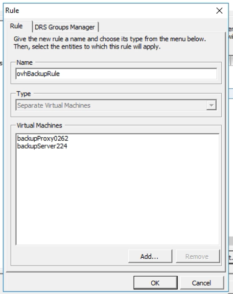

**Ultimo aggiornamento: 11/04/2019**

## Obiettivo

Durante la creazione di uno Snapshot di una macchina virtuale localizzata in un datastore NFS, potrebbe verificarsi un blocco di trenta secondi della VM o un arresto momentaneo del disco. Questo malfunzionamento è dovuto al fatto che lo Snapshot della macchina virtuale è situato sul <i>backup proxy</i> di un host differente. Se il proxy e la VM si trovano sullo stesso host, infatti, il problema non si verificherà.

**Questa guida ti mostra come utilizzare il meccanismo DRS di VMware per implementare una soluzione che eviti il blocco delle tue macchine virtuali.**

## Prerequisiti

- Disporre di una soluzione [Private Cloud OVH](https://www.ovh.it/private-cloud/){.external}
- Aver attivato l’opzione [Veeam Backup Managed](https://www.ovh.it/private-cloud/opzioni/veeam.xml){.external}
- Avere accesso all’interfaccia di gestione vSphere

## Procedura

### 

> [!primary]
>
> Prima di iniziare la procedura, considera questi aspetti:
>
> - in ambienti di grandi dimensioni, la creazione di diverse regole DRS potrebbe richiedere molto tempo
> - l’utente deve aggiungere manualmente le nuove macchine virtuali alle regole DRS
> - tutte le macchine virtuali di cui viene effettuato il backup ma che non sono incluse nelle regole DRS, possono subire un blocco 
>

Per implementare questa soluzione, clicca con il tasto destro sul cluster corrispondente e modificane le impostazioni.

Crea una regola DRS che permetta di **mantenere le macchine virtuali unite** e aggiungile con un backup proxy. Per effettuare il backup di un elevato numero di VM, è possibile creare diverse regole DRS e associarle a vari backup proxy. L’algoritmo OVH garantisce che il backup della macchina virtuale venga eseguito dal backup proxy presente sullo stesso host ESXi della VM.

> [!warning]
>
> L’aggiunta di un nuovo backup proxy comporta costi supplementari.
>

Per aggiungere una nuova regola, accedi alla sezione DRS: 

{.thumbnail}

Crea un’altra regola DRS per **separare le macchine virtuali** e mantenere i backup proxy su diversi host:

{.thumbnail}

Crea un gruppo di macchine virtuali, inserisci il nome del gruppo e aggiungi l’host a questa regola:

{.thumbnail}

Ti ricordiamo che, per fare in modo che i backup proxy non si trovino mai sullo stesso host, è necessario aver creato una regola anti-affinità e tante regole di affinità quanti sono i backup proxy. 

## Per saperne di più

Contatta la nostra Community di utenti all’indirizzo <https://www.ovh.it/community/>.