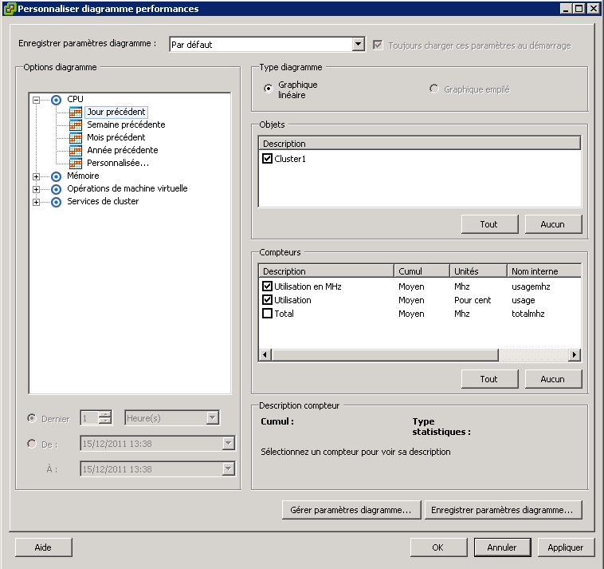

## 
Hier ziet u hoe de resources van uw Private Cloud gemonitord kunnen worden.
U moet de vSphere Client gebruiken, of toegang hiertoe krijgen met behulp van uw eigen Client geïnstalleerd op uw computer, of met behulp van de RDP-verbinding die wij leverden, toen u uw PCC activeerde.

## Op de Hosts
Een globaal overzicht van uw host resources krijgt u in uw PCC, via de 'host'-tab:

{.thumbnail}

## Op een cluster of een resources pool.
U kunt alle informatie resources voor uw PCC zien via de tab "Resource Allocatie".
Hier vindt u alle beschikbare resources: RAM, CPU, opslagruimte. Met deze weergave kunt u elke abnormale load isoleren, veroorzaakt door een VM op een van de hosts of virtual datacenter. U kunt disk toegang limieten (I/O) instellen voor uw storage. U kunt ook prioriteit aan uw VM's geven, maar ook de limieten van uw resources voor uw VM's beheren, om te voorkomen dat sommige VM's te veel resources monopoliseren en de prestaties verminderen. Bovendien is het mogelijk om ook de resources voor een VM pool te beheren.

{.thumbnail}

## Resource grafieken voor uw clusters of voor uw hosts
Op de «Performance» tab vindt u de gebruiksgrafieken van uw cluster of uw host:

{.thumbnail}
U kunt de knop "Advanced" gebruiken, dan de "Grafiek Opties" om alle grafieken aan tepassen.
U kunt kiezen om de tijdsframe voor het weergeven, of zelfs het type grafiek voor een nauwkeuriger analyse van deze gegevens:

{.thumbnail}
Het op maat maken van de grafieken

{.thumbnail}

## Op uw storage
Ga in de rubriek 'Datacenter' naar de datastore (of database) tab, hier ziet u al uw storage. U kunt de ruimte, die op uw gehele infrastructuur wordt gebruikt, monitoren:

{.thumbnail}

