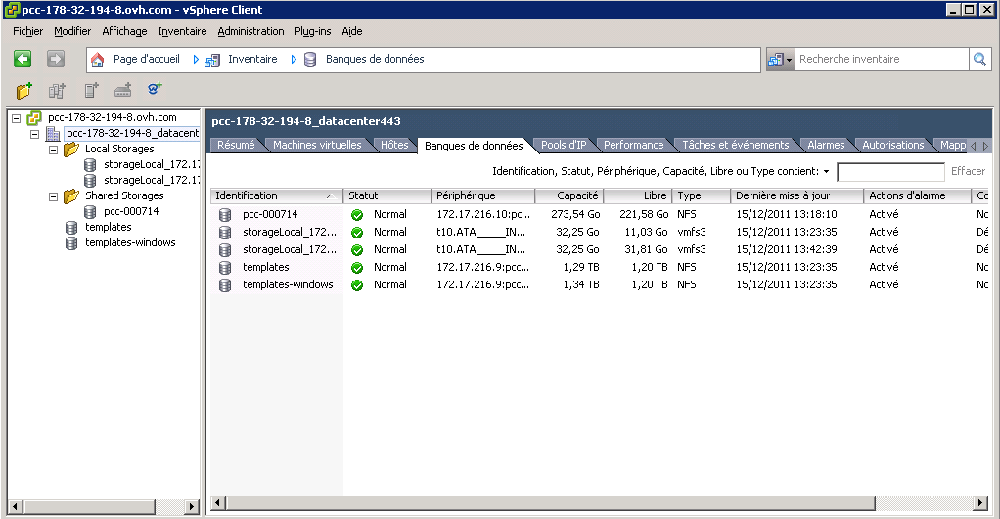

## 
W przewodniku tym opisujemy monitorowanie zasobów usługi Private Cloud.
Należy zalogować się do vSphere (poprzez program lokalny lub za pomocą połączenia RDP dostarczonego podczas aktywacji usługi Private Cloud).

## Na hostach
W zakładce host możesz sprawdzić informacje na temat wszystkich swoich zasobów:

{.thumbnail}

## Na klastrze lub puli zasobów
W zakładce « Ressource Allocation » znajdują się informacje na temat zasobów usługi PCC. 
Są tu informacje na temat wszystkich dostępnych zasobów: RAM, CPU, przestrzeń dyskowa. Sekcja ta pozwala na wykrycie ewentualnego nieprawidłowego obciążenia spowodowanego przez wirtualną maszynę na jednym z hostów lub na jednej z wirtualnych serwerowni. Możesz określić ograniczenia dostępu do dysku (I/O) dla przestrzeni dyskowej. Możesz również określić priorytety dla każdej VM, zarządzać ograniczeniami zasobów dla VM.

{.thumbnail}

## Wykresy zasobów dla klastrów i hostów
W zakładce « Performance » odnajdziesz wykresy zużycia klastra i hosta:

{.thumbnail}
Możesz skorzystać z przycisku « Advanced » i następnie « Chart Option... » , aby spersonalizować wykresy. Możesz wybrać zakres czasu do wyświetlania, rodzaj wykresu, aby korzystać z bardziej dokładnej analizy tych danych:

{.thumbnail}
Personalizacja wykresów:

{.thumbnail}

## Na przestrzeni dyskowej
W sekcji Datacenter, w zakładce Datastore znajdują się informacje o przestrzeni dyskowej. Dzięki temu możesz monitorować przestrzeń wykorzystaną na twojej infrastrukturze:

{.thumbnail}

