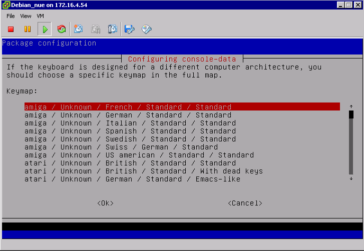
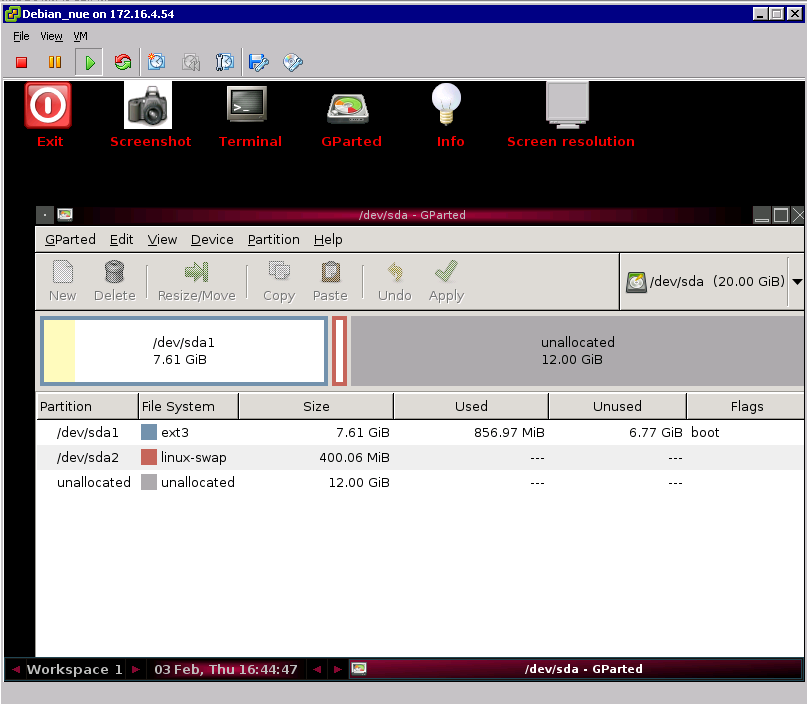

## 
Zanim przystąpisz do tego typu operacji, wykonaj backup danych lub sklonuj wirtualną maszynę.

## Dla systemu Linux
W przypadku dystrybucji Linux należy skorzystać z narzędzia do partycjonowania. Istnieje kilka metod:

- [7tools Partition Manager](http://www.7tools.com/pm/index.htm)
- [DFSee](http://www.dfsee.com/dfsee/index.php)
- [EASEUS Partition Manager](http://www.partition-tool.com)
- [GParted LiveCD](http://gparted.sourceforge.net/livecd.php)
- [Partition Logic](http://partitionlogic.org.uk)
- [Paragon Partition Manager](http://www.partition-manager.com)
- [Ranish Partition Manager](http://www.ranish.com/part)
- [System Rescue CD](http://www.sysresccd.org/Main_Page)

W tym przewodniku wybraliśmy GParted, który jest dostępny w formacie .iso w szablonach, które proponujemy. 

Poniżej przedstawiamy trzy metody uruchamiania z Live CD GPArted.

- Podczas uruchamiania VM, gdy pojawia się pasek postępu VMware, kliknij na przycisk « Escape », aby przejść do trybu wyboru urządzenia startowego i wybierz « CD-Rom ».
- Aby operacja ta udawała się za każdym razem, możesz zmienić czas wyświetlania paska VMware w zakładce « Options », « Boot Option ». W części tej można zwiększyć wartość parametru « Power On Boot Delay » dla wirtualnej maszyny.
- Następnie we właściwościach, w zakładce « Options », « Boot Options », zaznacz pole « Force BIOS setup ». Po zatwierdzeniu wykonaj restart wirtualnej maszyny. Po zaktualizowaniu dysku we właściwościach CD wirtualnej maszyny wybierz plik .iso GParted. 

Należy zatwierdzić opcję « Connect at power on ».
W części « Boot » dla BIOS wybierz czytnik CD-ROM (za pomocą strzałek) i skorzystaj z przycisku « + » na klawiaturze, aby podkreślić dysk twardy (Hard Drive). Dzięki temu wirtualna maszyna uruchomi się korzystając z CD GParted:

{.thumbnail}
Następnie wybierz « Exit ». Wybierz « Exit Saving Changes » i zatwierdź:

{.thumbnail}
Pojawi się strona bootowania GParted. Wybierz opcję GParted Live:

{.thumbnail}
W kolejnym kroku wybierz klawiaturę i język:

{.thumbnail}
Pojawi się graficzny interfejs GParted:

{.thumbnail}
Najpierw należy przenieść swap. Wybierz opcję « resize ». Następnie wskaż « 0 » w części « Free space following (MiB) ».
Wybierz partycję, którą chcesz zwiększyć i kliknij na « Resize ». Zwiększ partycję korzystając ze strzałki obok wolnej przestrzeni, aż do wybranego rozmiaru.
Do tej pory nic się nie zmieniło na poziomie dysku. Należy teraz zastosować zmiany klikając na « Apply ». Wszystkie zdefiniowane wcześniej zadania zostaną wykonane. 
Możesz teraz zatwierdzić zakończenie operacji i wykonać restart wirtualnej maszyny za pomocą podwójnego kliknięcia na « Exit ».
Wirtualna maszyna zostanie zrestartowana. System operacyjny będzie używał całej nowej przestrzeni dyskowej.

## Dla systemu Windows
W przypadku systemu Windows należy skorzystać z managera dysków. Wybierz « Server Manager », « Storage » i « Disk Management ». Na naszym dysku 0 zawierającym wolumin C: mamy 20 GB dostępnej przestrzeni. Kliknij prawym przyciskiem myszy na wolumin C: i wybierz « Extend Volume… ».
Wskaż przestrzeń, którą chcesz dodać. W naszym przykładzie dodajemy całą dostępną przestrzeń. Zatwierdź operację. 
Cała przestrzeń dyskowa została przyznana:

## UWAGA!!!
OVH nie ponosi odpowiedzialności za ewentualny wpływ na integralność danych podczas wykonywania tych operacji.

