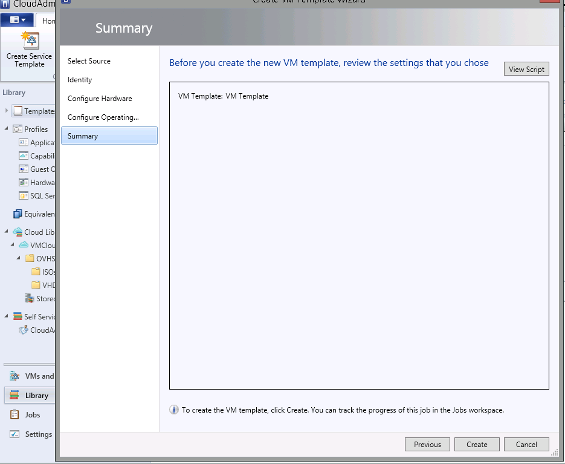

## Kirjasto
Voit luoda asennusmallin VMM:n Library-osiossa:

{.thumbnail}
Library-osiosta löydät ”Create VM Template”-painikkeen.

{.thumbnail}

## Lähteen valinta:
Tässä velhossa voit tehdä haluamasi valinnat. Esimerkissämme luomme asennusmallin olemassa olevasta asemasta. Valittu levy on OVH:n levykirjastossa.

{.thumbnail}

## Nimeäminen:
Kirjoita asennusmallin nimi ja lisää sille kuvaus, mikäli tarpeen.

## Raudan konfigurointi:
Voit valita haluamasi konfiguraation.
Älä unohda HA-valintaa, Cloud-yhteensopivuutta ja migraatio-oikeuksia.
HA:

{.thumbnail}
Cloud-yhteensopivuus

{.thumbnail}
Oikeus migraatioon tapauksissa joissa prosessorit eivät ole samat:

{.thumbnail}

## Käyttöjärjestelmän konfigurointi:
Valitse haluamasi konfiguraatio: oletussalasana, asiaan kuuluvat säännöt, RunOnce-avaimet, jne.

{.thumbnail}

## Yhteenveto:
Asennusmallin luonti pitäisi olla nyt valmis. Sinun täytyy enää vain viimeistellä se klikkaamalla ”create”.

{.thumbnail}

## Jobs
Voit seurata luotuja tehtäviä ”Jobs”-valikon kautta.

{.thumbnail}
Tehtävät listataan oikealla puolella kohdassa historia.

{.thumbnail}

