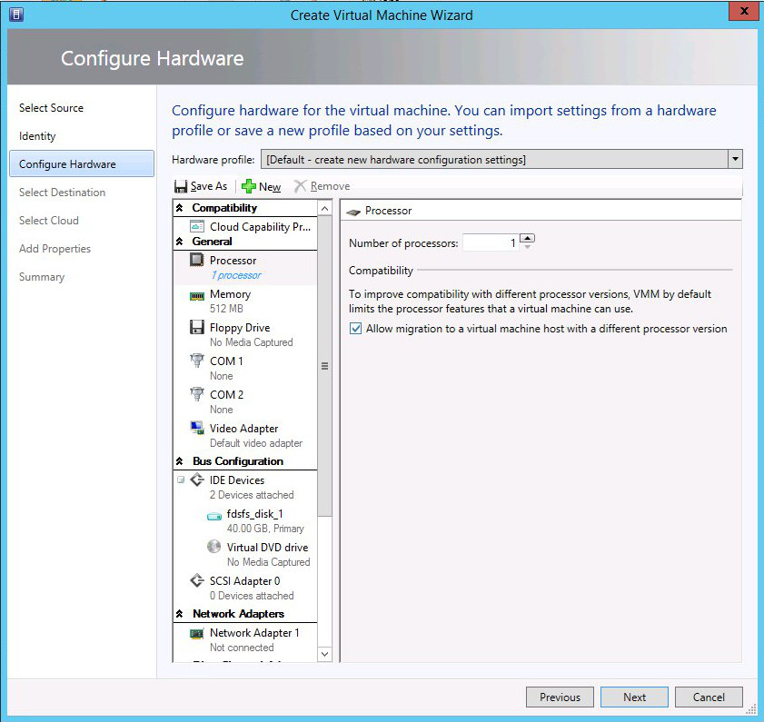

## Catalogus
U kunt het template maken in de VMM Catalogus:

{.thumbnail}
In dit gedeelte is een "VM Template aanmaken" knop beschikbaar.

{.thumbnail}

## Source selecteren
In de wizard kiest u de optie die het meest geschikt is voor u. Hier kiezen we ervoor om de template vanaf een bestaande disk aan te maken.
De geselecteerde disk is een disk geleverd door OVH in de catalogus

{.thumbnail}

## Identity
Selecteer de template naam en maak er een beschrijving van indien nodig.

## Hardware configureren
U kunt de configuratie kiezen die u wilt
Denk aan de HA, de compatibiliteit cloud en de migratierechten.
De HA:

{.thumbnail}
De Compatibiliteit Cloud:

{.thumbnail}
Het recht om te migreren wanneer er verschillende CPU's zijn:

{.thumbnail}

## Configureren van een Besturingssysteem
Selecteer de gewenste configuratie, ofwel het standaard wachtwoord, de rollen of functies die samenhangen met de run once, etc.

{.thumbnail}

## Overzicht
U bent klaar met het maken van de template, u hoeft alleen nog te bevestigen door te klikken op 'create'.

{.thumbnail}

## Jobs
U kunt de voortgang van het aanmaken van de job volgen in het "Jobs" menu

{.thumbnail}
De job wordt weergegeven in het rechtergedeelte, in historie

{.thumbnail}

