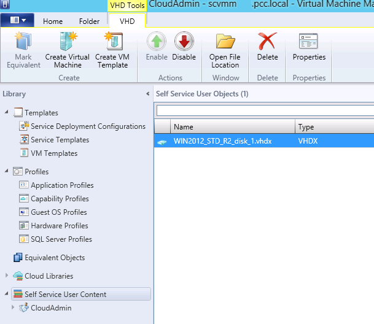

## Export Ihrer VM
Wir können die Vorgehensweise für den Export hier nicht detailliert beschreiben, da diese von der Infrastruktur abhängt, auf der Ihre VM läuft. Verwenden Sie die Ihnen zur Verfügung stehende Funktion zum Export Ihrer VM. Wichtig ist dabei vor allem, dass die Festplatte der virtuellen Maschine abgerufen werden kann, bei Hyper-V im vhdx Format oder bei VMware im vmdk Format.

- Sie haben Ihre vhdx Datei abgerufen:

Dann können Sie direkt mit dem Abschnitt "Import" fortfahren.

- Sie haben Ihre vmdk Datei abgerufen:

Zuerst muss Ihre vmdk in eine vhdx Datei umgewandelt werden, damit sie mit HyperV kompatibel ist. Für die Konvertierung können Sie eines der folgenden Werkzeuge verwenden:
[Microsoft Virtual Machine Converter Solution Accelerator](http://www.microsoft.com/en-us/download/details.aspx?id=34591)
[2Tware Convert VHD](http://www.2tware.com/product/6/2twareconvertvhdfree)
OVH nennt diese Werkzeuge lediglich zu informativen Zwecken, Sie können auch andere geeignete Werkzeuge verwenden.
OVH kann keinen Support für diese von Drittanbietern entwickelten Werkzeuge bieten.

## Verbindung mit der Library per FTPS
Sobald Ihre Festplatte heruntergeladen wurde, können Sie diese in Ihre VMM Library pushen, um anschließend eine auf dieser Festplatte basierende VM in Betrieb zu nehmen. Die Verbindung mit dem FTPS Dienst zum Upload Ihrer Festplatte wird in folgender Hilfe beschrieben: .
Ihre Festplatte muss in den Ordner "Data" geladen werden.

{.thumbnail}

## Vorhandensein der importierten Festplatte im VMM überprüfen
Damit Sie Ihre Festplatte im VMM sehen können, ist ein Refresh der Library erforderlich. Dies erfolgt einmal stündlich, es kann also sein, dass Sie sich ein Wenig gedulden müssen, bis Ihre Festplatte angezeigt wird.

{.thumbnail}

## Erstellung eines Templates anhand der Festplatte
Sie können anhand der Festplatte ein Template (Vorlage) erstellen, um damit künftige auf dieser Festplatte basierende virtuelle Maschinen einfacher personalisieren zu können. Die Vorgehensweise dazu wird in folgender Hilfe beschrieben: 

## Erstellung einer VM anhand der Festplatte
Wenn Sie keine Personalisierung durchführen möchten, können Sie auch direkt von der Festplatte aus eine VM in Betrieb nehmen. Die Vorgehensweise dazu wird in folgender Hilfe beschrieben: 

