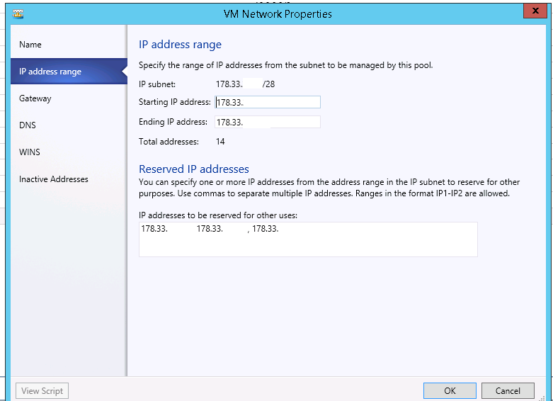

## Vorstellung des VM Network
OVH hat ein vordefiniertes "VM Network" mit einem IpPool erstellt, der die zu Ihrem RIPE Block gehörende Konfiguration enthält.
Dieses "VM Network" erlaubt Ihnen auch die Verwendung des vRack 1.5.

{.thumbnail}

## Dynamisch eine IP des RIPE Blocks erhalten (Beispiel mit einer Windows-VM)

- Erstellung des dazugehörigen Templates

Um eine IP des "VM Network" IpPools verwenden zu können, muss ein Template erstellt werden, um die VM korrekt in Betrieb zu nehmen (mehr Informationen zur Erstellung eines Templates finden Sie in folgender Hilfe: ).
Fügen Sie zuerst die passende Netzwerkkonfiguration zu Ihrem Template hinzu:

{.thumbnail}
Um dem Sysprep Tool der Maschine antworten zu können, muss das Template individuell angepasst werden:

{.thumbnail}

- Inbetriebnahme der VM

Nachdem die vorherigen Schritte durchgeführt wurden, können Sie nun die VM vom Template aus in Betrieb nehmen.
Nach der Inbetriebnahme sollte die VM folgende Konfiguration haben:

{.thumbnail}
Wenn die Netzwerkeinstellungen dem vorigen Screenshot entsprechen, können Sie die VM starten und die korrekte Zuweisung der IP zu Ihrer VM überprüfen.

## Von Hand eine IP des RIPE Blocks zuweisen
Wenn Sie die IP der VM (egal, ob diese von einem Template aus in Betrieb genommen wurde oder nicht) von Hand konfigurieren möchten, genügt es, diese mit dem "VM Network" Netzwerk zu verbinden.

{.thumbnail}
Nachdem die VM dann gestartet wurde, können Sie ihr die gewünschte IP direkt im Betriebssystem zuweisen.
Die Informationen zum RIPE Block finden Sie in der E-Mail, die Sie nach der Auslieferung der Dienstleistung erhalten haben, in Ihrem OVH Kundencenter oder in den Eigenschaften des "VM Network":

{.thumbnail}

## VMM und vRack 1.5
Im VMM erfolgt die Verbindung mit dem vRack 1.5 ebenfalls über das "VM Network".
Um mit einer IP im vRack 1.5 kommunizieren zu können, muss Ihre VM so konfiguriert werden, dass sie mit dem "VM Network" Netzwerk verbunden ist:

{.thumbnail}
Anschließend müssen Sie nur noch von Hand die IP-Einstellungen konfigurieren, damit Ihre VM mit den anderen Elementen im vRack 1.5 kommunizieren kann.

