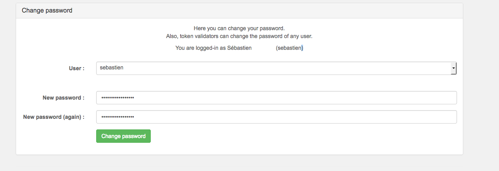

**Stand 03.09.2019**

## Einleitung

Über das sichere Interface können Sie sensible Operationen (wie Passwortänderungen, Hinzufügen eines Benutzers etc.) bestätigen, die von Benutzern oder Drittparteien auf Ihrer PCI-DSS Private Cloud durchgeführt wurden.

**In dieser Anleitung erfahren Sie, wie Sie das sichere Interface verwenden, um sensible Operationen zu bestätigen.**

## Voraussetzungen

- Sie verfügen über eine Infrastruktur mit der Option „**security advanced**“, damit Sie Bestätigungen durchführen können. Diese Option ist bei [PCI-DSS](https://www.ovh.de/private-cloud/payment-infrastructure/){.external} Angeboten inklusive.
- Sie haben Zugriff auf das sichere Interface der betreffenden Private Cloud. Zum Beispiel: `https://pcc-xxx-xxx-xxx-xxx.ovh.com/secure/` (achten Sie darauf, „ / “ am Ende der Adresse hinzuzufügen).

## Beschreibung

Die Bestätigung von als „sensibel“ eingestuften Operationen über das sichere Interface ist nur für Benutzter mit „**token validator**“-Berechtigung möglich. Admin-Benutzer verfügen automatisch über diese Berechtigung, da dies für die Aktivierung der Option „**security advanced**“ notwendig ist. Hinweis: Über Ihr OVH Kundencenter können Sie diese Berechtigung auch anderen Benutzern erteilen. Wenn Sie hierbei Hilfe benötigen, lesen Sie die Anleitung [Introduction to the OVH Private Cloud Control Panel](https://docs.ovh.com/gb/en/private-cloud/control-panel-ovh-private-cloud/#users) (Englisch).

Über das sichere Interface können Sie drei Operationen ausführen. Bitte wählen Sie aus den in dieser Anleitung behandelten Aktionen die für Sie passende aus: 

- [Operation mithilfe eines Tokens bestätigen](./#operation-mithilfe-eines-tokens-bestatigen)
- [Passwort eines Benutzers ändern](./#passwort-eines-benutzers-andern)
- [Passwort zurücksetzen](./#passwort-zurucksetzen)

### Operation mithilfe eines Tokens bestätigen

Wird ein Token per SMS versendet, muss dieser im sicheren Interface eingegeben werden, um die betreffende Operation zu starten.

> [!warning]
>
> Der gesendete Token ist nur 15 Minuten gültig. Wenn Sie die Operation in dieser Zeit nicht bestätigen, wird sie abgebrochen.
> 
> Im Falle von Wartungsarbeiten wird die Operation erneut vorgeschlagen. Ist das nicht der Fall, muss sie von Ihnen neu gestartet werden. 
> 

Hier eine Beispiel-SMS: 

{.thumbnail}

Diese Nachricht enthält: 

- den Benutzer mit **token validator**-Berechtigung, der die SMS erhalten hat. Das kann die Verwaltung der Token vereinfachen, wenn Sie Ihre Telefonnummer für verschiedene Benutzeraccounts angegeben haben
- den Namen der zu bestätigenden Operation
- die ID der Operation
- den Token für die Bestätigung
- einen Link zur Bestätigung der Operation (Achtung: Wenn Ihr Telefon nicht mit einem Netzwerk verbunden ist, dessen [IP zugelassen](https://docs.ovh.com/gb/en/private-cloud/control-panel-ovh-private-cloud/#security) ist, wird die Seite nicht angezeigt)

Um die Operation zu bestätigen, loggen Sie sich über den per SMS empfangenen Link ein. Gehen Sie dann in den Bereich `Operation Validation`{.action}.

{.thumbnail}

Es wird ein Verbindungsfenster geöffnet, in dem sich nur ein Benutzer mit **token validator**-Berechtigung einloggen kann.

Laden Sie die Operation, indem Sie die zugehörige ID im Feld `Operation id` eingeben und klicken Sie dann auf den Button `Load operation`{.action}. Geben Sie anschließend den Token ein, den Sie per SMS erhalten haben, und klicken Sie auf `Confirm operation`{.action}.

{.thumbnail}

Anschließend wird eine zweite SMS an Benutzer mit **token validator**\- Berechtigung versendet, um die Bestätigung der Operation zu bestätigen. Hier ein Beispiel: 

{.thumbnail}

Diese Nachricht enthält: 

- den Benutzer mit **token validator**-Berechtigung, der die SMS erhalten hat
- den Namen der Operation sowie die zugehörige ID
- den Benutzer mit **token validator**-Berechtigung, der die Operation bestätigt hat 

### Passwort eines Benutzers ändern

Jeder Benutzer kann sein Passwort ändern, auch wenn dieser nicht über die **token validator**-Berechtigung verfügt. Allerdings benötigt er sein aktuelles Passwort, um die Änderung durchzuführen.

> [!primary]
>
> Wenn der Benutzer sein Passwort vergessen hat, muss er einen anderen Benutzer mit **token validator**-Berechtigung bitten, die Passwortänderung für ihn durchzuführen, indem dieser [das Passwort zurücksetzt](./#passwort-zurucksetzen).
> 

Um ein Benutzerpasswort zu ändern, loggen Sie sich im sicheren Interface ein (zum Beispiel: `https://pcc-xxx-xxx-xxx-xxx.ovh.com/secure/`) und klicken Sie auf den Button `Change Password`{.action}.

{.thumbnail}

Wählen Sie auf der daraufhin angezeigten Seite den betreffenden Benutzer aus und legen Sie sein Passwort fest.

Anschließend wird ein Token an die Benutzer mit **token validator**\- Berechtigung versendet, damit diese die [Operation bestätigen](./#operation-mithilfe-eines-tokens-bestatigen) können.

{.thumbnail}

### Passwort zurücksetzen

Diese Operation kann nur von Benutzern mit **token validator**-Berechtigung durchgeführt werden.

> [!primary]
>
> Wenn ein Benutzer ohne **token validator**-Berechtigung sein Passwort verliert, muss er einen Benutzer mit dieser Berechtigung bitten, sein Passwort zurückzusetzen.
> 

Um ein Benutzerpasswort zurückzusetzen, loggen Sie sich im sicheren Interface ein (zum Beispiel: `https://pcc-xxx-xxx-xxx-xxx.ovh.com/secure/`) und klicken Sie auf den Button `Password lost`{.action}.

{.thumbnail}

Eine Nachricht zeigt an, dass Sie in der Lage sein müssen, SMS zu empfangen, um fortzufahren. Ist das der Fall, geben Sie die angeforderten Informationen ein (insbesondere den betreffenden Benutzer) und klicken Sie auf `Next step`{.action}.

{.thumbnail}

Geben Sie nun die beiden Token ein, die Sie per SMS und per E-Mail empfangen haben, und legen Sie das neue Passwort fest.

> [!primary]
>
> Wird das Passwort für einen anderen Benutzer zurückgesetzt, muss die Person, die das Passwort zurückgesetzt hat, diesem das neue Passwort mitteilen. Wir empfehlen dringendst, dieses [Passwort anschließend so schnell wie möglich zu ändern](./#passwort-eines-benutzers-andern).
> 

{.thumbnail}

## Weiterführende Informationen

Für den Austausch mit unserer User Community gehen Sie auf <https://community.ovh.com/en/>.