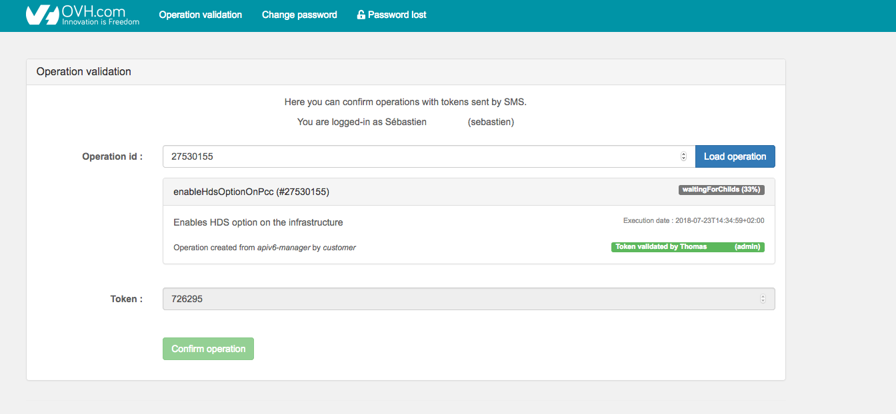
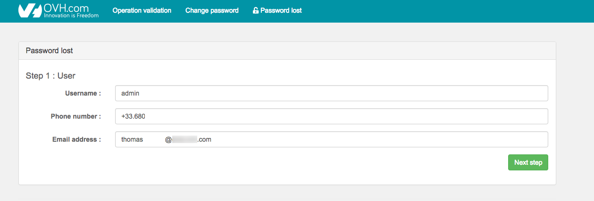

**Última actualización: 01/04/2019**

## Objetivo

La interfaz segura puede utilizarse para confirmar operaciones sensibles (como cambiar la contraseña o añadir un usuario) realizadas por usuarios o por terceros en un servicio Private Cloud Payment Infrastructure (con certificación PCI-DSS).

**Esta guía explica cómo utilizar la interfaz segura para confirmar operaciones sensibles.**

## Requisitos

- Tener una infraestructura con la opción **Seguridad avanzada**, que permite la confirmación de las operaciones sensibles y que se incluye en los [packs SDDC Payment Infrastructure](https://www.ovh.es/private-cloud/payment-infrastructure/){.external}.
- Tener acceso a la interfaz segura del Private Cloud correspondiente, por ejemplo, **https://pcc-xxx-xxx-xxx-xxx.ovh.com/secure/** (no olvide la barra al final de la dirección).

## Procedimiento

Los usuarios que disponen del permiso «**token validator**» son los únicos que pueden confirmar las operaciones sensibles desde la interfaz segura. El usuario **admin** tiene este permiso (imprescindible para activar la opción **Seguridad avanzada**), y es posible asignárselo también a otros usuarios desde el área de cliente de OVH. Para ello, consulte la guía [Presentación del área de cliente del Private Cloud de OVH](https://docs.ovh.com/gb/en/private-cloud/control-panel-ovh-private-cloud/#users) (en inglés) si lo necesita.

Desde la interfaz segura puede realizar tres operaciones. Continúe leyendo esta guía en el apartado correspondiente a la acción que quiera realizar. 

- [Confirmar una operación con un token](./#confirmar-una-operacion-con-un-token)
- [Cambiar la contraseña de un usuario](./#cambiar-la-contrasena-de-un-usuario)
- [Restaurar una contraseña](./#restaurar-una-contrasena)

### Confirmar una operación con un token

Cuando reciba un token por SMS, introdúzcalo en la interfaz segura para que se ejecute la tarea correspondiente.

> [!warning]
>
> El token solo es válido durante 15 minutos. Si no realiza la confirmación en ese plazo, la tarea se cancelará.
> 
> En los casos de mantenimiento, la interfaz volverá a proponerle la tarea. En los demás casos, usted deberá volver a realizar la solicitud. 
> 

A continuación le ofrecemos un ejemplo de SMS: 

{.thumbnail}

El mensaje de texto anterior contiene: 

- el usuario con el permiso «token validator» que ha recibido el SMS (esto le ayudará a gestionar los tokens que debe confirmar si ha introducido su número de teléfono en varias cuentas de usuario);
- el nombre de la operación que requiere confirmación;
- el ID de la operación;
- el token de confirmación;
- una URL que le permitirá confirmar la operación (atención: si su teléfono no está conectado a una red [cuya IP haya sido autorizada](https://docs.ovh.com/gb/en/private-cloud/control-panel-ovh-private-cloud/#security), la página no se mostrará).

Para confirmar la operación, conéctese a la URL que se indica en el mensaje recibido. A continuación, haga clic en `Operation validation`{.action}.

{.thumbnail}

Se abrirá una ventana de conexión, en la que podrán autenticarse los usuarios con permiso «token validator».

Cargue la operación introduciendo su ID en el campo **Operation id** y haciendo clic en `Load operation`{.action}. Introduzca el token recibido por SMS y haga clic en el botón `Confirm operation`{.action}.

{.thumbnail}

A continuación los usuarios que dispongan del permiso «token validator» recibirán un SMS de confirmación de la operación como el siguiente:

{.thumbnail}

El mensaje de texto anterior contiene: 

- el usuario con permiso «token validator» que ha recibido el SMS;
- el nombre y el ID de la operación;
- el usuario con permiso «token validator» que ha confirmado la operación. 

### Cambiar la contraseña de un usuario

Todos los usuarios pueden cambiar su contraseña sin necesidad de tener asignado el permiso «token validator». No obstante, es necesario disponer de la contraseña actual para poder realizar la operación.

> [!primary]
>
> Si un usuario ha perdido su contraseña, debe pedir a otro usuario con permiso «token validator» que realice el cambio en su lugar mediante el procedimiento de [restauración de la contraseña](./#restaurar-una-contrasena).
> 

Para cambiar la contraseña de un usuario, conéctese a la interfaz segura (por ejemplo, **https://pcc-xxx-xxx-xxx-xxx.ovh.com/secure/**) y haga clic en `Change password`{.action}.

{.thumbnail}

A continuación, seleccione el usuario y establezca una nueva contraseña.

Los usuarios con permiso «token validator» recibirán un token para poder [confirmar la operación](./#confirmar-una-operacion-con-un-token).

{.thumbnail}

### Restaurar una contraseña

Los usuarios con permiso «token validator» son los únicos que pueden realizar este procedimiento.

> [!primary]
>
> Si un usuario que no tiene permiso «token validator» pierde su contraseña, deberá pedir a un usuario que sí tenga este permiso que se la restaure.
> 

Para restaurar una contraseña, conéctese a la interfaz segura (por ejemplo, **https://pcc-xxx-xxx-xxx-xxx.ovh.com/secure/**) y haga clic en el botón `Password lost`{.action}.

{.thumbnail}

Un mensaje le indicará que, para continuar, debe poder recibir SMS. Si ese es su caso, introduzca la información solicitada (incluyendo el usuario cuya contraseña vaya a restaurar) y haga clic en `Next step`{.action}.

{.thumbnail}

Introduzca los dos tokens recibidos por SMS y por correo electrónico y establezca la nueva contraseña.

> [!primary]
>
> Si ha realizado el procedimiento de restauración para otro usuario, deberá comunicarle la nueva contraseña. Es altamente recomendable que el usuario que reciba dicha contraseña [vuelva a cambiarla](./#cambiar-la-contrasena-de-un-usuario) lo antes posible.
> 

{.thumbnail}

## Más información

Interactúe con nuestra comunidad de usuarios en [ovh.es/community](https://www.ovh.es/community){.external}.