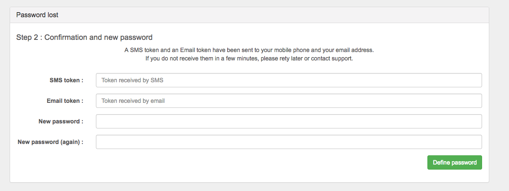

**Dernière mise à jour le 31/01/2019**

## Objectif

Par le biais de l'interface sécurisée, vous avez la possibilité de valider des opérations sensibles (comme un changement de mot de passe, l'ajout d'un utilisateur, etc.) réalisées par des utilisateurs ou des tiers sur votre Private Cloud HDS ou PCI-DSS.

**Découvrez comment utiliser l'interface sécurisée afin de valider des opérations dites « sensibles ».**

## Prérequis

- Disposer d'une infrastructure avec l'option « **security advanced** », qui permet la validation. Celle-ci est incluse dans les offres [PCI-DSS](https://www.ovh.com/fr/private-cloud/payment-infrastructure/){.external} et [HDS](https://www.ovh.com/fr/private-cloud/healthcare/){.external}.
- Avoir accès à l'interface sécurisée du Private Cloud concerné. Par exemple : `https://pcc-xxx-xxx-xxx-xxx.ovh.com/secure/` (attention à ne pas oublier le « / » final de l’adresse).

## En pratique

La validation des opérations dites « sensibles » depuis l'interface sécurisée est possible uniquement pour les utilisateurs disposant du droit « **token validator** ». L'utilisateur « admin » dispose déjà de ce privilège, puisque celui-ci indispensable à l'activation de l'option « **security advanced** ». À noter qu'il est permis d'ajouter ce droit à d'autres utilisateurs, depuis votre espace client OVH. Reportez-vous à notre documentation « [Présentation de l’espace client Private Cloud OVH](../manager-ovh-private-cloud/#utilisateurs) » si nécessaire.

Depuis l'interface sécurisée, vous pouvez effectuer trois manipulations. Poursuivez la lecture de la documentation selon celle que vous souhaitez réaliser. 

- [Valider une opération grâce à un token](./#valider-une-operation-grace-a-un-token).
- [Changer le mot de passe d'un utilisateur](./#changer-le-mot-de-passe-dun-utilisateur).
- [Réinitialiser son mot de passe](./#reinitialiser-votre-mot-de-passe).

### Valider une opération grâce à un token

Quand un token (jeton) est reçu par SMS, celui-ci doit être renseigné dans l'interface sécurisée afin de lancer la tâche en attente.

> [!warning]
>
> Le token fourni n’est valable que 15 minutes. Sans validation de votre part dans ce délai, la tâche est annulée.
> 
> Elle sera de nouveau proposée par la suite (dans les cas de maintenance) ou vous devrez la relancer (si cela fait suite à une action de votre part). 
> 

Voici un exemple de SMS que vous pouvez recevoir : 

{.thumbnail}

Nous retrouvons dans ce message : 

- l'utilisateur avec le droit « **token validator** » ayant reçu le SMS. Ceci peut vous aider à mieux gérer les tokens à valider si vous avez renseigné votre numéro de téléphone dans plusieurs comptes utilisateur ;
- le nom de l'opération qui nécessite une validation ;
- l'ID de l'opération ;
- le token de validation ;
- un lien vous permettant de valider l'opération (attention, si votre téléphone n'est pas connecté à un réseau dont l'[IP est autorisée](https://docs.ovh.com/fr/private-cloud/manager-ovh-private-cloud/#securite), la page ne s'affichera pas).

Pour valider l'opération, connectez-vous donc au lien mentionné dans le message reçu. Rendez-vous ensuite dans la partie `Operation Validation`{.action}.

{.thumbnail}

Une fenêtre de connexion s'ouvre, dans laquelle seul un utilisateur avec le droit « **token validator** » peut s'authentifier.

Chargez l'opération en renseignant son ID dans le champ `Operation id`, puis en cliquant sur le bouton `Load operation`{.action}. Indiquez ensuite le token que vous venez de recevoir par SMS et cliquez sur `Confirm operation`{.action}.

{.thumbnail}

Un SMS confirmant la validation de l'opération sera alors envoyé aux utilisateurs disposant du droit « **token validator** ». En voici un exemple : 

{.thumbnail}

Nous retrouvons dans ce message : 

- l'utilisateur avec le droit « **token validator** » ayant reçu le SMS ;
- le nom de l'opération ainsi que son ID ;
- l'utilisateur avec le droit « **token validator** » ayant validé l'opération. 

### Changer le mot de passe d'un utilisateur

Le changement de mot de passe est possible pour un utilisateur disposant ou non du droit « **token validator** ». Cette personne doit cependant être en possession de son mot de passe actuel afin de réaliser la manipulation.

> [!primary]
>
> Si l'utilisateur ne dispose plus de son mot de passe, il doit demander à un autre utilisateur possédant le droit « **token validator** » d'effectuer le changement pour lui via la procédure de [réinitialisation de mot de passe](./#reinitialiser-votre-mot-de-passe).
> 

Pour modifier le mot de passe d'un utilisateur, connectez-vous à l'interface sécurisée (par exemple : `https://pcc-xxx-xxx-xxx-xxx.ovh.com/secure/`) et cliquez sur le bouton `Change Password`{.action}.

{.thumbnail}

Dans la page qui s'affiche, choisissez l'utilisateur concerné puis définissez son mot de passe.

Un token sera alors envoyé aux utilisateurs disposant du droit « **token validator** » afin qu'ils puissent [valider l'opération](./#valider-une-operation-grace-a-un-token).

{.thumbnail}

### Réinitialiser un mot de passe

Cette procédure est permise uniquement aux utilisateurs disposant du droit « **token validator** ».

> [!primary]
>
> Si un utilisateur ne possédant pas le droit « **token validator** » perd son mot de passe, il devra demander à un utilisateur disposant de ce privilège de le réinitialiser.
> 

Pour réinitialiser un mot de passe, connectez-vous à l'interface sécurisée (par exemple : `https://pcc-xxx-xxx-xxx-xxx.ovh.com/secure/`) et cliquez sur le bouton `Password lost`{.action}.

{.thumbnail}

Un message indique que vous devez être en mesure de recevoir des SMS pour continuer. Si tel est le cas, remplissez les informations demandées (notamment l'utilisateur concerné par la réinitialisation) et cliquez sur `Next step`{.action}.

{.thumbnail}

Indiquez alors les deux tokens reçus par SMS et par e-mail, puis définissez le nouveau mot de passe.

> [!primary]
>
> Si la réinitialisation est effectuée pour un autre utilisateur, la personne ayant réalisé la procédure doit lui transmettre le nouveau mot de passe. Nous recommandons ensuite fortement de [changer ce mot de passe](./#changer-le-mot-de-passe-dun-utilisateur) dès que possible.
> 

{.thumbnail}

## Aller plus loin

Échangez avec notre communauté d'utilisateurs sur <https://community.ovh.com>.