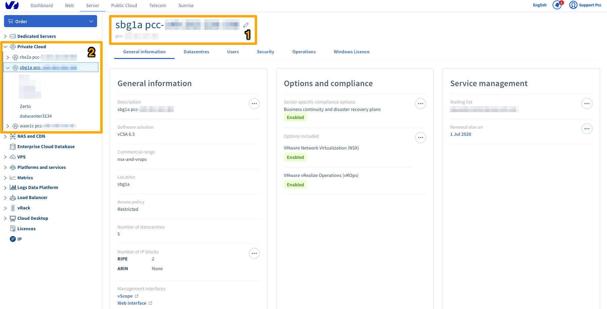
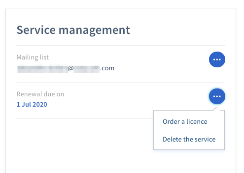
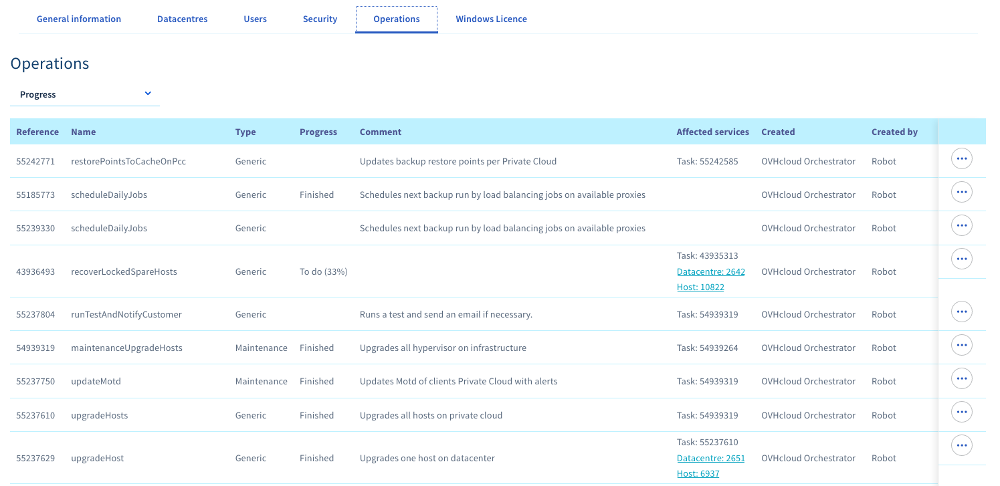

**Last updated 17th June 2020**

## Objective

The OVHcloud Hosted Private Cloud Control Panel enables you to easily manage the numerous settings of your Hosted Private Cloud infrastructure.

**This guide explains the management options available in your Control Panel.**

## Requirements

- a [Hosted Private Cloud infrastructure](https://www.ovhcloud.com/en-au/enterprise/products/hosted-private-cloud/)
- access to the [OVHcloud Control Panel](https://ca.ovh.com/auth/?action=gotomanager)

## Instructions

### General information tab

Once you have navigated to the "Server" section of your [OVHcloud Control Panel](https://ca.ovh.com/auth/?action=gotomanager), and selected your service under `Private Cloud`{.action} in the left-hand navigation bar, you will have access to a general overview of your Hosted Private Cloud service:

{.thumbnail}

At the top of the page, (1 on the image), you will find the name and description of your Private Cloud. Feel free to customise it – this will be very useful if you have several infrastructures. 

On the left (2 on the image), all your infrastructures and the data centres of which they consist are listed.

#### General information

On the main page, in the left-hand section, you will find the general information of your Private Cloud.

{.thumbnail}

- The "Description" of your infrastructure (label it here according to your needs)
- The version number of the software
- The OVHcloud commercial range
- The data centre, and more precisely, the zone in which your infrastructure is located
- The access policy of your infrastructure (`Open` or `Restricted`) 
- The number of virtual data centres in your infrastructure
- The number of IP address blocks (with the option to order IP blocks)
- Links to your management interfaces

#### Options and compliance

The middle section provides an overview of the status of activation regarding the Private Cloud options.

{.thumbnail}

#### Service management

In the right-hand section, you can enter an email address to sign up to the OVHcloud Hosted Private Cloud mailing list.

The next renewal date of the service is also mentioned here. By clicking on the `...`{.action} button, you can order a license or initiate the cancellation of your service.

{.thumbnail}

### Datacentres tab

On this tab, you will find a brief summary of virtual data centres in your offer.

{.thumbnail}

Please refer to the [data centre view section](./#data-centre-view) below for more information.

> [!primary]
>
> You can add another data centre from this page, this will not incur any additional charges.
> 

### Users tab

All users who can log in to vSphere are listed in this section:

{.thumbnail}

You can create a user by clicking on the `Create User`{.action} button.

For each user, their general information and the rights granted to them are specified in the table:

- the user ID
- the first name (optional)
- the last name (optional)
- the email address (optional)
- the phone number (optional)
- the right *token validator*, which allows to validate sensitive operations on a Hosted Private Cloud with the options HDS or PCI-DSS
- the right *IP*, which allows access with the OVHcloud Network plugin
- the right *Failover IP*, which allows to manage Failover IPs on the Hosted Private Cloud
- the right *NSX Interface*, which allows access to the NSX interface if this option is activated on your Private Cloud
- the *Diagnosis* status, informing you whether this user is actually enabled

You have several options when you click on the `...`{.action} button next to a user:

- editing the entries in this table (changing the rights listed above, adding an email address, adding a phone number)
- viewing and modifying this user's rights per data centre
- changing this user's password
- deleting this user

Following are detailed listings of the available user rights by data centre.

{.thumbnail}

- **vSphere access**: to set the global rights for a user in vSphere

|Right|Description|
|---|---|
|Provider|reserved for OVHcloud administrators|
|None|no access|
|Read-only|read access only|
|Read/Write|read and write access|

- **Access to the VM Network**: concerns management rights over the public network section (a.k.a "VM Network" in the vSphere interface)

|Right|Description|
|---|---|
|Provider|allows VMs to be configured on a public network|
|None|no access|
|Read-only|read access only|

- **Access to the V(X)LANs**: concerns management rights over the private network section (VXLAN for Dedicated Cloud and VLAN for SDDC)

|Right|Description|
|---|---|
|Provider|allows VMs to be configured on a private network|
|Administrator|allows port groups to be managed on the virtual switch (creation, modification, deletion), for SDDCs only|
|None|no access|
|Read-only|read access only|

- **Add resources**: gives the right to add additional resources through the OVHcloud plugin in the vSphere client

### Security tab

The vCenter access policy can be managed in this tab.

{.thumbnail}

You can configure security settings with the buttons on the right:

- Set the timeout for a login session.
- Specify the number of concurrent connections allowed.
- Change the access policy to "Restricted" or "Open", with permission by source IP. IP addresses are being managed in the table in this tab (`...`{.action} button).

> [!warning]
>
>  If you set the access policy to "Restricted" and do not enter any IP addresses, no user will be able to connect to the vSphere client. However, virtual machines will remain accessible.
> 

- The disconnection policy decides whether to disconnect the first or last logged-in user if the limit is reached. For example, if 50 users are logged in, and a 51st user logs in, the first (or last) user to log in will be disconnected.

The second table at the bottom of the page concerns the management of Virtual Machine Encryption Key Management Servers.

You can find more details about this option in [this guide](../vm-encrypt/).

### Operations tab

This tab shows the history of tasks executed on your Hosted Private Cloud service.

{.thumbnail}

The list provides details on each task, so you can verify if an operation is in error, if a scheduled maintenance is ongoing, and more. You can change the date of a maintenance by clicking on `...`{.action}.

> [!primary]
>
> If your access to the vSphere client is denied, a scheduled maintenance may be in progress. Check this tab first before taking further measures.
>

### Windows Licence tab

This tab allows you to activate Windows SPLA licences for your data centre by clicking on the button.

{.thumbnail}

You can find more information on the [pricing page](https://www.ovhcloud.com/en-au/enterprise/products/hosted-private-cloud/images-licenses/).

### Data centre view 

A Hosted Private Cloud may include multiple virtual data centres. The left-hand navigation bar will list them when you select a Hosted Public Cloud service. Click on a data centre to open its dedicated management page.

{.thumbnail}

You can customise the name of your data centre by clicking on the pencil icon. Below, you can add a description.

#### General information tab

The first page contains some information about your data centre, its range, and the number of hosts and datastores. Multiple data centres can be leveraged in a single Hosted Private Cloud infrastructure with the Dedicated Cloud and Software Defined Datacenter ranges.

#### Hosts tab

This tab lists the hosts of the selected data centre.

{.thumbnail}

You can find here:

- the names of the hosts
- their profiles (M, L, L+...)
- the billing mode (switchable via the button on the right, if the billing mode is set to hourly)
- the host status
- the usage in hours (if the billing mode is set to hourly)

You can also order a new host from here by clicking on the button on the left.

#### Datastores tab

The tab for your datastores looks similar to the previous one.

{.thumbnail}

You can find here:

- the names of the datastores
- their profiles
- the hardware type (hybrid or full SSD)
- the size
- the billing mode
- their status, indicating whether a datastore is correctly installed
- the usage in hours (for hourly-billed resources only)

You can also order a new host from here by clicking on the button on the left (monthly payment).

#### Backup tab

From this tab, you can order a Veeam Backup solution.

{.thumbnail}

You can find more details about this option in [this guide](https://docs.ovh.com/gb/en/private-cloud/veeam-backup-as-a-service/).

## Go further

Join our community of users on <https://community.ovh.com/en/>.
