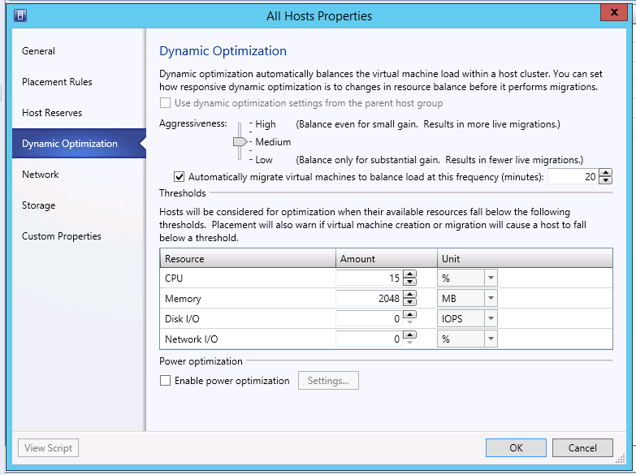

## Konfiguracja proponowana przez OVH
PRO zawiera funkcję Dynamic Optimization, która pozwala na automatyczne rozdzielanie obciążenia danego klastra pomiędzy poszczególne Hosty. OVH proponuje domyślną konfigurację PRO:

{.thumbnail}
Co 20 minut funkcja Dynamic Optimization będzie się wykonywać i automatycznie migrować wirtualne maszyny z jednego Hosta na inny tak, aby spełniać ustawienia zdefiniowana na rysunku.

## Wykluczenie VM z PRO
Jeśli nie chcesz, żeby wybrana wirtualna maszyna była automatycznie przenoszona przez PRO, możesz ją wykluczyć zaznaczając odpowiednie pole w ustawieniach VM:

{.thumbnail}

## Reguły anty-pokrewieństwa
W VMM możesz dla każdej wirtualnej maszyny zdefiniować reguły anty-pokrewieństwa. Możesz określić, że niektóre wirtualne maszyny nie powinny znajdować się na tym samym Hoście.

W tym celu przejdź do ustawień wirtualnej maszyny, Hardware Configuration, Availability, Availability Sets:

{.thumbnail}
Dodaj właściwość i dodaj ją w części "Assigned Properties":

{.thumbnail}
Wykonaj tą czynność dla każdej VM, którą chcesz odseparować.

