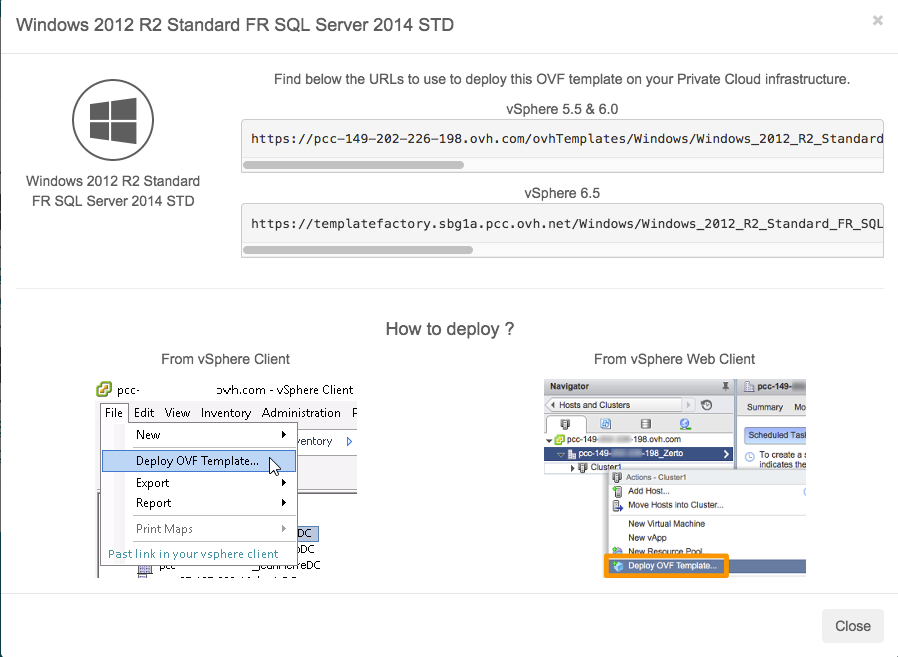
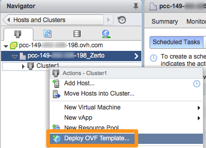
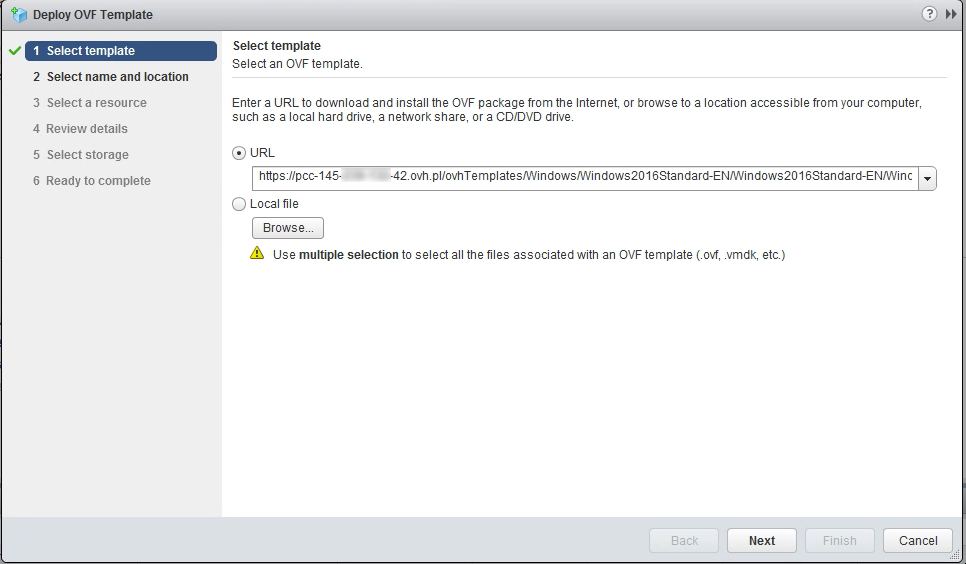

**Última actualización: 11/07/2018**

## Objetivo

OVH pone a su disposición plantillas de Windows y SQL Server (en formato OVF) que nuestros clientes pueden desplegar directamente desde su cliente de escritorio vSphere (versiones 5.5 y 6.0) y desde el cliente web (Flash y HTML5 en la versión 6.5).

**Esta guía explica dónde encontrar las plantillas y cómo desplegarlas.**

> [!primary]
> 
> En [esta página](https://www.ovhcloud.com/es/enterprise/products/hosted-private-cloud/images-licenses/){.external} puede consultar el precio del licenciamiento de las imágenes que OVH pone a su disposición.
>

## Requisitos

- Tener acceso al cliente web o al cliente de escritorio, según la versión utilizada.
- Haber activado las [licencias de Windows](https://www.ovhcloud.com/es/enterprise/products/hosted-private-cloud/images-licenses/){.external} desde el [área de cliente de OVH](https://ca.ovh.com/auth/?action=gotomanager){.external} (en la pestaña `Licencia Widows`{.action} de la plataforma). 

## Procedimiento

### Obtener la URL de la plantilla OVF

Desde un navegador de internet, vaya a la página de inicio de su Private Cloud y haga clic en `OVH Templates`{.action}.

{.thumbnail}

En la nueva página puede consultar los detalles de las plantillas Windows y SQL. 

Al seleccionar la plantilla, se abrirá una ventana con los enlaces necesarios para desplegarla, según la versión de vSphere que utilice.

{.thumbnail}

### Desplegar la plantilla OVF

Una vez conectado al cliente web vSphere, haga clic en `Hosts and Clusters`{.action}. A continuación, haga clic derecho en el datacenter y seleccione `Deploy OVF Template...`{.action}.

{.thumbnail}

Se abrirá un cuadro de diálogo donde podrá configurar el despliegue. En primer lugar, introduzca la URL obtenida como se explica más arriba.

{.thumbnail}

En la siguiente etapa, elija el datacenter.

{.thumbnail}

Seleccione a continuación el cluster en el que quiera desplegar la máquina virtual.

{.thumbnail}

A continuación se mostrarán todos los detalles de la plantilla, incluyendo la contraseña predeterminada. Por seguridad, es importante que la cambie la primera vez que se conecte.

{.thumbnail}

Elija el datastore en el que quiera que se almacene la máquina virtual, así como el formato del disco.

{.thumbnail}

Ahora elija la red que quiera utilizar.

{.thumbnail}

Se mostrará un resumen de la configuración elegida. Compruebe que sea correcta.

{.thumbnail}

Cuando haga clic en `Finish`{.action}, se creará una tarea en la que podrá consultar el progreso del despliegue.

{.thumbnail}

Una vez finalizado el despliegue, ya puede cerrar esta ventana.

La máquina virtual desplegada aparecerá en el inventario.

{.thumbnail}

## Más información

Interactúe con nuestra comunidad de usuarios en [https://community.ovh.com/en/](https://community.ovh.com/en/){.external}.
