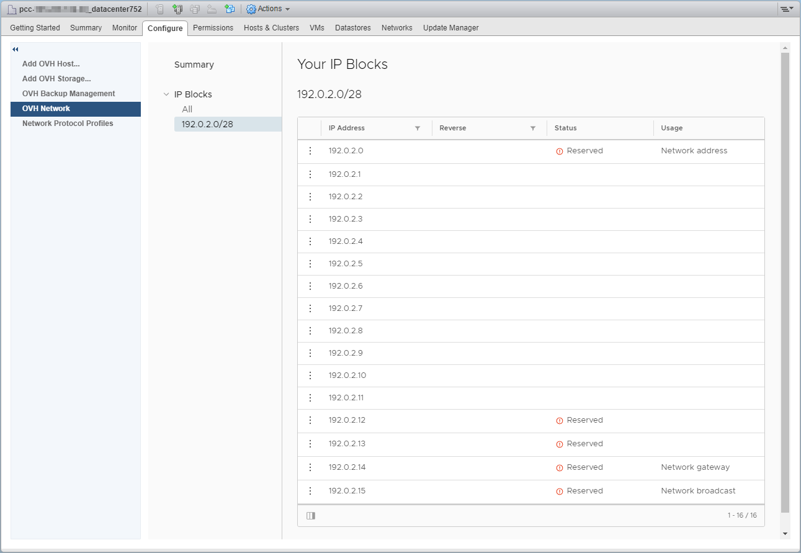

**Stand 02.04.2019**

## Einleitung

Das OVH Network Plugin wurde von OVH entwickelt. Es ermöglicht eine präzise Verwaltung aller IP-Adressen, die mit Ihrer [Private Cloud](https://www.ovh.de/private-cloud/){.external} Lösung verbunden sind.

**In dieser Anleitung erfahren Sie, wie Sie das OVH Network Plugin für Ihre Private Cloud Lösung verwenden.**

## Voraussetzungen

* Sie verfügen über ein [Private Cloud](https://www.ovh.de/private-cloud/){.external} Angebot.
* Sie haben einen mit Ihrer [Private Cloud](https://www.ovh.de/private-cloud/){.external} verbundenen IP-Block.
* Sie haben Zugriff auf das vSphere-Verwaltungsinterface.

## Beschreibung

Klicken Sie auf das Menü `Host and Cluster`{.action} und wählen Sie anschließend ein Datacenter oder Cluster der Infrastruktur. Klicken Sie dann auf den Tab `Configure`{.action} und `OVH Network`{.action}.

{.thumbnail}

So gelangen Sie in den Bereich `Summary`, der Ihre IP-Blöcke sowie Basisinformationen für jeden Block enthält.

{.thumbnail}

Der Bereich **IP Blocks** enthält alle IPs des jeweiligen Blocks. Achten Sie darauf, dass Sie nicht die **5 für die Konfiguration reservierten IPs des Blocks** verwenden. Zu diesen gehören:
- die erste IP, die dem Router Ihren Block ankündigt
- die letzte IP, die für **broadcast** verwendet wird
- die vorletzte IP, die für Ihr **gateway** verwendet wird
- die beiden IPs vor dem Gateway, die auf den Routern als **HSRP** (Hot Standby Router Protocol) verwendet werden

{.thumbnail}

Um dem OVH Plugin zu signalisieren, dass Ihre öffentlichen IPs bereits verwendet werden, muss über die virtuellen Maschinen, die diese IP-Adressen verwenden, eine ARP-Anfrage (_arping_) versendet werden. Achtung: Bei manchen Konfigurationen mit virtueller Firewall ist es nicht möglich, MAC-Adressen zurückzuverfolgen, wenn das ARP-Protokoll nicht erlaubt ist.

Nun können Sie Ihre Reverse-IPs konfigurieren, beispielsweise für einen Mailserver. Diese Einstellung können Sie auch über Ihr [OVH Kundencenter](https://www.ovh.com/auth/?action=gotomanager){.external} sowie die [OVH API](https://api.ovh.com/){.external} vornehmen. Klicken Sie links neben der IP auf die drei vertikalen Punkte und dann auf `Edit Reverse`{.action}.

{.thumbnail}

Geben Sie den Reverse-Eintrag ein und bestätigen Sie mit `Confirm`{.action}.

{.thumbnail}

Dieser erscheint nun rechts neben der IP in der Liste der IP-Adressen des Blocks.

{.thumbnail}

## Weiterführende Informationen

Für den Austausch mit unserer User Community gehen Sie auf <https://community.ovh.com/en/>.