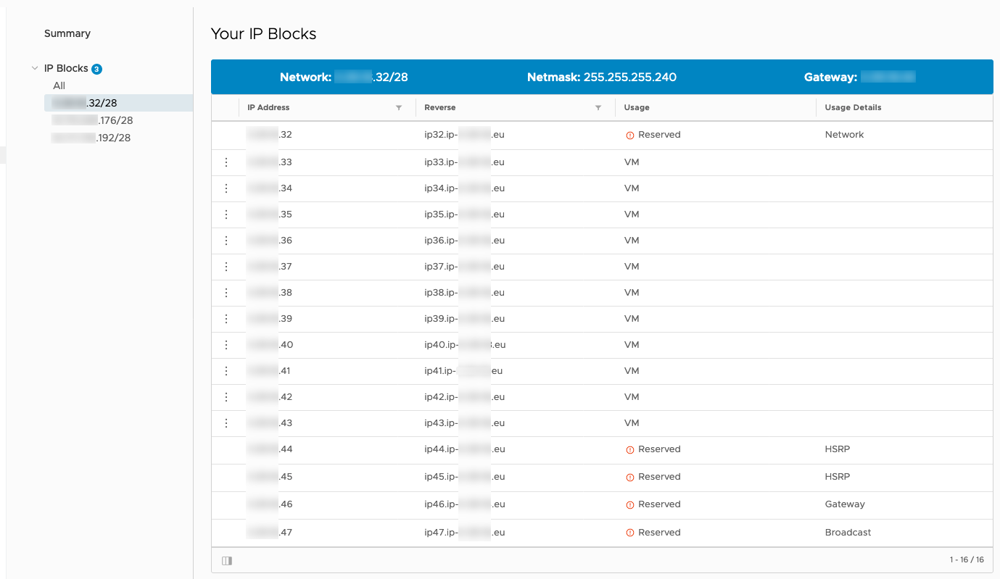

**Last updated 1st July 2020**

## Objective

The OVHcloud Network plugin was developed to allow for a more focused management of the IP addresses linked to your Hosted Private Cloud service.

**This guide will explain how to use the OVHcloud Network plugin with your Hosted Private Cloud solution.**

## Requirements

- a [Hosted Private Cloud infrastructure](https://www.ovhcloud.com/asia/enterprise/products/hosted-private-cloud/)
- an IP address block linked to your Hosted Private Cloud infrastructure
- access to the vSphere interface

## Instructions

Once you are logged in to the vSphere client, select your data centre from the left-hand menu and switch to the `Configure`{.action} tab. Next, click on `Network`{.action} under "OVHcloud" in the left-hand tab navigation to display the "Network summary" section.

{.thumbnail}

Your IP blocks are displayed here along with some basic information about them. Click on an IP block to see all of its IP addresses listed in a table overview.

{.thumbnail}

You can verify the reverse of each address and their purpose. Some of them will be marked as "Reserved". Make sure not to use these **five IPs that are reserved for the block's configuration and high availability**, namely:

- the first IP, which announces your block on the router
- the last IP, which is for **broadcast**
- the second to last IP, which is your **gateway**
- the two IPs before the gateway, which are used as **HSRP** (Hot Standby Router Protocol) on the routers

In order to inform the OVHcloud plugin that your public IP addresses are actually in use, you need to send an ARP request (_arping_) from the virtual machine(s) using these IPs. 

> [!warning]
> Some configurations with a virtual firewall do not allow to trace back MAC addresses if the ARP protocol is not authorised.
>

You can then customise your reverse IPs in this table (when configuring an email server, for example). Click on the three vertical dots to the left of the IP address, then on `Edit Reverse`{.action} 

{.thumbnail}

Enter the reverse and validate by clicking `Confirm`{.action}.

The new reverse will then be displayed in the table.

> [!primary]
>
> This configuration process is also accessible via the [OVHcloud Control Panel](https://ca.ovh.com/auth/?action=gotomanager) and the [OVHcloud APIs](https://ca.api.ovh.com/){.external}. 
> 

## Go further

Join our community of users on <https://community.ovh.com/en/>.
